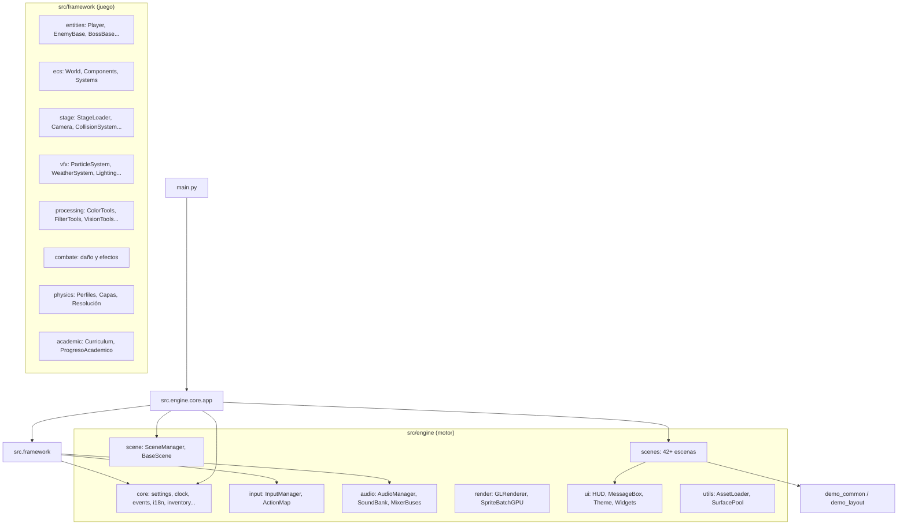

# Legacy of InFest — Arquitectura

**ID del documento:** LOI-ARCH-003
**Versión:** 1.2.0
**Estado:** Oficial
**Audiencia:** Profesor, ayudantes, asistentes de programación con IA

> **AUD-455.** Esta versión traduce el documento completo (antes en inglés,
> con una nota final que remitía al lector de vuelta al inglés: *"Este
> documento está disponible en inglés. Para una traducción completa al
> español, contacte al profesor"*) y corrige varios defectos verificados
> contra el árbol real y `tests/test_architecture_doc_matches_tree.py`:
> citaba tres veces un documento inexistente, `77_SYLLABUS_ALIGNMENT_AUDIT.md`;
> tenía la carpeta `framework/academic/` documentada **dos veces**, con dos
> descripciones distintas de los mismos tres ficheros (una con los nombres de
> clase reales — `PLAN`, `ProgresoAcademico`, `SesionAcademica` — y otra con
> nombres inventados que no existen en el código); el árbol de `render/`
> tenía `sprite_batch.py` fuera de su rama; `ai_predictor.py` se describía
> como «predicción de la acción del jugador» cuando predice **tácticas de
> enemigo**, no acciones del jugador; el mapa de dependencias de §3.1 seguía
> citando `engine.scene.transitions`, un módulo que el propio documento (nota
> AUD-111, más abajo) dice que se retiró por tener cero usos; la tabla de
> `VisionTools` (§2.9) documentaba `classify_region(features, model)`, que no
> existe en `vision_tools.py`; y la sección de pruebas enumeraba unos 75
> ficheros de una carpeta `tests/` que hoy tiene 297 — no por desactualizada
> unas líneas, sino por siete veces menos de lo real.

---

## 0. Diagrama de dependencias entre paquetes



> **AUD-641:** `engine/core`, `ui`, `input`, `audio` y `utils` NO importan
> `framework`. Verificado por `lint-imports` (4 contracts) y
> `tests/test_arquitectura_fronteras.py`.

---

## 1. Estructura completa de carpetas

Todas las rutas de abajo son relativas a la raíz real del repositorio.
`engine/`, `framework/` y `stages/` viven bajo `src/`; existe además
`student_templates/`.

```
legacy-of-infest/                      # Raíz real del repositorio
│
├── main.py                            # Punto de entrada. Instancia App y llama a run().
│                                     # Admite --stage y --boss para lanzar directo por CLI.
├── requirements.txt
├── requirements.lock
├── README.md
├── LICENSE
├── pyproject.toml                     # Config de build, dependencias, ajustes de ruff/pytest/mypy
├── build.spec                         # Spec de build de PyInstaller
├── build_nuitka.bat                   # Script de build de Nuitka (Windows)
├── .flake8                            # Config de Flake8 (heredado, sustituido por ruff)
├── .gitignore
├── .gitattributes
├── CHANGELOG.md
├── CONTRIBUTING.md
├── KNOWN_GAPS.md                      # Huecos conocidos y su resolución
│
├── docs/                              # Paquete oficial de documentación (00–52+)
│
├── assets/                            # DEL PROFESOR. Sólo lectura para estudiantes.
│   ├── sprites/
│   │   ├── player/
│   │   ├── enemies/
│   │   ├── bosses/
│   │   └── shared/
│   ├── tilesets/
│   ├── backgrounds/
│   ├── music/
│   ├── sfx/
│   ├── fonts/
│   ├── ui/
│   ├── splash/
│   ├── title/
│   ├── story/
│   ├── maps/
│   ├── models/
│   ├── datasets/
│   ├── scripts/
│   └── tileset_stage0.tsx
│
├── src/                                # Todo el código fuente en Python
│   │
│   ├── engine/                         # DEL PROFESOR. No modificar.
│   │   │
│   │   ├── core/
│   │   │   ├── __init__.py
│   │   │   ├── app.py                     # Clase App: init de pantalla, bucle principal, bombeo de escenas
│   │   │   ├── settings.py                # Todas las constantes globales
│   │   │   ├── clock.py                   # DeltaClock: delta de tiempo, tope de FPS, escala de tiempo
│   │   │   ├── azar.py                    # AUD-375: la semilla del proceso, anotada en el registro
│   │   │   ├── estadisticas.py            # AUD-346: cuantiles P50/P95/P99 del fotograma
│   │   │   ├── event_bus.py               # EventBus: despacho de eventos pub/sub
│   │   │   ├── events.py                  # Constantes de nombres de evento (clase Events)
│   │   │   ├── game_context.py            # GameContext: contenedor de DI de todos los subsistemas
│   │   │   ├── gpu_effects.py             # Reparto CPU/GPU del post-procesado (AUD-222)
│   │   │   ├── achievements.py            # Sistema de logros
│   │   │   ├── difficulty.py              # Escalado de dificultad (enum Difficulty, set_difficulty)
│   │   │   ├── experience.py              # XP por enemigo, curva de nivel y puntos de habilidad (AUD-249)
│   │   │   ├── skill_tree.py              # AUD-293: el árbol — vitalidad, fuerza e ímpetu
│   │   │   ├── i18n.py                    # AUD-455: catálogo JSON es/en propio — explícitamente NO gettext (ver F3.1 en el módulo)
│   │   │   ├── inventory.py               # Gestión de ítems/coleccionables
│   │   │   ├── integridad.py             # AUD-295: firma HMAC de los JSON del jugador
│   │   │   ├── plugins.py                # AUD-296: ganchos para extender sin tocar el núcleo
│   │   │   ├── registro.py                # AUD-268: los avisos van al fichero, no a la consola
│   │   │   ├── save_data.py               # dataclass SaveData, SAVE_VERSION, MAX_SLOTS
│   │   │   ├── score_system.py            # Puntos y monedas soltadas por tipo de enemigo
│   │   │   ├── save_manager.py            # SaveManager: guardar/cargar/borrar basado en JSON
│   │   │   ├── stage_registry.py          # StageRegistry: descubre escenarios automáticamente
│   │   │   └── user_settings.py           # UserSettings: preferencias del jugador persistidas
│   │   │
│   │   ├── scene/
│   │   │   ├── __init__.py
│   │   │   ├── scene_manager.py           # SceneManager: pila de escenas push/pop/replace
│   │   │   └── base_scene.py              # BaseScene: interfaz abstracta que implementa toda escena
│   │   │       # AUD-111: aquí vivía un módulo de transiciones con cinco
│   │   │       # clases y CERO usos en todo el repositorio, ni siquiera en
│   │   │       # pruebas. Competía con el gestor de transiciones de `scenes/`,
│   │   │       # que es el que SceneManager instancia de verdad, así que quien
│   │   │       # buscaba «cómo hago una transición» encontraba el muerto la
│   │   │       # mitad de las veces. Retirado.
│   │   │
│   │   ├── scenes/                        # Todas las implementaciones de escena (42+ ficheros)
│   │   │   ├── __init__.py
│   │   │   ├── splash_scene.py            # Logo del profesor, avance automático
│   │   │   ├── title_scene.py             # Menú principal: Empezar / Demos Académicas / Salir
│   │   │   ├── story_scene.py             # Secuencia de historia (escenas 1–3)
│   │   │   ├── loading_scene.py           # Pantalla de carga con indicador de progreso
│   │   │   ├── tutorial_scene.py          # Superposición del tutorial de controles
│   │   │   ├── tutorial_overlay.py        # Ayudas contextuales emergentes (nivel motor)
│   │   │   ├── options_scene.py           # Opciones: volumen, dificultad, modo daltónico
│   │   │   ├── keybinding_scene.py        # Reasignar controles
│   │   │   ├── load_game_scene.py         # Selector de partida guardada
│   │   │   ├── game_over_scene.py         # Pantalla de muerte con continuar/salir
│   │   │   ├── end_credits_scene.py       # Pantalla de créditos / finalización
│   │   │   ├── demo_menu_scene.py         # Selector de Demos Académicas (10+ escenas)
│   │   │   ├── scene_registry.py          # Contenedor de DI: patrón registrar → construir
│   │   │   ├── debug_overlay.py           # Consola de depuración F11 (FPS, eventos, módulos)
│   │   │   ├── param_panel.py             # Widget ParamPanel reutilizable
│   │   │   ├── demo_layout.py             # Constantes de disposición y ayudantes de dibujo
│   │   │   ├── demo_utils.py              # SourceSurfaceManager, FrameThrottle, etc.
│   │   │   ├── demo_common.py             # Re-exportaciones heredadas de demo_layout + demo_utils
│   │   │   ├── filter_demo_scene.py       # Unidad VII — Demo de filtros (9 modos)
│   │   │   ├── vision_demo_scene.py       # Unidad VIII — Demo de visión (10 modos)
│   │   │   ├── pattern_demo_scene.py      # Unidad IX — Demo de patrones (5 modos)
│   │   │   ├── vector_lab_scene.py        # Unidad II — Laboratorio de vectores
│   │   │   ├── transform_lab_scene.py     # Unidad II/III — Laboratorio de transformaciones
│   │   │   ├── curve_editor_scene.py      # Unidad III — Editor de curvas
│   │   │   ├── interpolation_lab_scene.py # Unidad III/IV — Laboratorio de interpolación
│   │   │   ├── color_theory_scene.py      # Unidad V — Laboratorio de teoría del color
│   │   │   ├── noise_lab_scene.py         # Unidad V/VIII — Laboratorio de ruido
│   │   │   ├── collision_lab_scene.py     # Unidad VI — Laboratorio de colisión
│   │   │   ├── combo_demo_scene.py        # Demo de la máquina de estados del sistema de combos
│   │   │   ├── inventory_scene.py         # Pantalla de inventario (rejilla; equipar/desequipar)
│   │   │   ├── skill_tree_scene.py       # AUD-293: gastar puntos de experiencia
│   │   │   ├── shop_scene.py              # Tienda: comprar/vender ropa con monedas
│   │   │   ├── boss_rush_entry.py         # Punto de entrada del boss rush (dos funciones auxiliares)
│   │   │   ├── achievement_scene.py       # Pantalla de logros (bloqueados/desbloqueados)
│   │   │   ├── bestiary_scene.py          # Bestiario: catálogo de enemigos
│   │   │   ├── world_map_scene.py         # Mapa del mundo (nodos conectados)
│   │   │   ├── progress_scene.py          # Panel de progreso del estudiante (% por categoría)
│   │   │   ├── leaderboard_scene.py       # Marcadores locales de speedrun / boss rush
│   │   │   ├── pipeline_builder_scene.py  # Constructor visual de cadena de filtros (Unidad VII/VIII)
│   │   │   ├── quiz_system.py             # Superposición de cuestionario para laboratorios académicos
│   │   │   ├── code_panel.py              # Panel de código fuente para enseñanza
│   │   │   ├── sandbox_scene.py           # Sandbox para probar mecánicas
│   │   │   ├── stage_error_scene.py       # Pantalla de error para fallos de carga de escenario
│   │   │   ├── stage_wizard_scene.py      # Asistente de creación de escenarios
│   │   │   ├── transition_manager.py      # Gestiona transiciones de pantalla (fundido/wipe/deslizar/círculo)
│   │   │   ├── unit_theory_scene.py       # Teoria y examen de una unidad (AUD-095)
│   │   │   └── student_login_scene.py     # Identificacion por correo (AUD-098)
│   │   │
│   │   ├── input/
│   │   │   ├── __init__.py
│   │   │   ├── input_manager.py           # InputManager: teclado + mando unificados
│   │   │   └── action_map.py              # Action(Enum): enlace abstracto acción → dispositivo
│   │   │
│   │   ├── audio/
│   │   │   ├── __init__.py
│   │   │   ├── sound_bank.py              # SoundBank: registro de sonidos con nombre
│   │   │   ├── audio_manager.py           # AudioManager: música + sfx + ambiente + stingers
│   │   │   ├── audio_pipeline.py          # Tubería de procesamiento de audio
│   │   │   ├── music_clock.py            # RelojMusical: pulsos, compases y latencia (F6)
│   │   │   ├── mixer_buses.py           # Mezclador: buses y ducking (AUD-144)
│   │   │   └── polifonia.py             # AUD-280: cuántas veces suena a la vez el mismo efecto
?   ?   ?   ??? music_stems.py            # MusicStemManager: stems dinamicos con crossfade
?   ?   ?   ??? reverb_zones.py          # ReverbZoneManager: reverb por zona pre-bakeado
│   │   ├── render/
│   │   │   ├── __init__.py
│   │   │   ├── gl_pipeline.py             # GLRenderer, GLRenderConfig: tubería de ModernGL
│   │   │   ├── gpu_sprite_batch.py        # AUD-340: SpriteBatchGPU, sprites instanciados con normal mapping (fase 5)
│   │   │   ├── memoria_de_textura.py      # AUD-397: memoria de textura viva y detección de fugas (GAP-049)
│   │   │   ├── normales.py                # AUD-340: normales procedurales del alfa del sprite
│   │   │   ├── shaders.py                 # Código fuente de los shaders GLSL
│   │   │   ├── sprite_batch.py           # AUD-302: muchos sprites en una llamada (blits)
│   │   │   └── gpu_present.py            # PresentadorGPU: presentar por SDL2 (AUD-148, opcional)
│   │   │
│   │   ├── ui/
 │   │   │   ├── __init__.py
 │   │   │   ├── hud.py                     # HUD: corazones, temporizador, retrato, puntaje
 │   │   │   ├── message_box.py             # MessageBox: texto con desplazamiento, mensajes de tutorial
 │   │   │   ├── screen_banner.py           # ScreenBanner: animación del título de escenario
 │   │   │   ├── minimap.py                 # Minimap: mapa de exploración con niebla de guerra
 │   │   │   ├── subtitle_overlay.py        # SubtitleOverlay: subtítulos de diálogo
 │   │   │   ├── text_panel.py              # TextPanel: paneles de texto con scroll, chips y ficha de nombre
 │   │   │   ├── theme.py                   # Theme: paleta de color y estilo de la interfaz
 │   │   │   └── widgets.py                 # Widgets de interfaz reutilizables
│   │   │
│   │   └── utils/
│   │       ├── __init__.py
│   │       ├── asset_loader.py            # AssetLoader: carga y cachea imágenes, sonidos, fuentes
│   │       ├── math_utils.py              # Vector2, lerp, clamp, funciones de easing
│   │       ├── surface_pool.py            # SurfacePool: reutiliza superficies temporales
│   │       └── sprite_atlas.py            # SpriteAtlas: muchos recortes en una hoja (G1)
│   │
│   ├── framework/                      # DEL PROFESOR. No modificar.
│   │   │
│   │   ├── entities/
│   │   │   ├── __init__.py
│   │   │   ├── base_entity.py             # BaseEntity: posición, rect, ciclo de vida update/draw
│   │   │   ├── player.py                  # Player: máquina de estados, respuesta a entrada, daño
│   │   │   ├── player_state.py            # Enum PlayerState (todos los estados del jugador)
│   │   │   ├── player_states.py           # Implementación de la máquina de estados del jugador
│   │   │   ├── states/                    # Clases de estado individuales (subcarpeta)
│   │   │   ├── enemy_base.py              # EnemyBase: enemigo abstracto con vida + estado
│   │   │   ├── enemy_walker.py            # EnemyWalker: patrulla horizontal, detección del jugador
│   │   │   ├── enemy_flying.py            # EnemyFlying: vuelo en senoide o por waypoints
│   │   │   ├── enemy_shooter.py           # EnemyShooter: emisión de proyectiles, disparador de rango
│   │   │   ├── boss_base.py               # BossBase: gestor de fases, evento de barra de vida del jefe
?   ?   ?   ??? enemy_buddies.py           # Buddy system: Rino, Expresso, Enguarde
?   ?   ?   ??? enemy_climber.py           # Climber enemy: wall climbing behavior
?   ?   ?   ??? enemy_flying_bomber.py     # Flying bomber: aerial attack pattern
?   ?   ?   ??? enemy_ice_skater.py        # Ice skater: sliding movement on ice
?   ?   ?   ??? enemy_parry_teacher.py     # Parry teacher: teaches parry mechanic
?   ?   ?   ??? enemy_shielded.py          # Shielded enemy: block and counter attacks
?   ?   ?   ??? enemy_summoner.py          # Summoner: spawns minions
?   ?   ?   ??? enemy_swimmer.py           # Swimmer: underwater movement
?   ?   ?   ??? enemy_terrain_shaper.py    # Terrain shaper: creates/destroys blocks
│   │   │   ├── boss_kit.py                # BossKit: componentes reutilizables de jefe
│   │   │   ├── enemy_charger.py           # EnemyCharger: preparación + ataque de embestida
│   │   │   ├── enemy_archer.py            # EnemyArcher: a distancia, disparo en arco
│   │   │   ├── enemy_brute.py             # EnemyBrute: cuerpo a cuerpo pesado + onda de choque
│   │   │   ├── enemy_caster.py            # EnemyCaster: magia con orbe autoguiado
│   │   │   ├── enemy_assassin.py          # EnemyAssassin: invisibilidad + estocada
│   │   │   ├── enemy_pez_abismal.py       # EnemyPezAbismal (AUD-519): persigue, no daña ni se puede dañar
│   │   │   ├── enemy_cangrejo.py          # EnemyCangrejo (AUD-575): patrulla terreno, presencia, no daña
│   │   │   ├── enemy_medusa.py            # EnemyMedusa (AUD-575): deriva en senoide, presencia, no daña
│   │   │   ├── entity_factory.py          # EntityFactory: creación de enemigos por registro
│   │   │   ├── flight_strategies.py       # FlightStrategy: patrones de vuelo senoide/bézier/aleatorio
│   │   │   ├── ai_predictor.py            # BehaviorPredictor: KNN+árbol recomienda táctica de enemigo, consultado en lote por SquadBrain a 4 Hz
│   │   │   ├── tactica_por_reglas.py      # accion_por_distancia: heurística sin sklearn para el primer lote (AUD-456)
│   │   │   ├── precarga_ia.py             # precargar_ia/ia_lista: importa sklearn en hilo para no congelar el primer lote (AUD-456)
│   │   │   ├── bestiary.py                # Bestiary: seguimiento de encuentros/muertes de enemigos
│   │   │   ├── bestiary_registry.py       # BestiaryRegistry: registro de datos de enemigos
│   │   │   ├── ranged_weapon.py           # ArcoDelJugador: arco del jugador, munición y flechas (F4.2)
│   │   │   └── squad_brain.py             # SquadBrain: IA de coordinación grupal de enemigos
│   │   │
│   │   ├── ecs/                            # F5 — entidades, componentes y sistemas
│   │   │   ├── __init__.py                 #   Va DEBAJO de la jerarquía, no en su lugar:
│   │   │   ├── world.py                    #   World: almacén de componentes y entidades
│   │   │   ├── components.py               #   Los datos, sin comportamiento
│   │   │   ├── systems.py                  #   Viento, plataformas, láseres, sigilo
│   │   │   ├── scheduler.py                #   Planificador: el orden de un fotograma
│   │   │   ├── bridge.py                   #   ComponentesDeEntidad: BaseEntity sobre componentes
│   │   │   └── bullet_swarm.py             #   EnjambreDeBalas: bullet hell con NumPy (F5.8)
│   │   │
│   │   ├── combate/                        # AUD-387/388 — reglas de combate compartidas
│   │   │   ├── __init__.py
│   │   │   ├── dano.py                     #   canales de daño y mitigación (data/damage_types.json)
│   │   │   └── efectos.py                  #   AUD-388: efectos temporales (data/effects.json)
│   │   │
│   │   ├── physics/                       # AUD-333/334 — física por contexto + resolutor compartido
│   │   │   ├── __init__.py
│   │   │   ├── capas.py                    #   AUD-395: capas de colisión sobre el AABB (GAP-038)
│   │   │   ├── perfil.py                   #   PhysicsProfile: física por modo de juego
│   │   │   └── resolucion.py               #   AUD-334: resolutor de mundo (EstadoDeMovimiento→Contacto)
│   │   │
│   │   ├── world/                          # AUD-358 — el mundo como simulación, no como tres sistemas sueltos
│   │   │   ├── __init__.py
│   │   │   ├── environment.py               #   EnvironmentState: la foto inmutable del ambiente del fotograma
│   │   │   └── simulation.py                #   AUD-358: WorldSimulation — reloj, calendario, estación, astronomía y clima → un estado
│   │   │
│   │   ├── stage/
│   │   │   ├── __init__.py
│   │   │   ├── profundidad.py             # AUD-277: escala 2.5D por altura (apagada por defecto)
│   │   │   ├── rejilla.py                 # AUD-276: rejilla espacial + raycast (línea de visión)
│   │   │   ├── culling.py                 # AUD-279: qué se simula y qué se dibuja cerca de la cámara
│   │   │   ├── pendientes.py             # AUD-297: suelo inclinado (Slope)
│   │   │   ├── objetivos.py               # AUD-400: objetivos declarados en el mapa y su seguimiento (GAP-047)
│   │   │   ├── stage_loader.py            # StageLoader: parsea TMX, construye la pila de capas, aparece
│   │   │   ├── stage_data.py              # AUD-350: StageData y vocabulario de Tiled (dataclasses, capas)
│   │   │   ├── stage_objetos.py           # AUD-350: mixin ObjetosDeTiled: un manejador por objeto de Tiled
│   │   │   ├── interactables.py           # Recogible/Cerradura/Cofre/Disparador/Llavero (F4.1)
│   │   │   ├── bloques.py                 # PushBlock y BreakableBlock: empujar y romper (AUD-140)
│   │   │   ├── interactable_system.py     # InteractableSystem: llaves, puertas, cofres y eventos (F4.1)
│   │   │   ├── level_mechanics.py         # ControlDeNado, TiempoBala, ScrollForzado (F5.5/F5.6)
│   │   │   ├── atencion.py                # AUD-492: Atencion: quietud, dirección y posición del jugador
│   │   │   ├── camera.py                  # Camera: viewport, parallax, sigue al objetivo
│   │   │   ├── checkpoint.py              # Checkpoint: zona disparadora, ancla de reaparición
│   │   │   ├── collision_system.py        # CollisionSystem: hitstop, procesamiento de ataques
│   │   │   ├── hazard_system.py           # HazardSystem: zonas de daño, fosos de muerte
│   │   │   ├── progression_system.py      # ProgressionSystem: finalización de escenario, disparadores
│   │   │   ├── drawing_system.py          # DrawingSystem: tubería de dibujado por capas
│   │   │   ├── gizmos.py                  # AUD-352: mixin GizmosDeDepuracion: cajas, flechas y conos de F1
│   │   │   ├── cutscene_system.py         # CutsceneSystem: cutscenes guionizadas
│   │   │   ├── cutscene_director.py       # CutsceneDirector: escenas declaradas en TMX (AUD-136)
│   │   │   ├── cutscene_guion.py          # analizar_guion: texto de guion a acciones (AUD-136)
│   │   │   ├── speedrun_mode.py           # SpeedrunTimer: cronómetro global + datos del fantasma
│   │   │   ├── boss_rush_mode.py          # BossRushMode: enfrentamiento consecutivo de jefes
 │   │   │   ├── combat_manager.py          # CombatManager: reglas de daño, hitstop y efectos de combate
 │   │   │   ├── day_night.py               # DayNight: sistema de ciclo día/noche
?   ?   ?   ??? prefab_loader.py           # PrefabLoader: carga prefabs declarados en TMX
│   │   │   ├── level_metrics.py           # LevelMetrics: métricas de análisis de escenario
│   │   │   ├── seasons.py                 # Seasons: efectos visuales estacionales
│   │   │   └── tmx_diagnostics.py         # TmxDiagnostics: utilidades de validación de TMX
│   │   │
│   │   ├── ui/
│   │   │   ├── __init__.py
│   │   │   ├── tutorial_overlay.py        # TutorialOverlay: ayudas contextuales emergentes
│   │   │   ├── dialogue_system.py         # DialogueSystem: diálogo ramificado con retratos
│   │   │   └── learning_overlay.py        # LearningOverlay: superposición de contexto académico
│   │   │
│   │   ├── audio/
 │   │   │   ├── __init__.py
 │   │   │   ├── dynamic_music.py           # DynamicMusic: crossfade calma <-> combate
 │   │   │   ├── menu_sfx.py                # AUD-345: los menús también suenan
 │   │   │   └── audio_layer_mixer.py       # AudioLayerMixer: mezcla por capas (ambiente, música, sfx, voz)
│   │   │
│   │   ├── academic/
│   │   │   ├── __init__.py
│   │   │   ├── curriculum.py              # PLAN: las unidades, su teoria y su examen
│   │   │   ├── progress.py                # ProgresoAcademico: notas y desbloqueo encadenado
│   │   │   └── sesion.py                  # SesionAcademica: estudiante activo
│   │   │
│   │   ├── scenes/
│   │   │   ├── __init__.py
│   │   │   ├── stage_scene.py             # StageScene: la escena principal jugable
│   │   │   └── stage_parts/               # AUD-152: mixins de lectura de StageScene
│   │   │       ├── __init__.py            #   por qué son mixins y no colaboradores
│   │   │       ├── ambiente.py            #   luz, bloom, viñeta y partículas: la precedencia del TMX
│   │   │       ├── simulacion.py          #   AUD-362: monta WorldSimulation y consume su EnvironmentState
│   │   │       ├── senales.py             #   suscripciones al bus: VFX, inventario y warp
│   │   │       ├── economia.py            #   AUD-595: el botín que deja cada enemigo al morir
│   │   │       ├── sonido.py              #   AUD-290: la mitad sonora — 38 eventos y su tabla
│   │   │       ├── diagnostico.py         #   AUD-290: lo que enseña F11 y qué pasa si una
│   │   │       │                          #   entidad revienta (AUD-283, AUD-289)
│   │   │       ├── cinematicas.py         #   AUD-290: monta el director de escenas y lo corre
│   │   │       ├── arco.py                #   AUD-299: apuntar, disparar y la parábola
│   │   │       ├── mundo_ecs.py           #   AUD-299: planificador, población y agarres
│   │   │       ├── fantasma.py            #   silueta de la mejor carrera
│   │   │       ├── actualizaciones.py     #   AUD-351: la familia _update_* — audio,
│   │   │       │                         #   HUD, efectos, luz, logros, minimapa y estelas
│   │   │       ├── dibujo.py              #   AUD-343: draw partido en mundo/UI
│   │   │       │                          #   y el mapa de luz que viaja a la GPU
│   │   │       ├── pausa.py               #   AUD-555: panel de pausa con pestañas
│   │   │       │                          #   (Equipo/Habilidades/Mapa/Menú), Ocarina of Time
│   │   │       ├── rush.py                #   AUD-261: conduce el Boss Rush —
│   │   │       │                          #   golpes, tiempo y arrastre de vida
│   │   │       └── dibujo_mecanicas.py    #   pinta lo del ECS: bloques rítmicos,
│   │   │                                  #   láseres, resortes, plataformas móviles
│   │   │
│   │   ├── vfx/
│   │   │   ├── __init__.py
│   │   │   ├── particle_system.py         # ParticleSystem: emisores, ráfagas
│   │   │   ├── contorno.py                # AUD-304: el contorno de silueta, sin dueño (jugador y enemigos)
│   │   │   ├── sombras.py                 # AUD-273: la elipse bajo los pies (dónde vas a caer)
│   │   │   ├── sombras_proyectadas.py     # AUD-278: la luz ya no atraviesa las paredes
│   │   │   ├── hit_effects.py             # HitEffects: configuraciones de ráfaga por tipo de golpe
│   │   │   ├── damage_numbers.py          # DamageNumberManager: números de daño flotantes
│   │   │   ├── gradacion.py               # AUD-496: matriz de color 3x3 por píxel (núcleo JIT opcional)
│   │   │   ├── post_processing.py         # PostProcessing: bloom, viñeta, motion blur
│   │   │   ├── cielo.py                   #   AUD-426: cielo procedural (degradado desde la altura solar)
│   │   │   ├── pulso.py                   #   AUD-425: el pulso visual — cámara y luz al compás
│   │   │   ├── lighting.py                # LightSystem: iluminación dinámica 2D
│   │   │   ├── ambient_particles.py       # AmbientParticleSystem: polvo, hojas, brasas
│   │   │   ├── trail_system.py            # TrailSystem: estelas de movimiento
│   │   │   ├── fog_of_war.py              # FogOfWar: superposición negra con huecos revelados
│   │   │   ├── water_effect.py            # WaterEffect: superposición animada de onda senoidal
│   │   │   └── weather_system.py          # WeatherSystem: efectos de lluvia, nieve, niebla
│   │   │
│   │   ├── processing/
│   │   │   ├── __init__.py
│   │   │   ├── color_tools.py             # ColorTools: RGB↔HSV↔HSL↔CMYK, mezcla alfa
│   │   │   ├── filter_tools.py            # FilterTools: convolución, desenfoque, Sobel, Canny
│   │   │   ├── curve_tools.py             # CurveTools: Bézier, B-Spline, NURBS, muestreo
│   │   │   ├── vision_tools.py            # VisionTools: umbralización, morfología, características
│   │   │   ├── edge_detection.py          # EdgeDetection: métodos adicionales de detección de bordes
│   │   │   ├── pattern_recognition_tools.py  # PatternRecognitionTools: entrenamiento, inferencia
│   │   │   └── reference_model.py         # AUD-455: modelo de referencia reentrenado en la máquina del jugador, no distribuido como .pkl
│   │   │
│   │   └── ai/
│   │       ├── __init__.py
│   │       ├── lua_script.py              # LuaScript: scripting Lua para la IA de enemigos
│   │       └── navegacion.py              # AUD-389: A* sobre tiles, con su coste medido
│   │
│   └── stages/
│       ├── stage0/                        # DEL PROFESOR. Documentación ejecutable.
│       │   ├── __init__.py
│       │   ├── stage0.py                  # Clase Stage0Scene
│       │   ├── stage0.tmx                 # Mapa de Tiled
│       │   └── README.md
│       ├── boss_venado/                   # DEL PROFESOR. Jefe de referencia.
│       │   ├── __init__.py
│       │   ├── boss_venado.py
│       │   └── boss_venado_scene.py
│       └── <entrega_del_estudiante>/      # UNA carpeta por Stage/Boss asignado individualmente
│           ├── __init__.py
│           ├── <entrega>.py
│           ├── <entrega>.tmx               # (sólo Stages — los Boss usan una arena fija, sin scroll)
│           └── README.md
│
├── scripts/                            # Scripts de herramientas
│   ├── _cli_paths.py                   # Utilidades de ruta compartidas para los scripts de CLI
│   ├── audit_docs_vs_code.py           # Audita identificadores de doc contra el código real (regenera docs/63)
│   ├── build_executable.py             # Construye el ejecutable a partir del código fuente
│   ├── check_dependency_sync.py        # Verifica la consistencia de dependencias
│   ├── check_tmx_coverage.py           # Comprueba la cobertura de los mapas TMX
│   ├── check_translations.py           # Verifica que las traducciones estén completas
│   ├── collect_palettes.py             # Recolecta datos de paleta de los assets
│   ├── downloader.py                   # Utilidad para descargar assets
│   ├── feedback_generator.py           # Genera informes de retroalimentación al estudiante
│   ├── generate_exam.py                # Genera exámenes de práctica desde el banco de preguntas
│   ├── generate_tmx_reference.py       # Genera la documentación de referencia de TMX
│   ├── grade_boss.py                   # Califica automáticamente los ficheros Python de jefe del estudiante
│   ├── grade_exporter.py               # Exporta calificaciones a un formato externo
│   ├── grade_stage.py                  # Califica automáticamente los TMX de escenario del estudiante
│   ├── obsidianize.py                  # Convierte la documentación al formato de Obsidian
│   ├── plagiarism_detector.py          # Detección de plagio en el trabajo del estudiante
│   ├── preview_tmx.py                  # Vista previa de mapas TMX en la terminal
│   ├── project_stats.py                # Genera estadísticas del proyecto
│   ├── train_reference_model.py        # Entrena el modelo de ML de referencia
│   ├── validate_assets.py              # Valida fuentes, modelos, mapas
│   └── validate_tmx.py                 # Valida ficheros de mapa TMX contra errores comunes
│
├── colab/                              # Notebooks de Google Colab para ejercicios interactivos
│   ├── 01_vector_math_exercises.ipynb  # Unidad II — Ejercicios de matemática vectorial
│   ├── 02_color_spaces_exercises.ipynb # Unidad V — Ejercicios de conversión de espacios de color
│   └── 03_filter_kernels_exercises.ipynb# Unidad VII — Ejercicios de kernels de convolución
│
├── student_templates/                  # Plantilla canónica (cada estudiante la copia a src/stages/)
│   ├── __init__.py
│   ├── stage_template/
│   │   ├── stage_template.py
│   │   ├── stage_template.tmx
│   │   └── README_template.md
│   └── boss_template/
│       ├── boss_template.py
│       └── README_template.md
│
├── locale/                             # Ficheros de localización
│   ├── en.json                         # Traducciones al inglés
│   └── es.json                         # Traducciones al español
│
├── fonts/                              # Fuentes empaquetadas
│
├── tools/                              # Herramientas de desarrollo (el juego no las importa)
│
├── web/                                # Panel web (si aplica)
│
├── exams/                              # Exámenes generados
│
├── KNOWN_GAPS.md                       # Huecos conocidos y su resolución
│
└── tests/                              # AUD-455: 297 ficheros de prueba reales — ver §1.1, no se enumeran todos aquí
    ├── __init__.py
    ├── conftest.py                      # activa SDL_VIDEODRIVER=dummy antes de importar pygame
    ├── strategies.py                    # estrategias de Hypothesis para pruebas basadas en propiedades
    ├── test_layering.py                 # las 4 reglas de capas de §3.1, comprobadas en cada corrida
    ├── test_architecture_doc_matches_tree.py  # este documento contra el árbol real de src/
    ├── test_documentacion_en_espanol.py # qué documentos siguen en inglés (lista que sólo encoge)
    ├── test_player_physics.py, test_player_state_machine.py, test_enemy_*.py, test_boss_*.py, …
    │                                    # física, máquina de estados, IA de enemigos y jefes
    ├── test_event_bus.py, test_stage_loader.py, test_camera.py, test_hud.py, …
    │                                    # motor: eventos, carga de escenarios, cámara, UI
    ├── test_color_tools.py, test_filter_tools.py, test_vision_tools.py, test_curve_tools.py, …
    │                                    # unidades académicas VII–IX: filtros, visión, patrones
    ├── (y unos 270 ficheros más — la mayoría con nombre descriptivo en español,
    │    p. ej. test_la_ia_contra_su_heuristica.py, test_los_guardias_no_ven_a_traves_de_las_paredes.py)
    ├── benchmarks/                      # 5 pruebas de presupuesto (memoria, física, render, arranque)
    │   ├── __init__.py
    │   ├── baseline_v1.json
    │   ├── test_memory_benchmark.py
    │   ├── test_performance_budget.py
    │   ├── test_physics_benchmark.py
    │   ├── test_render_benchmark.py
    │   └── test_startup_benchmark.py
    ├── fixtures/
    │   ├── __init__.py
    │   └── minimal_stage.tmx
    ├── output/
    │   ├── demo/
    │   ├── filter/
    │   └── vision/
    └── playtest/
        ├── __init__.py
        ├── bot.py
        └── jump_bench.py
```

**AUD-455 — por qué esta sección no enumera los 297 ficheros de `tests/`.**
La versión anterior enumeraba unos 75, con el encabezado «41+ files,
5.251+ LOC». Los dos números eran ya falsos cuando se escribieron y llevan
un tiempo sin corresponder a nada: hoy hay 297 ficheros de prueba. Una lista
así se desactualiza en la primera prueba que se añade — que es casi cada
commit — y nadie la vuelve a mirar hasta que alguien la sigue. La lista
autoritativa es siempre `pytest --collect-only -q`; este documento describe
las categorías, no los nombres.

**Aclaración sobre la entrega individual:** cada estudiante tiene asignado
exactamente un Stage o un Boss (ver `21_COURSE_SCHEDULE.md`). Copia la
plantilla correspondiente de `student_templates/` a una carpeta nueva bajo
`src/stages/`, con el nombre de su entrega (por ejemplo,
`src/stages/stage1_2_la_soda/` o `src/stages/boss_venado/`). Desarrolla esa
única carpeta a lo largo de las evaluaciones prácticas. Ningún estudiante
crea más de una carpeta de entrega.

## 2. Responsabilidad de cada módulo

### 2.1 Engine Core

#### `engine/core/app.py` — `App`

La clase raíz de la aplicación. Es dueña de la superficie de Pygame, el `DeltaClock`, el `SceneManager`, el `InputManager` y el `AudioManager`. Corre el bucle principal, bombea eventos al `InputManager` y al `EventBus`, llama a `update()` y `draw()` de la escena activa, y gestiona el escalado de la resolución interna a la de la ventana. La disposición de la UI usa un sistema responsivo basado en porcentajes, no en coordenadas de píxel fijas, para mantener proporciones consistentes entre escalas de pantalla.

**Interfaz pública:**
- `App()` — inicializa Pygame, crea la superficie interna con `settings.INTERNAL_WIDTH`×`settings.INTERNAL_HEIGHT`, crea todos los singletons del motor
- `App.run()` — entra al bucle principal. No retorna hasta que la aplicación termina.

**Restricciones:**
- Sólo puede existir una instancia de `App`.
- `App` se instancia únicamente en `main.py`.
- Ningún otro módulo llama a `pygame.init()` ni a `pygame.display.set_mode()`.

#### `engine/core/settings.py` — Constantes

Un módulo plano de constantes en mayúsculas. Sin clases, sin funciones.

| Constante | Tipo | Valor | Descripción |
|---|---|---|---|
| `INTERNAL_WIDTH` | int | 800 | Ancho de render interno en píxeles |
| `INTERNAL_HEIGHT` | int | 600 | Alto de render interno en píxeles |
| `TARGET_FPS` | int | 60 | Fotogramas por segundo objetivo |
| `DISPLAY_SCALE` | int | 1 (por defecto) | Multiplicador de escala de ventana; se lee de una variable de entorno, con 1 si no está fijada o no es un entero |
| `TILE_SIZE` | int | 16 | Tamaño estándar de baldosa en píxeles |
| `ASSETS_DIR` | Path | `_PROJECT_ROOT / "assets"` | Carpeta raíz de recursos (ruta absoluta, ancla en la raíz del proyecto) |
| `STAGES_DIR` | Path | `_PROJECT_ROOT / "src/stages"` | Carpeta raíz de escenarios |
| `STUDENT_TEMPLATES_DIR` | Path | `_PROJECT_ROOT / "student_templates"` | Carpeta de plantillas de estudiante |
| `PLAYER_MAX_HEALTH` | float | 5.0 | Corazones máximos del jugador |
| `GRAVITY` | float | 800.0 | Píxeles por segundo al cuadrado |
| `PLAYER_WALK_SPEED` | float | 90.0 | Píxeles por segundo |
| `PLAYER_JUMP_FORCE` | float | -380.0 | Velocidad vertical inicial del salto |

#### `engine/core/clock.py` — `DeltaClock`

Envuelve `pygame.time.Clock`. Da el delta de tiempo en segundos, tiempo acumulado, un multiplicador de escala de tiempo (para cámara lenta) y un acceso a los FPS.

**Interfaz pública:**
- `DeltaClock.tick() → float` — avanza el reloj. Devuelve el delta en segundos, escalado por `time_scale`.
- `DeltaClock.fps → float` — fotogramas por segundo actuales.
- `DeltaClock.time_scale → float` — **`@property`**, no un atributo simple: es el
  producto de todas las escalas nombradas activas (`escalar(nombre, factor)` /
  `restaurar(nombre)`), pensado para que el hitstop y una cámara lenta
  manual puedan coexistir sin pisarse. Detalle completo en
  `22_API_CONTRACTS.md` §2.2.

#### `engine/core/event_bus.py` — `EventBus`

Un despachador de eventos publicación/suscripción, por instancia. Las entidades y sistemas se comunican a través del bus en vez de guardar referencias directas entre sí. Los eventos no se despachan al emitirse: `emit()` los encola y `dispatch()` los vacía al principio del siguiente fotograma (ver §4.2) — un reentrante (un evento emitido *por* un suscriptor) se vuelve a encolar en vez de despacharse de forma recursiva, lo que hace imposible un bucle infinito de emisiones.

**Interfaz pública:**
- `EventBus.subscribe(event_name: str, callback: Callable)` — registra un oyente.
- `EventBus.unsubscribe(event_name: str, callback: Callable)` — quita un oyente.
- `EventBus.unsubscribe_all(events: list[str], callback: Callable)` — quita un oyente de varios eventos a la vez.
- `EventBus.emit(event_name: str, **data)` — encola un evento para el próximo `dispatch()`.
- `EventBus.dispatch()` — vacía la cola, invocando a los suscriptores.

**Eventos estándar:**

| Event Name | Data Keys | Emitted By | Consumed By |
|---|---|---|---|
| `PLAYER_DAMAGED` | `amount`, `source` | Player | HUD, AudioManager |
| `PLAYER_DIED` | — | Player | SceneManager |
| `PLAYER_HEALED` | `amount` | Checkpoint | Player, HUD |
| `CHECKPOINT_REACHED` | `checkpoint_id` | Checkpoint | StageLoader |
| `ENEMY_DIED` | `entity_id`, `position` | EnemyBase | Stage, AudioManager |
| `STAGE_COMPLETE` | — | NextTrigger | SceneManager |
| `BOSS_PHASE_CHANGED` | `boss_name`, `phase`, `phase_count`, `new_max_health` | BossBase | Stage, HUD |
| `SHOW_MESSAGE` | `text`, `duration` | Stage | MessageBox |
| `HIDE_MESSAGE` | — | Stage | MessageBox |

---

### 2.2 Engine Scene

#### `engine/scene/scene_manager.py` — `SceneManager`

Gestiona una pila de objetos `BaseScene`. Soporta apilar (superponer una escena), desapilar (volver a la anterior) y reemplazar (transición a una nueva). Sólo la escena de arriba recibe llamadas a `update()` y `draw()`.

**Interfaz pública:**
- `SceneManager.push(scene: BaseScene)` — apila una escena.
- `SceneManager.pop()` — desapila la escena de arriba. Reanuda la de debajo.
- `SceneManager.replace(scene: BaseScene)` — reemplaza la escena de arriba por una nueva.
- `SceneManager.current → BaseScene` — la escena activa actual.

#### `engine/scene/base_scene.py` — `BaseScene`

Clase base abstracta para todas las escenas (splash, título, pantallas de historia, escenarios). El constructor recibe el contenedor de inyección de dependencias `GameContext`.

```python
class BaseScene:
    def __init__(self, context: GameContext) -> None: ...
```

**Métodos del ciclo de vida (en este orden, invocados por `SceneManager`):**
- `awake()` — se llama una vez, al instanciar la escena (antes de `on_enter`).
- `start()` — se llama una vez, en el primer `update()` tras `on_enter`.
- `on_enter()` — se llama cuando la escena se activa.
- `on_exit()` — se llama cuando la escena se desactiva o se quita.
- `update(dt: float)` — actualiza el estado de la escena. `dt` es el delta de tiempo en segundos.
- `draw(surface: pygame.Surface)` — dibuja la escena en la superficie dada.
- `on_pause()` — se llama cuando se apila otra escena encima.
- `on_resume()` — se llama cuando la escena se reanuda tras un `pop`.

---

### 2.3 Engine Input

#### `engine/input/input_manager.py` — `InputManager`

Abstracción unificada de entrada. Gestiona teclado y mando a través del enum `Action` de `engine/input/action_map.py`. Las entidades consultan acciones, no teclas o botones en crudo.

**Interfaz pública:**
- `InputManager.is_action_pressed(action: str) → bool` — verdadero en el fotograma en que se activó la acción.
- `InputManager.is_action_held(action: str) → bool` — verdadero mientras se mantiene la acción.
- `InputManager.is_action_released(action: str) → bool` — verdadero en el fotograma en que se soltó la acción.
- `InputManager.pump(events: list)` — la llama `App` una vez por fotograma con la lista de eventos actual.

**Acciones estándar:**

| Acción | Teclado por defecto | Mando por defecto |
|---|---|---|
| `MOVE_LEFT` | Flecha izquierda / A | Cruceta izquierda / stick izquierdo a la izquierda |
| `MOVE_RIGHT` | Flecha derecha / D | Cruceta derecha / stick izquierdo a la derecha |
| `JUMP` | Espacio / Arriba / W | A (Xbox) / Cruz (PS) |
| `CROUCH` | Abajo / S | Cruceta abajo / stick izquierdo abajo |
| `SHORT_ATTACK` | Z / J | X (Xbox) / Cuadrado (PS) |
| `LONG_ATTACK` | X / K | Y (Xbox) / Triángulo (PS) |
| `PAUSE` | Escape / P | Start |
| `CONFIRM` | Enter / Z | A (Xbox) |
| `CANCEL` | Retroceso / X | B (Xbox) |

---

### 2.4 Engine Audio

#### `engine/audio/audio_manager.py` — `AudioManager`

Envuelve `pygame.mixer`. Gestiona la reproducción de música (una pista a la vez) y de efectos (varios canales simultáneos). El control de volumen se aplica de forma global.

**Interfaz pública:**
- `AudioManager.play_music(path: str | Path, loops: int = -1)` — reproduce una pista de música con nombre.
- `AudioManager.stop_music()` — detiene la música.
- `AudioManager.play_sfx(name: str, volume: float = 1.0)` — reproduce un efecto con nombre.
- `AudioManager.set_music_volume(volume: float)` — fija el volumen de música, 0.0–1.0.
- `AudioManager.set_sfx_volume(volume: float)` — fija el volumen de efectos, 0.0–1.0.

---

### 2.5 Engine UI

#### `engine/ui/hud.py` — `HUD`

Dibuja el HUD del jugador: retrato, medidor de corazones, temporizador y puntuación. Se dibuja encima de todo el contenido del escenario en cada fotograma. Se suscribe a `PLAYER_DAMAGED`, `PLAYER_HEALED` y `PLAYER_DIED` para actualizar el medidor de corazones.

**Interfaz pública:**
- `HUD.update(dt: float)` — anima el temporizador y los estados de parpadeo.
- `HUD.draw(surface: pygame.Surface)` — vuelca los elementos del HUD sobre la superficie.
- `HUD.start_timer(seconds: int)` — inicializa y arranca la cuenta atrás.
- `HUD.pause_timer()` / `HUD.resume_timer()` — pausa/reanuda el temporizador.

Ver `09_HUD_SPEC.md` para la especificación completa de la maqueta.

#### `engine/ui/message_box.py` — `MessageBox`

Muestra mensajes de tutorial al pie de la pantalla. Se suscribe a `SHOW_MESSAGE` y `HIDE_MESSAGE`. Soporta texto que se revela con scroll y descarte automático tras una duración configurable.

#### `engine/ui/screen_banner.py` — `ScreenBanner`

Anima el rótulo de entrada al escenario. Un rótulo en dos partes entra deslizándose desde ambos lados de la pantalla, muestra el nombre y número del escenario, se mantiene un instante y sale deslizándose. Se dispara al empezar el escenario.

---

### 2.6 Engine Utils

#### `engine/utils/asset_loader.py` — `AssetLoader`

Centraliza la carga de recursos. Mantiene una caché en memoria indexada por ruta. Soporta imágenes, sonidos y fuentes.

**Interfaz pública:**
- `AssetLoader.load_image(path: str | Path) → pygame.Surface` — carga y cachea una imagen PNG.
- `AssetLoader.load_sound(path: str | Path) → pygame.mixer.Sound` — carga y cachea audio.
- `AssetLoader.load_font(path: str | Path, size: int) → pygame.font.Font` — carga y cachea una fuente TTF.
- `AssetLoader.load_sprite_sheet(path: str | Path, frame_width: int, frame_height: int) → list[pygame.Surface]`
  — recorta una hoja horizontal en fotogramas. Es el **único** camino de hoja de
  sprites del motor: `enemy_base`, `boss_base` y `player` pasan todos por aquí.

> **AUD-098 — qué decía esta sección antes.**
> Documentaba `AssetLoader.load_spritesheet` (sin guion bajo) devolviendo un
> objeto `SpriteSheet`, y una clase `engine/utils/spritesheet.py` con
> `get_frame(index)`, `get_frames(start, end)` y `frame_count`.
>
> Nada de eso existía. El método real se llama `load_sprite_sheet` y devuelve
> una lista de superficies; la clase `SpriteSheet` sí estaba en el árbol, pero
> **nadie la importaba** y su `get_frame` tomaba `(x, y, width, height)`, no un
> índice. Era una segunda implementación del mismo concepto, muerta, con una
> API distinta de la documentada y de la real a la vez.
>
> Lo mismo con `engine/ui/bitmap_font.py`: un renderizador de texto por mapa
> de bits que nadie usaba, en un proyecto donde los 115 puntos de dibujado de
> texto pasan por `AssetLoader.load_font`.
>
> Los dos módulos se han retirado. En un motor que existe para que alguien lo
> lea, una implementación paralela sin usar no es código de reserva: es una
> trampa para el estudiante que la encuentra primero.

#### `engine/utils/math_utils.py` — Utilidades matemáticas

Una colección de funciones puras de matemática común, usadas en todo el framework.

| Función | Firma | Descripción |
|---|---|---|
| `lerp` | `(a, b, t) → float` | Interpolación lineal |
| `clamp` | `(value, min_v, max_v) → float` | Recorta un valor a un rango |
| `ease_in_quad` | `(t) → float` | Cuadrática, entrada lenta |
| `ease_out_quad` | `(t) → float` | Cuadrática, salida lenta |
| `ease_in_out_quad` | `(t) → float` | Cuadrática, entrada y salida lentas |
| `ease_in_cubic` | `(t) → float` | Cúbica, entrada lenta |
| `ease_out_cubic` | `(t) → float` | Cúbica, salida lenta |
| `ease_out_bounce` | `(t) → float` | Rebote al final |
| `ease_out_elastic` | `(t) → float` | Sobrepaso elástico al final |
| `ease_in_sine` | `(t) → float` | Senoidal, entrada lenta |
| `ease_out_sine` | `(t) → float` | Senoidal, salida lenta |
| `vec2_normalize` | `(v: pygame.Vector2) → pygame.Vector2` | Normaliza un vector 2D |
| `vec2_length` | `(v: pygame.Vector2) → float` | Longitud de un vector 2D |
| `vec2_dot` | `(a, b: pygame.Vector2) → float` | Producto punto de dos vectores 2D |
| `vec2_distance` | `(a, b: pygame.Vector2) → float` | Distancia entre dos puntos |

**No hay dependencia `pytweening`** (ver `10_LIBRARIES_AND_DEPENDENCIES.md` §11): las once funciones de easing de arriba están implementadas directamente en este módulo.

---

### 2.7 Framework Entities

#### `framework/entities/base_entity.py` — `BaseEntity`

Clase raíz de todos los objetos de juego. Gestiona la posición en el mundo, un `Rect` de Pygame para colisión, visibilidad, estado activo y el ciclo de vida básico `update`/`draw`.

**Propiedades:**
- `position: pygame.Vector2` — posición en espacio de mundo (esquina superior izquierda del rectángulo)
- `rect: pygame.Rect` — rectángulo de colisión y de render
- `is_active: bool` — si la entidad participa en las actualizaciones
- `is_visible: bool` — si la entidad participa en el dibujado
- `layer: int` — capa de orden de dibujado

**A sobreescribir obligatoriamente:**
- `update(dt: float)` — actualiza el estado de la entidad
- `draw(surface: pygame.Surface, camera_offset: pygame.Vector2)` — dibuja la entidad

#### `framework/entities/player.py` — `Player`

Ver `04_PLAYER_SPEC.md` para la especificación completa.

#### `framework/entities/enemy_base.py` — `EnemyBase`

Ver `05_ENEMY_SPEC.md` para la especificación completa.

---

### 2.8 Framework Stage

#### `framework/stage/stage_loader.py` — `StageLoader`

Analiza un fichero TMX con `pytmx`, construye la pila de capas con `pyscroll`, genera entidades desde las capas de objetos, registra los checkpoints y devuelve el estado ya ensamblado del escenario.

**Interfaz pública:**
- `StageLoader.load(tmx_path: Path) → StageData` — carga un TMX y devuelve la estructura de datos del escenario.

**Contenido de `StageData` (núcleo; la lista completa ronda 50 campos tras
AUD-350/AUD-426/AUD-339 y otros — ver el `@dataclass` exacto en
`src/framework/stage/stage_data.py` y el detalle en `22_API_CONTRACTS.md`
§11.3, no aquí, para no volver a desincronizarse en el próximo campo que se
añada):**
- `map_layer` — el grupo de scroll de `pyscroll`
- `map_pixel_size: tuple[int, int]` — dimensiones totales del mapa en píxeles
- `collision_rects: list[pygame.Rect]` — todos los rectángulos de colisión sólida
- `one_way_rects: list[pygame.Rect]` — rectángulos de plataforma de un solo sentido
- `entity_list: list[BaseEntity]` — todas las entidades generadas
- `checkpoints: list[Checkpoint]` — todos los checkpoints
- `spawn_point: pygame.Vector2` — posición inicial del jugador
- `next_trigger: pygame.Rect | None` — zona de disparo de fin de escenario
- `background_layers: list[pygame.Surface]` — capas de fondo con parallax
- `message_triggers: list[MessageTrigger]` — zonas de disparo de mensaje
- `hazard_zones: list[HazardZone]` — zonas de peligro
- `death_pits: list[DeathPit]` — rectángulos de pozo de muerte
- `camera_locks: list[CameraLock]` — zonas de bloqueo de cámara
- `stage_id: str` — identificador único del escenario
- `stage_name: str` — nombre visible
- `time_limit: int` — cuenta atrás en segundos (0 = sin límite)
- `bgm_track: str` — nombre de la pista de música
- …y unos 33 campos más (cielo procedural, iluminación/clima ambiente,
  objetivos, empujables/destructibles, recogibles/cerraduras/cofres/warps,
  cámara, estamina, tiempo bala, escala 2.5D, niebla de guerra, efecto de
  agua…) — ver `22_API_CONTRACTS.md` §11.3 para el inventario exacto.

#### `framework/stage/stage_data.py` — `StageData` y el vocabulario de Tiled

Separado de `stage_loader.py` en AUD-350 (el cargador era un fichero de 1.886 líneas; ningún cambio de lógica). Contiene el contrato de datos que rellena el cargador: los ocho `@dataclass` (`StageData`, `MessageTrigger`, `HazardZone`, `EscenaGuionizada`, `DeathPit`, `CameraLock`, `LightSpec`, `ZonaLuzAmbienteSpec` — AUD-598, GAP-072.4), los vocabularios de capas/propiedades (`REQUIRED_LAYERS`, `_NUMERIC_PROPS`, `_BOOL_PROPS`), los modos de vista/cámara (`VISTAS_VALIDAS`, `MODOS_DE_CAMARA`) y `_TIPOS_DE_COMPONENTE`. `stage_loader.py` reexporta cada nombre público, así que los sitios de importación no cambiaron.

#### `framework/stage/stage_objetos.py` — `ObjetosDeTiled`

Separado de `stage_loader.py` en AUD-350. Mixin heredado por `StageLoader`: el despachador `_process_objects` recorre la capa `Objects` y enruta cada `type` de Tiled a un manejador (`_handle_*`). Los tipos desconocidos se diagnostican en vez de descartarse en silencio (AUD-055) y se acumulan en `TmxReport`. Los manejadores comparten nombres de propiedad amigables con Tiled y conversores que recortan en vez de rechazar.

#### `framework/stage/camera.py` — `Camera`

Gestiona el desplazamiento de la ventana. Sigue a la entidad jugador suavemente con una velocidad de interpolación configurable. Soporta un factor de parallax por capa de fondo. Recorta la ventana a los límites del mapa.

**Interfaz pública:**
- `Camera.follow(target: BaseEntity)` — fija la entidad que sigue la cámara.
- `Camera.update(dt: float)` — suaviza la posición de la cámara.
- `Camera.world_to_screen(pos: pygame.Vector2) → pygame.Vector2` — convierte coordenadas de mundo a pantalla.
- `Camera.screen_to_world(pos: pygame.Vector2) → pygame.Vector2` — convierte coordenadas de pantalla a mundo.
- `Camera.offset → pygame.Vector2` — desplazamiento de píxeles actual, a aplicar en todo dibujado de espacio de mundo.

#### `framework/stage/checkpoint.py` — `Checkpoint`

Una zona de disparo que registra la posición actual del jugador como ancla de reaparición. Cuando el jugador entra en su rectángulo, emite `CHECKPOINT_REACHED`. Si el jugador muere después, el escenario lo restaura en el último checkpoint.

---

### 2.9 Framework Processing

#### `framework/processing/color_tools.py` — `ColorTools`

Funciones puras de conversión de espacio de color y operaciones por píxel sobre superficies de Pygame.

| Función | Entrada | Salida | Unidad académica |
|---|---|---|---|
| `rgb_to_hsv(r, g, b)` | enteros 0–255 | (0–360, 0–1, 0–1) | Unidad V |
| `hsv_to_rgb(h, s, v)` | floats | enteros 0–255 | Unidad V |
| `rgb_to_hsl(r, g, b)` | enteros 0–255 | (0–360, 0–1, 0–1) | Unidad V |
| `hsl_to_rgb(h, s, l)` | floats | enteros 0–255 | Unidad V |
| `rgb_to_cmyk(r, g, b)` | enteros 0–255 | floats 0–1 | Unidad V |
| `cmyk_to_rgb(c, m, y, k)` | floats 0–1 | enteros 0–255 | Unidad V |
| `alpha_blend(src, dst, alpha)` | superficies, float | superficie | Unidad V |
| `apply_tint(surface, color)` | superficie, RGB | superficie | Unidad V |
| `surface_to_array(surface)` | superficie | ndarray de numpy | Unidad VI |
| `array_to_surface(array)` | ndarray de numpy | superficie | Unidad VI |

#### `framework/processing/filter_tools.py` — `FilterTools`

Filtros de convolución y detección de bordes sobre superficies de Pygame, vía NumPy y SciPy.

| Función | Descripción | Unidad académica |
|---|---|---|
| `apply_kernel(surface, kernel)` | Aplica un núcleo de convolución arbitrario | Unidad VII |
| `gaussian_blur(surface, sigma)` | Desenfoque gaussiano según sigma | Unidad VII |
| `sobel_edge(surface)` | Detección de bordes de Sobel, devuelve escala de grises | Unidad VII |
| `canny_edge(surface, low, high)` | Detección de bordes de Canny | Unidad VII |
| `adjust_brightness(surface, factor)` | Multiplica los valores de píxel por `factor` | Unidad VII |
| `adjust_contrast(surface, factor)` | Estira el contraste por `factor` | Unidad VII |
| `compute_histogram(surface)` | Devuelve el histograma RGB como diccionario | Unidad VII |

#### `framework/processing/curve_tools.py` — `CurveTools`

Cómputo matemático de curvas. Todas las funciones devuelven listas de tuplas `(x, y)` con los puntos muestreados.

| Función | Descripción | Unidad académica |
|---|---|---|
| `bezier(control_points, n_samples)` | Curva de Bézier vía polinomios de Bernstein | Unidad III |
| `b_spline(control_points, degree, n_samples)` | Curva B-Spline | Unidad III |
| `nurbs(control_points, weights, knots, degree, n_samples)` | Curva NURBS | Unidad III |
| `catmull_rom(control_points, n_samples)` | Spline de Catmull-Rom | Unidad III |
| `sample_path(points, t)` | Interpola posición sobre un camino muestreado, parámetro t (0–1) | Unidad III |

#### `framework/processing/vision_tools.py` — `VisionTools`

Utilidades de segmentación de imagen y reconocimiento de patrones.

| Función | Descripción | Unidad académica |
|---|---|---|
| `threshold_binary(surface, thresh)` | Umbralización binaria | Unidad VIII |
| `threshold_otsu(surface)` | Umbral automático de Otsu | Unidad VIII |
| `morphological_erode(surface, kernel_size)` | Erosión morfológica | Unidad VIII |
| `morphological_dilate(surface, kernel_size)` | Dilatación morfológica | Unidad VIII |
| `watershed_segment(surface)` | Segmentación por watershed | Unidad VIII |
| `extract_hog(surface)` / `extract_lbp(surface)` | Vector de características HOG / LBP | Unidad IX |

**AUD-455 — `classify_region(features, model)` no existe en `vision_tools.py`.**
La versión anterior de este documento la documentaba aquí; no hay tal función
en el código. La clasificación con scikit-learn real vive en
`framework/entities/ai_predictor.py` (tácticas de enemigo, ver §2.7) y en
`framework/processing/reference_model.py` / `pattern_recognition_tools.py`
(demo académica de la Unidad IX). Ver `10_LIBRARIES_AND_DEPENDENCIES.md` §7.

---

## 3. Reglas de dependencia

### 3.1 Jerarquía de importación

Cuatro reglas, y sólo cuatro. Están comprobadas en cada ejecución de la suite
por `tests/test_layering.py`; si alguna deja de cumplirse, la suite se pone en
rojo antes de que la infracción llegue a nadie.

| # | Regla | Por qué |
|---|---|---|
| **L1** | El núcleo del motor —`engine/` **excepto** `engine/scenes/` y `engine/core/app.py`— no importa nada de `framework`. | Es lo que permite que el motor se pueda leer y reutilizar sin arrastrar el juego. Hoy se cumple con **cero** excepciones. |
| **L2** | `framework/processing/` no importa nada de `engine`. | Son las funciones que se explican en clase: convolución, Sobel, Otsu, HOG. Tienen que poder ejecutarse desde un cuaderno sin arrancar pygame. Hoy se cumple con **cero** excepciones. |
| **L3** | Un escenario no importa otro escenario. | Cada `stages/stageN` es entregable por separado. Hoy se cumple con **cero** excepciones. |
| **L4** | Ni `engine/` ni `framework/` importan de `stages/`, salvo el jefe de referencia. | `stages/` es contenido —y en su mayor parte, entregas de estudiantes—. Si el motor depende de una entrega, un paquete que falta o que no importa deja de romper un nivel y pasa a romper el juego entero. Hoy se cumple con **una** excepción nombrada. |

**La excepción de L4, nombrada y acotada:**

`framework/entities/entity_factory.py` importa `stages.boss_venado.boss_venado`
dentro de `ensure_registered()` para darlo de alta en el registro de entidades.
Se tolera porque el Venado es el **jefe de referencia** que mantiene el equipo
docente y del que copian los estudiantes, no una entrega. Se declara aquí y en
`tests/test_layering.py::EXCEPCION_L4` para que sea una decisión y no un
descuido: cualquier *otra* dependencia de `framework` hacia `stages` pone la
suite en rojo (AUD-172).

**Las dos excepciones, nombradas y acotadas:**

- `engine/core/app.py` es la **raíz de composición**: es el único sitio que
  conoce todas las piezas a la vez, porque su trabajo es cablearlas. Que
  importe `framework.entities.entity_factory` y `framework.academic.sesion`
  no es una fuga de capas, es el patrón.
- `engine/scenes/` es la **capa de aplicación**, no el núcleo. Los
  laboratorios académicos viven ahí y enseñan algoritmos que viven en
  `framework/processing/`; que el laboratorio de color importe
  `color_tools` es exactamente lo que tiene que hacer. Todos los imports de
  esta carpeta hacia `framework` son de esa forma.
>
> **AUD-161 — aquí decía «son 27 imports».** Eran 26 al medirlo. Un número
> contado a mano en prosa envejece a la primera escena que se añade o se
> quita, y entonces el documento miente sobre algo que nadie va a volver a
> contar. Lo que sí se comprueba en cada ejecución es la **regla**, en
> `tests/test_layering.py`; la cifra no aportaba nada que la regla no diga
> mejor.

> **AUD-101 — qué decía esta sección antes.**
> Decía: «*Cross-layer imports (going upward) are prohibited*», seguido de una
> lista de importaciones permitidas por módulo. Medido contra el código, esa
> regla estaba incumplida **27 veces** —todas legítimas— y a la vez pedía a
> `framework/processing` que no importara «engine or framework», lo que
> prohibía incluso que un módulo del paquete importara a su vecino, cosa que
> hacen tres de ellos con toda la razón.
>
> Una regla que se incumple 27 veces sin consecuencias no es una regla: es
> una frase. Lo que sí es cierto, y ahora está comprobado, es que el núcleo
> del motor y las funciones de procesamiento están limpios. Eso es lo que
> importa y es lo que se vigila.

La lista de abajo se conserva como **mapa de dependencias típicas**, no como
una prohibición: describe por dónde fluyen normalmente las importaciones.

```
main.py
  → engine.core.app

engine.core.app
  → engine.core.settings
  → engine.core.clock
  → engine.core.event_bus
  → engine.scene.scene_manager
  → engine.input.input_manager
  → engine.audio.audio_manager

engine.scene.scene_manager
  → engine.scene.base_scene

framework.entities.*
  → engine.core.settings
  → engine.core.event_bus
  → engine.utils.*

framework.stage.*
  → engine.core.settings
  → engine.utils.*
  → framework.entities.*

framework.processing.*
  → (sin imports de engine ni framework — sólo funciones puras)

stages.stage0.stage0
  → engine.scene.base_scene
  → framework.entities.*
  → framework.stage.*
  → framework.processing.*
  → engine.core.event_bus
```

**AUD-455:** este mapa citaba `engine.scene.scene_manager → engine.scene.transitions`.
Ese módulo es justo el que la nota de §1 (AUD-111) dice que se retiró por
tener cero usos en todo el repositorio, ni siquiera en pruebas — el propio
documento se contradecía a sí mismo. `SceneManager` no importa ningún módulo
de transiciones; las transiciones de pantalla viven en
`engine/scenes/transition_manager.py`, que es capa de aplicación, no núcleo.

### 3.2 Importaciones prohibidas entre escenarios

Un módulo de escenario nunca importa de otro escenario. Cada escenario está aislado.

```python
# PROHIBIDO:
from stages.stage1.stage1 import MyCustomEnemy  # Nunca en stage2 ni stage3
```

---

## 4. Flujo de datos

### 4.1 Flujo de datos por fotograma

```
pygame.event.get()
    ↓
InputManager.pump(events)        # entrada en crudo → estados de acción
    ↓
EventBus (eventos encolados)     # se resuelven los eventos del fotograma anterior
    ↓
SceneManager.current.update(dt)  # la escena activa actualiza todas las entidades
    |
    ├── Player.update(dt)        # entrada → velocidad → posición → estado
    ├── EnemyX.update(dt)        # IA → velocidad → posición → estado
    ├── Checkpoint.update(dt)    # detección de zona de disparo
    └── Camera.update(dt)        # seguimiento suave
    ↓
App.internal_surface.fill(BG)   # limpia el búfer interno
    ↓
SceneManager.current.draw(surface)
    |
    ├── Capas de fondo (parallax)
    ├── Render del mapa de pyscroll
    ├── Render de entidades (espacio de mundo, con el desplazamiento de cámara aplicado)
    └── Render del HUD (espacio de pantalla, sin desplazamiento)
    ↓
pygame.transform.scale(internal, window_size)  # escalado responsivo — la UI usa layout por porcentaje
    ↓
pygame.display.flip()
```

### 4.2 Flujo de datos de eventos

Los eventos no se procesan de inmediato al emitirse. Se encolan y se despachan
al principio de la actualización del siguiente fotograma. Esto evita
corrupción de estado a mitad de fotograma.

```
Una entidad emite un evento      (p. ej., el jugador muere → PLAYER_DIED)
    ↓
EventBus.emit(...)               (se guarda en la cola pendiente)
    ↓
Siguiente fotograma: EventBus.dispatch()  (se llama al principio del update)
    ↓
Todos los oyentes registrados reciben los datos del evento
```

---

## 5. Ciclo de vida de la aplicación

```
main.py: App()
    ├── pygame.init()
    ├── pygame.mixer.init()
    ├── Crea la superficie interna (settings.INTERNAL_WIDTH × settings.INTERNAL_HEIGHT)
    ├── Crea la superficie de ventana (escalada por settings.DISPLAY_SCALE)
    ├── Instancia DeltaClock
    ├── Instancia EventBus (singleton)
    ├── Instancia InputManager
    ├── Instancia AudioManager
    ├── Instancia SceneManager
    └── Apila SplashScene

App.run()
    └── Bucle principal:
        ├── for event in pygame.event.get():
        │       if event.QUIT → App.quit()
        ├── InputManager.pump(events)
        ├── EventBus.dispatch()
        ├── dt = DeltaClock.tick()
        ├── SceneManager.current.update(dt)
        ├── internal_surface.fill(NEGRO)
        ├── SceneManager.current.draw(internal_surface)
        ├── Escala internal_surface → window_surface
        └── pygame.display.flip()

App.quit()
    ├── AudioManager.stop_music()
    ├── pygame.quit()
    └── sys.exit(0)
```

---

## 6. Flujo de inicialización

### 6.1 Orden de inicialización del motor

1. `pygame.init()` — inicializa todos los subsistemas de Pygame
2. `pygame.mixer.init(frequency=44100, size=-16, channels=2, buffer=512)` — audio
3. `pygame.display.set_mode(window_size)` — crea la ventana del sistema operativo
4. `internal_surface = pygame.Surface((settings.INTERNAL_WIDTH, settings.INTERNAL_HEIGHT))` — crea el destino de render
5. `DeltaClock()` — envuelve `pygame.time.Clock`
6. `EventBus()` — despachador de eventos singleton
7. `AssetLoader()` — caché de recursos singleton
8. `InputManager(action_map)` — carga los enlaces de acción por defecto
9. `AudioManager()` — inicializa los canales del mezclador
10. `SceneManager()` — inicializa la pila de escenas vacía
11. `SceneManager.push(SplashScene())` — arranca la aplicación

### 6.2 Orden de inicialización de un escenario

Cuando una escena de escenario se apila o reemplaza en el gestor de escenas:

1. Se llama a `Stage.on_enter()`
2. `AudioManager.play_music(stage_bgm)`
3. `StageLoader.load(tmx_path)` — analiza el mapa, construye las capas, recoge los datos de aparición
4. Genera al `Player` en `StageData.spawn_point`
5. Genera todas las entidades de `StageData.entity_list`
6. Registra todos los `StageData.checkpoints`
7. `Camera.follow(player)`
8. `HUD.start_timer(stage_time_limit)`
9. `ScreenBanner.play(stage_name)`

---

## 7. Flujo de escenas

```
SplashScene          (logo del profesor, logo del framework)
    ↓ (avanza sola tras 3 segundos)
TitleScene           (título del juego, menú principal: Empezar / Opciones / Demos académicas / Salir)
    ↓ (el jugador elige Empezar)
StoryScene1          (texto de historia con ilustración de fondo)
    ↓ (el jugador confirma)
StoryScene2
    ↓
StoryScene3
    ↓
Stage0Scene          (escenario de demostración construido por el profesor)
    ↓ (se alcanza el disparador de avance)
Stage1Scene          (escenario de estudiante)
    ↓ (se alcanza el disparador de avance)
Stage2Scene
    ↓
Stage3Scene
    ↓
EndScene             (créditos / pantalla de finalización)
```

**Flujo de las demos académicas (accesible desde el menú de TitleScene):**
```
TitleScene
    ↓ (el jugador elige "DEMOS ACADÉMICAS")
DemoMenuScene        (10 opciones: Unidades II–IX)
    ↓      ↓         ↓           ↓            ↓
Vector   Transform  Curve       Interpolate  Color
(II)     (II/III)   (III)       (III/IV)     (V)
    ↓      ↓         ↓           ↓            ↓
Noise    Collision  Filter      Vision       Pattern
(V/VIII) (VI)       (VII)       (VIII)       (IX)
    ↓ (ESC)
DemoMenuScene
    ↓ (ESC)
TitleScene
```

**Flujo de fin de partida:**
```
La vida del jugador llega a 0
    ↓ el EventBus emite PLAYER_DIED
GameOverScene se apila encima del escenario activo
    ↓ el jugador elige Continuar
GameOverScene se desapila → el escenario se reanuda desde el último checkpoint
    ↓ el jugador elige Salir
GameOverScene se desapila → TitleScene
```

---

## 8. Integración entre sistemas

### 8.1 Integración Player ↔ HUD

La entidad `Player` emite `PLAYER_DAMAGED` y `PLAYER_HEALED` vía el `EventBus`. El `HUD` se suscribe a esos eventos y actualiza el medidor de corazones. El `HUD` no guarda una referencia directa al `Player`.

### 8.2 Integración Stage ↔ Camera

La `Camera` guarda una referencia a la entidad `Player` como objetivo a seguir. `Camera.update(dt)` mueve suavemente la ventana hacia la posición del jugador. Todas las entidades de espacio de mundo reciben `camera.offset` como parámetro en su `draw()` y lo restan de su posición de mundo para calcular la posición en pantalla.

### 8.3 Integración TMX ↔ StageLoader ↔ generación de entidades

El fichero TMX define los puntos de aparición de entidades como objetos de capa de Tiled con atributos `type` y `properties`. `StageLoader` lee esos objetos, busca la clase de entidad en un diccionario de fábrica registrado, e instancia la entidad con las propiedades del objeto TMX. Esto desacopla la implementación de la entidad del diseño del mapa.

**Registro en la fábrica de entidades:**
```python
# En App o en la inicialización del escenario — el profesor registra las por defecto:
StageLoader.register_entity("Walker", EnemyWalker)
StageLoader.register_entity("Flying", EnemyFlying)
StageLoader.register_entity("Shooter", EnemyShooter)
StageLoader.register_entity("Checkpoint", Checkpoint)

# Los estudiantes registran sus entidades propias en su escenario:
StageLoader.register_entity("MyCustomEnemy", MyCustomEnemy)
```

### 8.4 Integración herramientas de procesamiento ↔ entidades

Las utilidades de `framework/processing/` las usan entidades y escenarios para transformar datos visuales. Por ejemplo, un escenario de estudiante puede aplicar un desenfoque gaussiano a una capa de fondo, o usar `CurveTools.bezier()` para generar la ruta de patrulla de un enemigo. Las herramientas devuelven datos; el código que las llama decide qué hacer con ellos.

### 8.5 Diagrama de integración del EventBus

```
[Player]          → emite → PLAYER_DAMAGED, PLAYER_HEALED, PLAYER_DIED
[EnemyBase]       → emite → ENEMY_DIED
[Checkpoint]      → emite → CHECKPOINT_REACHED
[NextTrigger]     → emite → STAGE_COMPLETE
[Stage]           → emite → SHOW_MESSAGE, HIDE_MESSAGE
[HUD]             → escucha → PLAYER_DAMAGED, PLAYER_HEALED
[AudioManager]    → escucha → PLAYER_DAMAGED, ENEMY_DIED, STAGE_COMPLETE
[SceneManager]    → escucha → PLAYER_DIED, STAGE_COMPLETE
[MessageBox]      → escucha → SHOW_MESSAGE, HIDE_MESSAGE
[StageLoader]     → escucha → CHECKPOINT_REACHED
```

---
## 🔗 Documentos relacionados

- [[04_PLAYER_SPEC.md|Especificación del jugador]]
- [[05_ENEMY_SPEC.md|Especificación de enemigos]]
- [[06_TMX_SPEC.md|Especificación TMX]]
- [[10_LIBRARIES_AND_DEPENDENCIES.md|Librerías y dependencias]]
- [[22_API_CONTRACTS.md|Contratos de API]]
