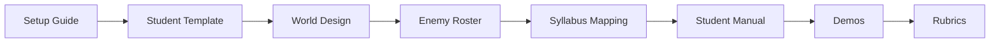

# 🧠 Legacy of InFest — Base de Conocimiento Obsidian

Bienvenido al **cerebro digital** del proyecto Legacy of InFest. Este vault de Obsidian contiene toda la documentación del framework académico de Gráficas por Computadora, Procesamiento de Imágenes, Visión por Computadora y Reconocimiento de Patrones.

---

## 📚 Capas de Documentación

El conocimiento está organizado en **4 capas**. Explora según tu rol:

### 🎓 Académica — *"¿Qué es este curso y cómo se evalúa?"*

| Documento | Descripción |
|-----------|-------------|
| [[77_SYLLABUS_ALIGNMENT_AUDIT.md|Syllabus Alignment Audit]] | Auditoría de alineación con el sílabo oficial |
| [[08_SYLLABUS_MAPPING.md|Syllabus Mapping]] | Mapeo de componentes del framework a unidades del sílabo |
| [[14_PROFESSOR_DELIVERABLE_MATRIX.md|Deliverable Matrix]] | Trazabilidad sílabo-framework-evaluación |
| [[21_COURSE_SCHEDULE.md|Course Schedule]] | Calendario de 11 clases + Invenio Fest |
| [[27_ACADEMIC_RUBRICS.md|Academic Rubrics]] | Criterios de calificación detallados |

### 🏗️ Análisis y Diseño — *"¿Qué estamos construyendo y por qué?"*

| Documento | Descripción |
|-----------|-------------|
| [[01_PROJECT_CHARTER.md|Project Charter]] | Alcance, visión, stakeholders |
| [[02_CODEX_CONTEXT.md|Codex Context]] | Filosofía del proyecto, reglas de código |
| [[16_WORLD_DESIGN.md|World Design]] | 4 zonas, 14 etapas, mapeo narrativo |
| [[17_BOSS_SPEC.md|Boss Spec]] | Diseño de los 4 jefes, fase por fase |
| [[18_ENEMY_ROSTER.md|Enemy Roster]] | Todos los enemigos estándar por zona |
| [[19_NARRATIVE_AND_LORE.md|Narrative & Lore]] | Historia, personajes, cultura Tilawa |
| [[20_ASSET_BIBLE.md|Asset Bible]] | Cada asset visual/auditivo, ruta, dimensiones |
| [[28_DECISION_LOG.md|Decision Log]] | ADRs: por qué cada decisión técnica |

### ⚙️ Implementación y Arquitectura — *"¿Cómo está estructurado el sistema?"*

| Documento | Descripción |
|-----------|-------------|
| [[03_ARCHITECTURE.md|Architecture]] | Estructura de carpetas, responsabilidades, flujo de datos |
| [[04_PLAYER_SPEC.md|Player Spec]] | Física, estados (25), combate |
| [[05_ENEMY_SPEC.md|Enemy Spec]] | Clase base + 8 tipos de enemigo |
| [[06_TMX_SPEC.md|TMX Spec]] | Formato de mapas, capas, objetos |
| [[07_STAGE0_DESIGN.md|Stage 0 Design]] | Escenario de referencia del profesor |
| [[09_HUD_SPEC.md|HUD Spec]] | Layout del HUD, corazones, timer |
| [[10_LIBRARIES_AND_DEPENDENCIES.md|Libraries]] | Cada librería externa, propósito, reglas |
| [[11_FILTER_TOOLS_SPEC.md|Filter Tools]] | Subsys. procesamiento de imágenes (Unidad VII) |
| [[12_VISION_TOOLS_SPEC.md|Vision Tools]] | Subsys. segmentación (Unidad VIII) |
| [[13_PATTERN_RECOGNITION_SPEC.md|Pattern Recognition]] | Subsys. ML (Unidad IX) |
| [[15_ACADEMIC_DEMO_SCENES.md|Academic Demos]] | 10+ laboratorios interactivos |

### 💻 Código y Build — *"¿Qué escribo, en qué orden, y cómo sé que está correcto?"*

| Documento | Descripción |
|-----------|-------------|
| [[22_API_CONTRACTS.md|API Contracts]] | Firmas exactas de funciones/clases |
| [[23_DATA_SCHEMAS.md|Data Schemas]] | Formas de datos entre módulos |
| [[24_TEST_PLAN.md|Test Plan]] | Casos de prueba por módulo |
| [[25_IMPLEMENTATION_ROADMAP.md|Implementation Roadmap]] | 16 fases de construcción con DoD |
| [[26_STUDENT_TEMPLATE_SPEC.md|Student Templates]] | Archivos iniciales que cada estudiante copia |
| [[29_GIT_WORKFLOW_AND_STANDARDS.md|Git Workflow]] | Ramas, commits, PRs, code review |
| [[80_TICKET_BACKLOG.md|Ticket Backlog]] | Tickets atómicos por fase del roadmap |

---

## 🧭 Lectura por Rol

### 👨‍🎓 Estudiante


- Comienza en: [[82_ENVIRONMENT_SETUP_GUIDE.md|Environment Setup Guide]]
- Sigue con: [[36_STUDENT_MANUAL.md|Student Manual]]
- Revisa: [[27_ACADEMIC_RUBRICS.md|Academic Rubrics]]

### 👨‍🏫 Profesor
- [[21_COURSE_SCHEDULE.md|Course Schedule]]
- [[27_ACADEMIC_RUBRICS.md|Academic Rubrics]]
- [[81_RISK_REGISTER.md|Risk Register]]

### 🤖 AI Coding Assistant
- [[00_MASTER_INDEX.md|Master Index]]
- [[02_CODEX_CONTEXT.md|Codex Context]]
- [[25_IMPLEMENTATION_ROADMAP.md|Implementation Roadmap]]

---

## 🗺️ Mapa de Tags

| Tag | Documentos Relacionados |
|-----|------------------------|
| `#academic` | Syllabus, rubrics, assignments, course schedule |
| `#architecture` | Architecture, codex, decision log |
| `#entity` | Player, enemy, boss specs |
| `#processing` | Filter tools, vision tools, pattern recognition |
| `#vfx` | Fog of war, water, transitions, cutscenes |
| `#student` | Student manual, templates, setup guide |
| `#assignment` | 4 assignments, rubrics |

---

*Este vault fue generado automáticamente el 2026-07-14. Para actualizar, ejecuta:*
```bash
python scripts/obsidianize.py
```
