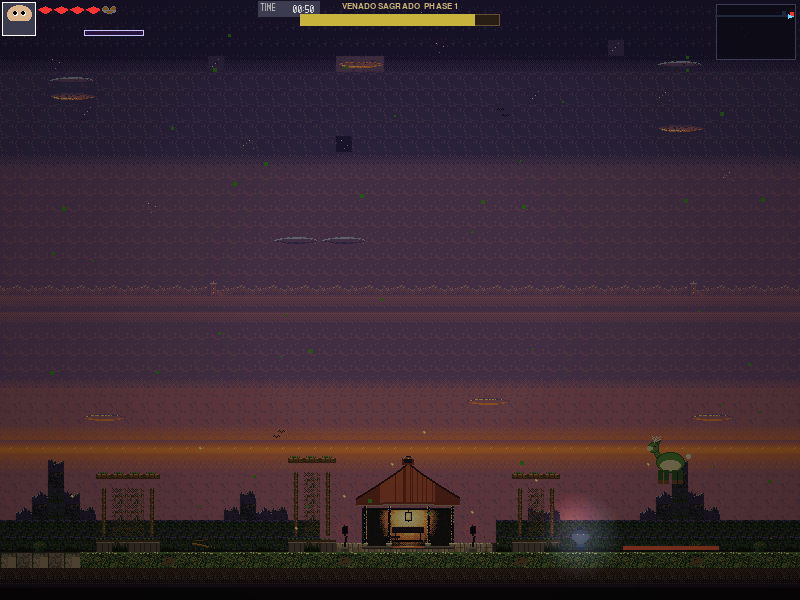
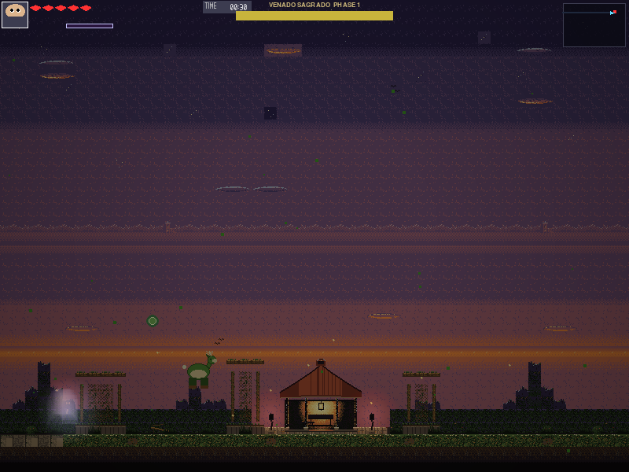
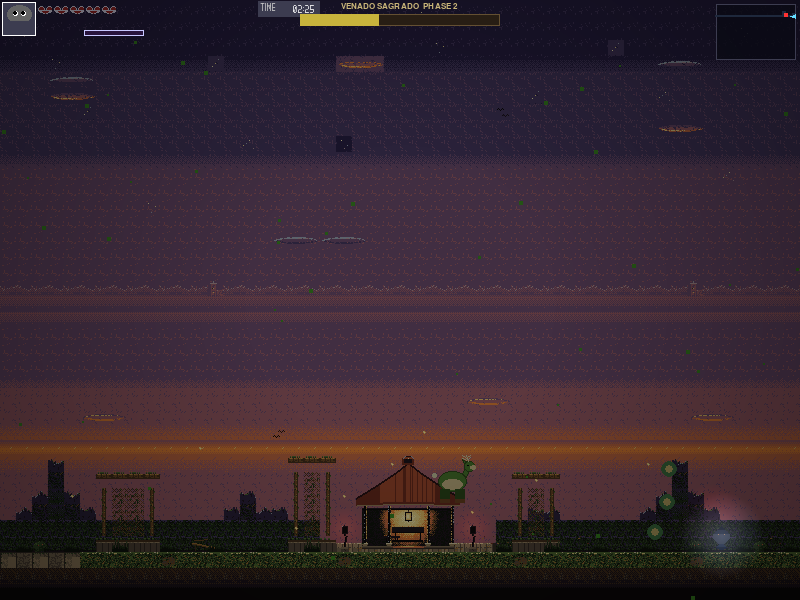

# El Venado Sagrado — Evaluación Práctica I

## Narrative Context

El Venado Sagrado es el espíritu de un venado cola blanca que el bosque reclamó como guardián de su umbral más íntimo: el gazebo al final de "Residencias al Crepúsculo". No ataca con malicia, sino con la certeza tranquila de algo que lleva ahí más tiempo que cualquier intruso. Mientras duerme (Fase 1, "El Bosque Duerme") flota en un drift senoidal suave, golpeando el suelo y embistiendo con el peso de un animal grande. Cuando su salud cae a la mitad despierta (Fase 2, "El Bosque Despierta"): abandona el vaivén tranquilo por un vuelo en figura-8 y añade barridos de liana y esporas al combate. La pelea completa ocurre en la arena del gazebo (x=2480–3264 del mapa), rodeada por los muros que el propio bosque levantó para contenerlo.

## Attack Patterns

| Ataque | Tipo | Daño | Cooldown | Ventana de castigo | Descripción |
| --- | --- | --- | --- | --- | --- |
| `STOMP` | melee (área en el suelo) | 1.0 | 3.0 s | 0.6 s (`STOMP_RECOVER`) | Telegraph rojo de 0.4 s; el venado se planta en el suelo (`GROUND_Y`) y abre una ventana de golpe de 0.35 s con un rectángulo de 96×8 px centrado en su posición. Tras disiparse la onda queda 0.6 s plantado, inofensivo y sin poder iniciar otro ataque: la ventana real para golpearlo. |
| `CHARGE` | melee (embestida) | 0.75 (daño de contacto de cuerpo, `damage_on_contact`) | 6.0 s | 1.0 s (`CHARGE_WALL_PAUSE`) | Telegraph de 0.35 s con dirección normalizada hacia el jugador (Unidad II); embiste a 220 px/s en Fase 1 o 280 px/s en Fase 2 mientras desciende a la banda de melee (`CHARGE_BAND_Y = 500`). Al chocar con la pared queda 1.0 s aturdido e inmóvil a esa misma altura golpeable, sin poder iniciar otro ataque. |
| `VINE_TOSS` | proyectil | 0.5 | 8.0 s | — | Lanza una liana por curva de Bézier cuadrática (3 puntos de control, 32 muestras) hacia la posición predicha del jugador. |
| `VINE_SWEEP` | melee (barrido de piso) | 0.5 | 5.0 s | — | Telegraph verde de 0.6 s a lo largo de todo el piso de la arena; abre una ventana de golpe de 0.4 s cubriendo el ancho completo de la arena. |
| `MUSHROOM_SPORE` | proyectil (abanico ×3) | 0.25 c/u | 10.0 s | — | Dispara 3 esporas normalizadas hacia el jugador con rotaciones de −15°/0°/+15° a 80 px/s; expiran a los 6.0 s o al superar 420 px de distancia euclidiana desde su origen. |

`STOMP_RECOVER` y `CHARGE_WALL_PAUSE` son ventanas de castigo dedicadas (`boss_venado.py`, líneas 39 y 42), añadidas después de la implementación inicial: el diseño clásico de boss es un ritmo ataque→apertura→castigo, y el venado reescrito, tal como quedó tras la Task 8, no dejaba ningún remanente golpeable — la onda de `STOMP` y la ventana de golpe eran la misma duración exacta, y el frenazo de `CHARGE` contra la pared entregaba el control de vuelta sin pausa. Estas dos constantes cierran ese hueco de jugabilidad (Hallazgo C de la bitácora QA interna del proyecto) sin tocar el daño ni el cooldown de ningún ataque.

## Phase Transitions

| Fase | HP | Movimiento | Comportamiento nuevo |
| --- | --- | --- | --- |
| 1 — El Bosque Duerme | 12.0–6.1 (100–51 %) | Drift senoidal (`BASE_Y = 460`, amplitud 40, frecuencia 0.4 Hz) | Patrones `STOMP`, `CHARGE`, `VINE_TOSS`; `speed_multiplier = 1.0` |
| 2 — El Bosque Despierta | ≤ 6.0 (50–0 %) | Trayectoria en figura-8 (Bézier grado 5, 64 muestras, recorrido ping-pong) | Patrones `VINE_SWEEP`, `MUSHROOM_SPORE`, `CHARGE`; `speed_multiplier = 1.5`; embestida a 280 px/s; anima con `frenzy_drift` |

La transición entre fases se dispara cuando `current_health <= 6.0` (el segundo `health_threshold` de `set_phases`), abre 2.5 s de invulnerabilidad (`transition_timer`) y dibuja el pulso HSV descrito en la Unidad V.

## Weak Points (puntos débiles — enriquecimiento opcional, no rúbrica oficial)

Adopción puntual de `boss_kit.WeakPoint`/`resolve_weak_point_damage` del boss de referencia del paquete V2 del profesor (diseño en la bitácora interna del proyecto, §3). **No forma parte de `17_BOSS_SPEC.md` §3** — es una capa extra sobre el diseño de combate oficial ya completo y evaluado, no una corrección de un requisito faltante.

| Punto débil | Offset (canónico, mirando a la derecha) | Tamaño | Multiplicador | Fases expuestas |
| --- | --- | --- | --- | --- |
| `cuernos` | (32, 0) | 14×10 | ×2.5 | todas |
| `flanco` | (9, 18) | 12×16 | ×1.8 | solo fase 2 (`current_phase == 1`, espejando el diseño del profesor) |

**Los offsets no son una traducción literal de la referencia.** El profesor declara sus puntos débiles sobre un `self.rect` de 36×44 (más ceñido que el sprite); el nuestro es el lienzo completo de 48×48. Una traducción ingenua (`offset_profesor + (6, 4)`) da `cuernos=(12, 4)` y `flanco=(2, 24)` — pero al verificarla pixel a pixel contra `assets/sprites/bosses/boss_venado_drift.png` (con una rejilla de 4 px superpuesta y bounding boxes por color exacto) esos números caen sobre el lomo/aire, no sobre el venado. Los valores finales de la tabla se midieron directamente sobre el sprite: la cornamenta (color crema `(200,200,180)`) ocupa `x∈[34,42], y∈[0,6]` en el frame 0 de `drift`/`charge`/`frenzy_drift` (misma posición en los tres — un solo offset estático sirve para las tres animaciones, igual que hace la referencia), y la grupa/flanco trasero (el lado opuesto a la cabeza, donde el jugador tiene que rodear al venado para golpear) queda en `x∈[9,21], y∈[18,34]`. Los rects de la tabla dan un pequeño margen alrededor de esas mediciones. Verificación visual: overlay de las dos cajas sobre `boss_venado_drift.png`/`_charge.png`, confirmando que `cuernos` cae sobre la cornamenta y `flanco` sobre la grupa, en ambas orientaciones (ver espejado abajo).

**Espejado con el facing.** El sprite se voltea horizontalmente cuando `facing_direction < 0` (`boss_base.py`, `pygame.transform.flip` dentro del mismo lienzo de 48 px), pero `boss_kit.WeakPoint.rect_for()` no tiene ningún concepto de facing — ni siquiera la referencia lo espeja (verificado: sus offsets son fijos en espacio mundo sin importar hacia dónde mire). Nuestro venado sí cambia de facing en combate real (los choques de `CHARGE` lo reorientan también en fase 2), así que sin espejar, un golpe a la cornamenta visualmente volteada resolvería contra el rect equivocado. `BossVenado._mirror_weak_point` refleja el offset X con la misma fórmula que implica `pygame.transform.flip`: `mirrored_x = ancho − offset_x − tamaño_x` (offset Y no cambia — el flip es solo horizontal). `apply_hit` arma la lista de puntos débiles ya espejada para el facing vigente antes de llamar a `resolve_weak_point_damage`.

**Hallazgo de motor — por qué no se usa `apply_hit_at`.** `apply_hit_at` (`boss_base.py`) es, en el papel, la API "oficial" para resolver daño con punto débil — pero nada en el flujo real de daño la llama nunca: el único call site real de melee (`collision_system.py::process_attack`, línea ~198) descarta el `hitbox` del swing del jugador y llama al `apply_hit(damage, source_position)` liso (verificado por grep exhaustivo sobre `game/src/`, cero call sites de `apply_hit_at` fuera de `boss_base.py`/`boss_kit.py`; ni siquiera el propio boss de referencia la usa). `self._player_ref` (el mismo objeto `Rect` del jugador, no una copia — `StageScene._update_gameplay` lo mantiene sincronizado cada frame vía `enemy.set_player_ref`) es el mejor proxy disponible de "dónde estaba el jugador al golpear" sin tocar ese archivo de motor. `BossVenado.apply_hit` llama a `resolve_weak_point_damage` directamente (función pura, sin riesgo de recursión) y delega el daño final a `super().apply_hit()` — una sola cadena, sin doble despacho, preservando cualquier invulnerabilidad/i-frame que esa cadena ya maneje (el multiplicador solo cambia el argumento `damage`, nunca se salta cómo se aplica).

**Feedback visual.** No reutiliza `Events.VFX_PARRY` (aunque está cableado) porque semánticamente significa "parry", no "punto débil acertado" — confundiría el lenguaje visual del juego. En su lugar, `_draw_weak_point_flash` dibuja un parpadeo breve (`WEAK_POINT_FLASH_DURATION = 0.12 s`) con `ColorTools.hsv_to_rgb` (mismo patrón que el pulso de transición de la Unidad V): el brillo decae con el temporizador en vez de cortar de golpe, sobre el rect real del punto débil acertado (recalculado cada frame contra `self.rect`, no congelado en la posición del golpe, para que siga al venado si sigue en movimiento).

## Academic Concepts Demonstrated

### Unidad I — Contexto

El motor corre un game loop clásico con `dt` fijo por frame, resolución interna real de **800×600** (`src/engine/core/settings.py`, `INTERNAL_WIDTH`/`INTERNAL_HEIGHT`) y renderiza el mapa "Residencias al Crepúsculo" de **3280×608 px** (205×38 tiles de 16 px). La cámara sigue al jugador salvo dentro de la arena del boss, donde `boss_venado_scene.py` la fija a la zona del gazebo (ver Unidad IV).

### Unidad II — Vectores (`math_utils`)

Toda la puntería del boss pasa por normalización de vectores:

```
d = (P_jugador − P_boss) / ‖P_jugador − P_boss‖
```

implementada con `vec2_normalize` (`src/engine/utils/math_utils.py`). Se usa en dos sitios:

- **`MUSHROOM_SPORE`** (`_do_mushroom_spore`): `d` apunta al jugador y produce la espora central; las dos laterales son `d.rotate(±15.0)` — el mismo vector normalizado, rotado ±15° en torno al origen del venado.
- **`CHARGE`** (`_do_charge`): `d` (solo componente X) define `_charge_direction`, la dirección de la embestida.

Las esporas expiran por **distancia euclidiana** desde su punto de origen, no por tiempo únicamente:

```
‖P − P_origen‖ > 420
```

calculada con `vec2_distance` contra `SPORE_RANGE = 420.0` (la expiración por vida útil, `SPORE_LIFETIME = 6.0 s`, es deliberadamente holgada: la distancia siempre gana primero).

`VINE_TOSS` predice el punto de impacto de la liana extrapolando la velocidad del jugador medio segundo hacia adelante:

```
P₂ = P_jugador + V_jugador · 0.5
```

(`VINE_PREDICT = 0.5`, en `_do_vine_toss`), usando `self._last_player_velocity` capturada cada frame en `_check_player_contact`.

### Unidad III — Curvas (`CurveTools`)

**Bézier cuadrática de la liana** (`_do_vine_toss`): 3 puntos de control — el hocico del venado (`muzzle`, desplazado 18 px hacia adelante y 6 px arriba del centro), un punto medio elevado 80 px sobre la línea hocico–blanco (`VINE_ARC_HEIGHT = 80.0`, da el arco de la liana) y el blanco predicho (`predicted`, Unidad II). Se evalúa con `CurveTools.bezier(pts, 32)` — 32 muestras sobre la base de Bernstein:

```
B(t) = (1−t)²P₀ + 2(1−t)t·P₁ + t²P₂
```

**Bézier grado 5 de la figura-8** (`_build_figure8_path`, Fase 2): 6 puntos de control repartidos entre `ARENA_X0` y `ARENA_X1` con desviaciones verticales de ±45 px sobre `BASE_Y`, evaluados con `CurveTools.bezier(pts, 64)` — 64 muestras. `_update_movement` recorre la trayectoria con `_bezier_t` incrementando `0.12·dt·speed_multiplier` por frame y **rebota** (`_bezier_dir` cambia de signo) en `t=0` y `t=1` en vez de saltar de vuelta al inicio — un recorrido ping-pong, no un ciclo.

**Drift senoidal** (Fase 1, `_update_movement`):

```
y = 460 + 40 · sin(2π · 0.4 · t)
```

con `BASE_Y = 460.0`, `SINE_AMPLITUDE = 40.0` y `SINE_FREQ = 0.4` Hz, acumulado sobre `self._elapsed`.

### Unidad IV — Representación de escena

El TMX de la arena (`assets/maps/boss_venado/boss_venado.tmx`) tiene las **8 capas** obligatorias (`BG_Far`, `BG_Mid`, `BG_Near`, `Terrain`, `Terrain_Detail`, `Objects`, `Collision`, `FG_Overlay`) y usa el tileset propio `tileset_residencias_crepusculo` de **266 tiles**.

El orden de dibujo combina dos mecanismos:

- **Y-sort del motor** (algoritmo del pintor): `drawing_system.py` acumula `(entidad, rect.centery)` para todas las entidades y checkpoints y las ordena (`drawables.sort(key=lambda x: x[1])`) antes de dibujarlas — el venado se intercala correctamente con el jugador y el resto de entidades según su posición vertical.
- **Orden explícito dentro del boss** (`BossVenado.draw`): dentro del propio venado, el orden es fijo — 1) cuerpo (sprite vía `BossBase.draw`), 2) telegraphs, 3) proyectiles, 4) VFX de color (pulso de transición), y el cráneo de la secuencia de muerte al final. Esto garantiza que un telegraph nunca quede tapado por un proyectil ni un proyectil por el propio cuerpo del boss.

**Política de cámara por zona**: `CameraLock` en el motor (`camera.py`) es un interruptor **global** — usa `any()` sobre toda la lista de locks e ignora el rect de cada uno. `BossVenadoScene` compensa esto desde la escena: `_locks_for_player_x` devuelve la lista original de locks del TMX solo cuando el jugador está dentro de la arena (`player_x >= ARENA_X0`) y una lista vacía fuera de ella, para que la cámara siga libremente al jugador en el resto del mapa y se fije en el gazebo durante la pelea. Además, `_sync_map_render` llama cada frame a `stage.map_layer.center(...)` (API pública de `pyscroll`) para compensar H-10: sin esta llamada el fondo del tilemap se queda pegado a su posición inicial aunque `camera.offset` sí avance correctamente para las entidades.

**Nota de contrato**: el objeto del boss en el TMX usa `type="BossVenado"` (convención del motor y del TMX de referencia del profesor). Desde AUD-259 el loader también acepta el tipo genérico `BossSpawn` con propiedad `boss="BossVenado"` (ver `06_TMX_SPEC.md` §4.2 y `23_DATA_SCHEMAS.md` §3.10): produce exactamente la misma entidad. Este mapa de referencia sigue usando `type="BossVenado"` directamente porque es anterior a AUD-259 y no había motivo para tocarlo.

### Unidad V — Color (`ColorTools`)

**Glow de proyectiles** (`_build_spore_glow`, construido **una sola vez** en `__init__` y cacheado en `self._spore_glow`): combina un halo verde y un núcleo claro con `ColorTools.alpha_blend(halo, core, 0.55)`, fórmula por canal:

```
C = α·src + (1−α)·dst
```

con `α = 0.55`. Al precomputarse una vez, `_draw_projectiles` solo hace un `blit` del resultado cacheado por frame — sin recalcular el blend en cada draw.

**Pulso de transición de fase** (`_draw_transition_pulse`, visible durante los 2.5 s de invulnerabilidad del cambio de fase): parte de un verde base convertido a HSV con `ColorTools.rgb_to_hsv(120, 220, 140)`, rota el tono a **144°/s** (`0.4 · 360`, porque `rgb_to_hsv` de este motor devuelve `h` en `[0, 360]`, no en `[0, 1]`) módulo 360°, y reconvierte con `ColorTools.hsv_to_rgb`. El resultado se dibuja como un anillo de radio `30 + 8·sin(12·t)` alrededor del venado — un halo que cambia de color mientras dura la transición.

**Flash de punto débil** (`_draw_weak_point_flash`, ver sección "Weak Points" arriba): mismo patrón HSV que el pulso de transición, pero como confirmación puntual de 0.12 s en vez de un halo continuo — `ColorTools.hsv_to_rgb(48.0, 0.9, 0.55 + 0.45·fade)` con `fade` decayendo linealmente con el temporizador, así el crítico se lee como un parpadeo que se apaga, no un tinte fijo.

## How to Run

Requisitos: Python ≥3.11 y las dependencias de `requirements.txt` (`pip install -r requirements.txt`; incluye `pygame-ce`, `numpy`, `opencv-python`, `pytmx`, `pyscroll`, entre otras). Todos los comandos se ejecutan desde la raíz de `legacyofInfest\`:

```
python main.py --boss boss_venado
```

Lanza directo la pelea contra El Venado Sagrado, sin pasar por el resto del juego: `main.py` importa `src.stages.boss_venado.boss_venado_scene` por convención de nombre (import dinámico), sin necesidad de que el stage esté registrado en `STAGE_ORDER`.

```
python main.py
```

Arranca el juego completo; el boss aparece en su posición normal dentro de la progresión de stages (`stage1_4_boss_venado` en `src/engine/core/stage_registry.py`), al final del mapa "Residencias al Crepúsculo".

## Screenshots

Capturas tomadas de una corrida automatizada del arnés QA del proyecto (bot competent, seed 1, 14400 frames), no renders ni mockups.



Fase 1 ("El Bosque Duerme"): el venado, con su cornamenta y silueta completa claramente distinguibles contra la franja anaranjada del horizonte crepuscular, todavía en pleno descenso hacia el suelo mientras el telegraph de `STOMP` (`_TELEGRAPH_WARN_COLOR = (230, 90, 60)`) ya marca en el pasto, bajo él, la franja de 96×4 px donde caerá el golpe. En el frame capturado el color se ve como un tono ladrillo/rojo apagado en vez del rojo crudo de la constante porque el compuesto de iluminación ambiental de la escena (Unidad V) atenúa toda la imagen antes de componerse el frame final; verificado a nivel de píxel: rectángulo sólido de 96×4 px (96 px de ancho, exactamente el tamaño del rect del telegraph) en `(115, 45, 27)` ±6, ausente en capturas fuera de la ventana de telegraph de este mismo `STOMP` — Unidad V (color) y Unidad IV (escena/cámara fija de la arena).



`VINE_TOSS` en pleno vuelo: la liana (el círculo con contorno dibujado proceduralmente descrito en "Visual / Audio Design", ya que el sprite `proyectil_vine` no se usa) se arquea por encima del venado, cuya silueta y cornamenta también se distinguen con claridad en este fotograma, siguiendo la curva de Bézier cuadrática evaluada por `CurveTools.bezier` hacia la posición predicha del jugador — Unidad III (curvas) apoyada en la predicción por vector de velocidad de la Unidad II.



Fase 2 ("El Bosque Despierta"): con el venado ya transformado, el halo verde cacheado de `_build_spore_glow` (`ColorTools.alpha_blend` sobre un halo y un núcleo claro) queda visible flotando sobre el césped de la arena tras un `MUSHROOM_SPORE` — Unidad V (color).

## Visual / Audio Design

Los sprites son los originales del RAR del profesor (48×48 px, 9 sheets: `drift`, `hurt`, `charge`, `stomp`, `vine`, `death`, `frenzy_drift`, `skull`, `proyectil_vine`); 8 de ellos se cargan por código (`_load_boss_sprites` carga los 6 fijos del framework — `drift`, `hurt`, `charge`, `stomp`, `vine`, `death` — y `_load_extra_sprites` añade `frenzy_drift` y `skull`), mientras que `proyectil_vine` queda sin consumir porque la liana se dibuja proceduralmente (círculo con contorno). Todo el VFX adicional es procedural: el glow de espora y el anillo de pulso HSV (Unidad V) y los telegraphs geométricos (barras, cuñas y franjas dibujadas con `pygame.draw`). La música de la pelea es `bgm_zone1_boss` (propiedad `bgm_track` del TMX). Los telegraphs de ataque se pintan en rojo (`_TELEGRAPH_WARN_COLOR = (230, 90, 60)`) y las ventanas de golpe activas en amarillo-verde (`(250, 220, 120)` para `STOMP`, `(140, 200, 110)` para `VINE_SWEEP`). Halo de luz de luna aditivo sobre el héroe (screen-space) para garantizar legibilidad de la silueta sobre la paleta crepuscular del mapa.

Cada ataque emite su propio evento SFX en el mismo punto de resolución donde ya emitía `Events.BOSS_ATTACK` (`STOMP`→`SFX_BOSSES_VENADO_STOMP`, `CHARGE`→`SFX_BOSSES_VENADO_CHARGE`, `VINE_TOSS`→`SFX_BOSSES_VENADO_VINE`). Como el motor solo trae 3 wavs del Venado, `VINE_SWEEP` y `MUSHROOM_SPORE` reutilizan `SFX_BOSSES_VENADO_VINE` — `VINE_SWEEP` lo hace en el instante en que se abre su ventana de golpe (sin emitir `BOSS_ATTACK` ahí, candado del Hallazgo D); `MUSHROOM_SPORE` sonando es una decisión propia distinta a la del profesor, cuya referencia deja esa espora muda por no tener un 4.º wav dedicado.

## Reflection

Lo más difícil no fue escribir la fórmula de Bézier, sino entender que evaluar la base de Bernstein en `n` muestras no es lo mismo que hacer `lerp` entre los puntos de control uno a uno — la curva de la liana y la figura-8 se ven suaves precisamente porque cada muestra pondera los tres (o seis) puntos a la vez, no solo los dos vecinos más cercanos. También aprendí por qué el orden de dibujo importa para que el combate se lea bien: si un proyectil se dibujara antes que su telegraph, el jugador perdería la advertencia justo cuando más la necesita, así que fijé un orden explícito (cuerpo → telegraphs → proyectiles → VFX) en vez de dejarlo al azar del Y-sort del motor. Por último, el `CameraLock` global del motor me obligó a resolver la cámara por zona desde la propia escena del boss en vez de tocar el motor: fue un buen recordatorio de que la "zona editable" no es una limitación arbitraria, sino lo que fuerza a diseñar soluciones que no dependan de romper el contrato del framework.
