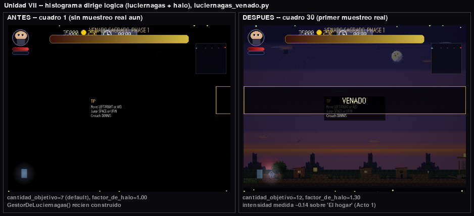
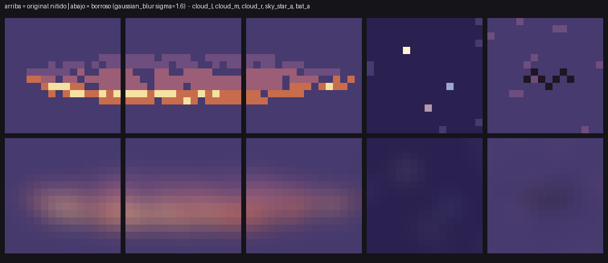
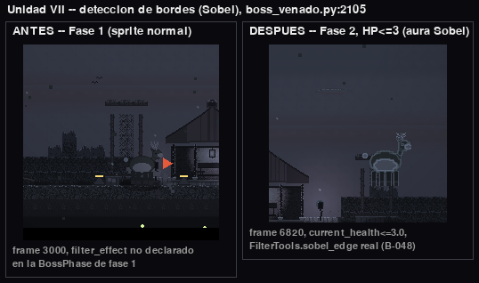
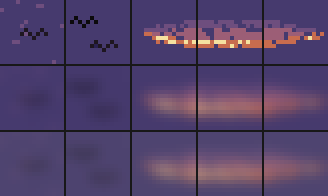
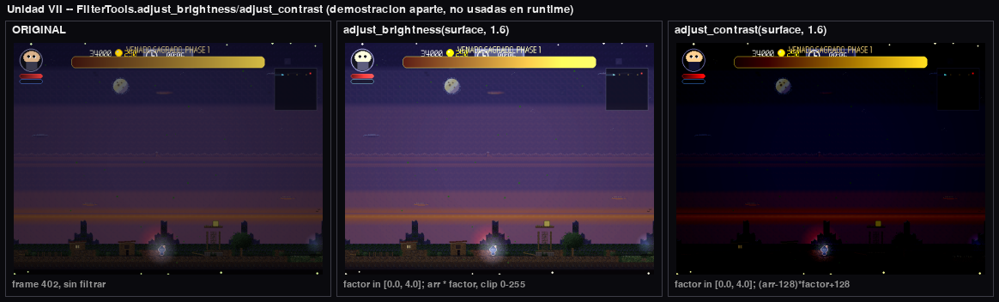

# El Venado Sagrado — Evaluación Práctica II

## Contexto narrativo

El Venado Sagrado es el espíritu de un venado cola blanca que el bosque reclamó como guardián de su umbral más íntimo: el gazebo al final de "Residencias al Crepúsculo". No ataca con malicia, sino con la certeza tranquila de algo que lleva ahí más tiempo que cualquier intruso. Mientras duerme (Fase 1, "El Bosque Duerme") flota en un drift senoidal suave, golpeando el suelo y embistiendo con el peso de un animal grande. Cuando su salud cae a la mitad despierta (Fase 2, "El Bosque Despierta"): abandona el vaivén tranquilo por un vuelo en figura-8 y añade barridos de liana y esporas al combate. La pelea completa ocurre en la arena del gazebo (x=2480–3264 del mapa), rodeada por los muros que el propio bosque levantó para contenerlo.

## Attack Patterns

| Ataque | Tipo | Daño | Cooldown | Ventana de castigo | Descripción |
| --- | --- | --- | --- | --- | --- |
| `STOMP` | melee (área en el suelo) | 1.0 | 3.0 s | 0.6 s (`STOMP_RECOVER`) | Telegraph rojo de 0.4 s; el venado se planta en el suelo (`GROUND_Y`) y abre una ventana de golpe de 0.35 s con un rectángulo de 96×8 px centrado en su posición. Tras disiparse la onda queda 0.6 s plantado, inofensivo y sin poder iniciar otro ataque: la ventana real para golpearlo. |
| `CHARGE` | melee (embestida) | 0.75 (daño de contacto de cuerpo, `damage_on_contact`) | 6.0 s | 1.0 s (`CHARGE_WALL_PAUSE`) | Telegraph de 0.35 s con dirección normalizada hacia el jugador (Unidad II); embiste a 220 px/s en Fase 1 o 280 px/s en Fase 2 mientras desciende a la banda de melee (`CHARGE_BAND_Y = 500`). Al chocar con la pared queda 1.0 s aturdido e inmóvil a esa misma altura golpeable, sin poder iniciar otro ataque. |
| `VINE_TOSS` | proyectil | 0.5 | 8.0 s | — | Lanza una liana por curva de Bézier cuadrática (3 puntos de control, 32 muestras) hacia la posición predicha del jugador. |
| `VINE_SWEEP` | melee (barrido de piso) | 0.5 | 5.0 s | 1.6 s (`SWEEP_ROOTED`) | Telegraph de 0.6 s (astas + grietas creciendo desde las pezuñas hacia ambos lados, anticipan de dónde sale el barrido y cuándo); durante el aviso el venado pica en diagonal hacia el jugador (`VEL_PICADO = 950` px/s) y aterriza a `ATERRIZAJE_BARRIDO = 110` px de él (B-039 opción C); al expirar el telegraph nacen dos `OleadaDeLianas` viajeras de 40×24 px que recorren cada una su mitad de la arena a 380 px/s hasta la pared o hasta golpear al jugador (0.5 de daño, una sola vez). Tras el paso el venado queda 1.6 s plantado e inofensivo (`SWEEP_ROOTED`, subido de 1.2 s por B-039) — la ventana real para golpearlo — y despega con una rampa suave (`SWEEP_DESPEGUE`, B-043). Pulido AAA 2026-08-21/22 y paquete game-feel 2026-08-23/24 (ver nota de diseño debajo de esta tabla). |
| `MUSHROOM_SPORE` | proyectil (abanico ×3) | 0.25 c/u | 10.0 s | — | Dispara 3 esporas normalizadas hacia el jugador con rotaciones de −15°/0°/+15° a 80 px/s; expiran a los 6.0 s o al superar 420 px de distancia euclidiana desde su origen. |

`STOMP_RECOVER` y `CHARGE_WALL_PAUSE` son ventanas de castigo dedicadas (`boss_venado.py`, líneas 111 y 108), añadidas después de la implementación inicial: el diseño clásico de boss es un ritmo ataque→apertura→castigo, y el venado reescrito, tal como quedó tras la Task 8, no dejaba ningún remanente golpeable — la onda de `STOMP` y la ventana de golpe eran la misma duración exacta, y el frenazo de `CHARGE` contra la pared entregaba el control de vuelta sin pausa. Estas dos constantes cierran ese hueco de jugabilidad (Hallazgo C de la bitácora QA interna del proyecto) sin tocar el daño ni el cooldown de ningún ataque.

## Phase Transitions

| Fase | HP | Movimiento | Comportamiento nuevo |
| --- | --- | --- | --- |
| 1 — El Bosque Duerme | 12.0–6.1 (100–51 %) | Drift senoidal (`BASE_Y = 460`, amplitud 40, frecuencia 0.4 Hz) | Patrones `STOMP`, `CHARGE`, `VINE_TOSS`; `speed_multiplier = 1.0` |
| 2 — El Bosque Despierta | ≤ 6.0 (50–0 %) | Trayectoria en figura-8 (Bézier grado 5, 64 muestras, recorrido ping-pong) | Patrones `VINE_SWEEP`, `MUSHROOM_SPORE`, `CHARGE`; `speed_multiplier = 1.5`; embestida a 280 px/s; anima con `frenzy_drift` |

La transición entre fases se dispara cuando `current_health <= 6.0` (el segundo `health_threshold` de `set_phases`), abre 2.5 s de invulnerabilidad (`transition_timer`) y dibuja el pulso HSV descrito en la Unidad V.

## Weak Points (puntos débiles — enriquecimiento opcional, no rúbrica oficial)

Adopción puntual de `boss_kit.WeakPoint`/`resolve_weak_point_damage` del boss de referencia del paquete V2 del profesor (diseño en la bitácora interna del proyecto, §3). **No forma parte de `17_BOSS_SPEC.md` §3** — es una capa extra sobre el diseño de combate oficial ya completo y evaluado, no una corrección de un requisito faltante.

| Punto débil | Offset (canónico, mirando a la derecha) | Tamaño | Multiplicador | Fases expuestas |
| --- | --- | --- | --- | --- |
| `cuernos` | (32, 0) | 14×10 | ×2.5 | todas |
| `flanco` | (9, 18) | 12×16 | ×1.8 | solo fase 2 (`current_phase == 1`, espejando el diseño del profesor) |

**Los offsets no son una traducción literal de la referencia.** El profesor declara sus puntos débiles sobre un `self.rect` de 36×44 (más ceñido que el sprite); el nuestro es el lienzo completo de 48×48. Una traducción ingenua (`offset_profesor + (6, 4)`) da `cuernos=(12, 4)` y `flanco=(2, 24)` — pero al verificarla pixel a pixel contra `assets/sprites/bosses/boss_venado_drift.png` (con una rejilla de 4 px superpuesta y bounding boxes por color exacto) esos números caen sobre el lomo/aire, no sobre el venado. Los valores finales de la tabla se midieron directamente sobre el sprite: la cornamenta (color crema `(200,200,180)`) ocupa `x∈[34,42], y∈[0,6]` en el frame 0 de `drift`/`charge`/`frenzy_drift` (misma posición en los tres — un solo offset estático sirve para las tres animaciones, igual que hace la referencia), y la grupa/flanco trasero (el lado opuesto a la cabeza, donde el jugador tiene que rodear al venado para golpear) queda en `x∈[9,21], y∈[18,34]`. Los rects de la tabla dan un pequeño margen alrededor de esas mediciones. Verificación visual: overlay de las dos cajas sobre `boss_venado_drift.png`/`_charge.png`, confirmando que `cuernos` cae sobre la cornamenta y `flanco` sobre la grupa, en ambas orientaciones (ver espejado abajo).

**Espejado con el facing.** El sprite se voltea horizontalmente cuando `facing_direction < 0` (`boss_base.py`, `pygame.transform.flip` dentro del mismo lienzo de 48 px), pero `boss_kit.WeakPoint.rect_for()` no tiene ningún concepto de facing — ni siquiera la referencia lo espeja (verificado: sus offsets son fijos en espacio mundo sin importar hacia dónde mire). Nuestro venado sí cambia de facing en combate real (los choques de `CHARGE` lo reorientan también en fase 2), así que sin espejar, un golpe a la cornamenta visualmente volteada resolvería contra el rect equivocado. `BossVenado._mirror_weak_point` refleja el offset X con la misma fórmula que implica `pygame.transform.flip`: `mirrored_x = ancho − offset_x − tamaño_x` (offset Y no cambia — el flip es solo horizontal). `apply_hit` arma la lista de puntos débiles ya espejada para el facing vigente antes de llamar a `resolve_weak_point_damage`.

**Hallazgo de motor — por qué no se usa `apply_hit_at`.** `apply_hit_at` (`boss_base.py`) es, en el papel, la API "oficial" para resolver daño con punto débil — pero nada en el flujo real de daño la llama nunca: el único call site real de melee (`collision_system.py::process_attack`, línea ~198) descarta el `hitbox` del swing del jugador y llama al `apply_hit(damage, source_position)` liso (verificado por grep exhaustivo sobre `game/src/`, cero call sites de `apply_hit_at` fuera de `boss_base.py`/`boss_kit.py`; ni siquiera el propio boss de referencia la usa). `self._player_ref` (el mismo objeto `Rect` del jugador, no una copia — `StageScene._update_gameplay` lo mantiene sincronizado cada frame vía `enemy.set_player_ref`) es el mejor proxy disponible de "dónde estaba el jugador al golpear" sin tocar ese archivo de motor. `BossVenado.apply_hit` llama a `resolve_weak_point_damage` directamente (función pura, sin riesgo de recursión) y delega el daño final a `super().apply_hit()` — una sola cadena, sin doble despacho, preservando cualquier invulnerabilidad/i-frame que esa cadena ya maneje (el multiplicador solo cambia el argumento `damage`, nunca se salta cómo se aplica).

**Feedback visual.** No reutiliza `Events.VFX_PARRY` (aunque está cableado) porque semánticamente significa "parry", no "punto débil acertado" — confundiría el lenguaje visual del juego. En su lugar, `_draw_weak_point_flash` dibuja un parpadeo breve (`WEAK_POINT_FLASH_DURATION = 0.12 s`) con `ColorTools.hsv_to_rgb` (mismo patrón que el pulso de transición de la Unidad V): el brillo decae con el temporizador en vez de cortar de golpe, sobre el rect real del punto débil acertado (recalculado cada frame contra `self.rect`, no congelado en la posición del golpe, para que siga al venado si sigue en movimiento).

## Adopción V3 (features del profesor + Reliquia — enriquecimiento opcional, no rúbrica oficial)

Misma categoría que los Weak Points de la sección anterior: capa extra sobre el diseño de combate ya completo y evaluado (`17_BOSS_SPEC.md` §3), no una corrección de un requisito faltante. El motor V3 del profesor (aplicado 2026-08-13) trae, en su propio boss de referencia (archivado en `LAB\reference\v3_boss_profesor`, solo lectura), cinco features nuevas más un ítem de progresión. Las cinco se reimplementaron **desde cero, en español, sobre este boss** — nunca copiadas de la referencia: se leyó solo para entender qué API del motor llamar, no cómo redactarla.

| Feature | Qué hace | Dónde |
| --- | --- | --- |
| `skill_drop` | Al morir, el venado suelta `skill_dash` y `skill_parry`. Atributo de CLASE, no de instancia: el test de contrato del profesor lo lee con `getattr(cls, "skill_drop")` sin instanciar al jefe. | `skill_drop = ["skill_dash", "skill_parry"]` |
| Esporas `EnjambreDeBalas` | Anillo de 12 proyectiles que se abre al ENTRAR a la fase 2, a 70 px/s, con huecos entre esporas para que el cambio de fase siga siendo esquivable. A diferencia de la referencia del profesor (donde `dano_total_contra` nunca se llama y las esporas quedan decorativas), aquí sí hacen daño real: 0.25 por espora, agregado en una sola llamada por frame para no perder golpes contra el cooldown de invulnerabilidad del jugador. | `self.esporas`, `_soltar_abanico_de_esporas()` |
| Voz | Líneas de audio en los momentos clave de la pelea (primer avistamiento del jugador, cada cambio de fase, muerte) vía un enganche opcional que la escena inyecta después de `on_enter()`. Sin mezclador conectado (tests, arnés headless) cada intento de hablar se descarta sin lanzar nada. | `self.audio_de_voz`, `_decir()` |
| `escala=1.25` en fase 2 | El cuerpo crece de 48 a 60 px al despertar, anclado por los pies y el centro (lo resuelve el motor). Compensación propia (histórica): ni `WeakPoint.rect_for()` ni las cajas de golpe del venado escalaban solas con el rect (hallazgo H-20, `reports\FINDINGS.md`) — se mantenían sincronizadas con el cuerpo visible a mano. **Actualizado 2026-08-26:** la mitad de esta compensación (hitbox/hurtbox) ya no aplica — ver "Adopción post-drop #6" más abajo; los puntos débiles siguen compensados a mano (B-050). | `set_phases(..., escala=1.25)`, `_factor_de_escala()` |
| Teletransporte de fase | Al abrir la ventana de invulnerabilidad del cambio de fase, el venado se reposiciona en mitad del gazebo en vez de continuar donde lo agarró el jugador. Compensación propia: el motor le entrega a todo `BossBase` el mapa ENTERO como arena (hallazgo H-19) — el destino real se calcula con las constantes de arena propias de la escena, nunca con las que el motor inyectó. | `_start_phase_transition()`, `_destino_de_teletransporte()` |

**"Fragmento de Reliquia 1"** (`17_BOSS_SPEC.md` §3.6, `docs\niveles\04_BOSS_1_4.md`): al terminar la secuencia de derrota — cuando la calavera termina de desvanecerse — el jefe levanta una sola vez su bandera de reliquia y la escena la lee para pintar un icono procedural de cornamenta con el nombre durante unos segundos. **El anuncio es mudo a propósito:** el efecto `SFX_BOSSES_RELIC_APPEAR` está cableado de punta a punta por el motor, pero el profesor lo mantiene reservado en la lista `AWAITING_THEIR_BOSS` de `tests\test_audio_wiring.py`, donde deja escrito que la recompensa del Venado «se resuelve por la escena de créditos» — emitirlo desde el jefe contradiría esa decisión suya y pondría en rojo su prueba de cableado de audio. **Límite honesto, verificado antes de escribir una línea de código:** no existe ninguna reliquia en el catálogo de objetos del motor (`inventory._ITEM_DEFS`), `Inventory.add()` rechaza cualquier id fuera de ese catálogo y el HUD no expone ninguna API para añadir iconos permanentes — meterla al catálogo real exigiría editar el motor, terreno prohibido. Así que se declara por lo que sí hace y nada más: **no entra al inventario, no da ningún bonus de estadística y no persiste entre partidas** — hoy esa limitación vive solo como comentario en el código (`boss_venado.py`, junto a `RELIQUIA_ID`/`RELIQUIA_NOMBRE`); queda anotada aquí para que quien lea el README la vea sin tener que abrir el archivo.

También se regeneraron en el TMX de la arena las propiedades de mapa que exige la especificación de niveles y jefes del profesor (`86_ESPECIFICACION_DE_NIVELES_Y_JEFES.md`): `schema_version=1`, `author`, `start_hour="night"`, `day_length=0` (jefe de Zona 1, pelea nocturna sin ciclo de día).

Diseño completo y los hallazgos que motivaron cada compensación (H-19, H-20): `docs\superpowers\specs\2026-08-14-adopcion-v3-h18-design.md`. Candados de regresión de esta sección: `src/stages/boss_venado/tests/test_adopcion_v3.py`.

## Adopción post-drop #6 (AUD-605/606 — enriquecimiento opcional, no rúbrica oficial)

Misma categoría que las dos secciones anteriores: capa extra sobre el diseño de combate ya completo y evaluado, no una corrección de un requisito faltante. El drop #6 del motor (2026-08-25, `origin/dev` `2ae7f26`) trajo dos features opt-in adoptadas aquí, que reemplazan parte de las compensaciones manuales de H-19/H-20 de la sección anterior:

- **`ArenaZone_01`** (`x=2480, y=0, w=784, h=608`), declarada en el TMX por el generador (`gen_level_residencias.py`): desde AUD-605 el motor entrega el rect de arena del jefe leyendo la primera `ArenaZone` que contiene su centro (`_arena_del_jefe`, `stage_scene.py:81-91`) en vez del mapa entero (comportamiento histórico de H-19). El override manual de la escena, `jefe.set_arena_bounds(pygame.Rect(ARENA_BOUNDS))` (`boss_venado_scene.py`, `on_enter`), ya no es estrictamente necesario para que el jefe reciba la arena correcta — pero se **conserva a propósito** como doble candado (decisión del dictamen 2026-08-26): sigue siendo la fuente de verdad si `ARENA_BOUNDS` y el rect del TMX alguna vez divergieran, y no cuesta nada mantenerlo.
- **`cajas_siguen_al_cuerpo = True`** (atributo de clase, `boss_venado.py`): con esta bandera (AUD-606) es el MOTOR quien escala hitbox/hurtbox junto con `self.rect` al crecer en fase 2 (`escala=1.25`), reemplazando el escalado manual que exigía H-20 (ver tabla de la sección anterior). **Los puntos débiles siguen compensados a mano (B-050, `REGISTRO-DE-BUGS.md`):** la fórmula de `boss_kit.WeakPoint.rect_for()` para resolver el rect de un punto débil es incorrecta a escala≠1 — espeja el offset canónico contra el ancho YA escalado en vez del ancho canónico, desalineando cuernos/flanco en fase 2 mirando a la izquierda (~15 px de desfase medido). `_escalar_weak_point`/`_resolver_punto_debil` (`boss_venado.py`) reproducen la fórmula correcta a mano (escalar primero, espejar después) en vez de delegar en `rect_for`. Un test canario, `test_canario_b050_rect_for_del_motor_desalinea_a_escala_no_uno` (`test_adopcion_v3.py`), está diseñado para **fallar** el día en que el profesor corrija el orden de `rect_for` en el motor — esa falla futura es la señal para retirar la compensación y adoptar la ruta directa del motor.

## Conceptos académicos demostrados

### Unidad I — Contexto

El motor corre un game loop clásico con `dt` fijo por frame, resolución interna real de **800×600** (`src/engine/core/settings.py`, `INTERNAL_WIDTH`/`INTERNAL_HEIGHT`) y renderiza el mapa "Residencias al Crepúsculo" de **3280×608 px** (205×38 tiles de 16 px). La cámara sigue al jugador salvo dentro de la arena del boss, donde `boss_venado_scene.py` la fija a la zona del gazebo (ver Unidad IV).

### Unidad II — Vectores (`math_utils`)

Toda la puntería del boss pasa por normalización de vectores:

```
d = (P_jugador − P_boss) / ‖P_jugador − P_boss‖
```

implementada con `vec2_normalize` (`src/engine/utils/math_utils.py`). Se usa en dos sitios:

- **`MUSHROOM_SPORE`** (`_do_mushroom_spore`): `d` apunta al jugador y produce la espora central; las dos laterales son `d.rotate(±15.0)` — el mismo vector normalizado, rotado ±15° en torno al origen del venado.
- **`CHARGE`** (`_do_charge`): `d` (solo componente X) define `_charge_direction`, la dirección de la embestida.

Las esporas expiran por **distancia euclidiana** desde su punto de origen, no por tiempo únicamente:

```
‖P − P_origen‖ > 420
```

calculada con `vec2_distance` contra `SPORE_RANGE = 420.0` (la expiración por vida útil, `SPORE_LIFETIME = 6.0 s`, es deliberadamente holgada: la distancia siempre gana primero).

`VINE_TOSS` predice el punto de impacto de la liana extrapolando la velocidad del jugador medio segundo hacia adelante:

```
P₂ = P_jugador + V_jugador · 0.5
```

(`VINE_PREDICT = 0.5`, en `_do_vine_toss`), usando `self._last_player_velocity` capturada cada frame en `_check_player_contact`.

### Unidad III — Curvas (`CurveTools`)

**Bézier cuadrática de la liana** (`_do_vine_toss`): 3 puntos de control — el hocico del venado (`muzzle`, desplazado 18 px hacia adelante y 6 px arriba del centro), un punto medio elevado 80 px sobre la línea hocico–blanco (`VINE_ARC_HEIGHT = 80.0`, da el arco de la liana) y el blanco predicho (`predicted`, Unidad II). Se evalúa con `CurveTools.bezier(pts, 32)` — 32 muestras sobre la base de Bernstein:

```
B(t) = (1−t)²P₀ + 2(1−t)t·P₁ + t²P₂
```

**Bézier grado 5 de la figura-8** (`_build_figure8_path`, Fase 2): 6 puntos de control repartidos entre `ARENA_X0` y `ARENA_X1` con desviaciones verticales de ±45 px sobre `BASE_Y`, evaluados con `CurveTools.bezier(pts, 64)` — 64 muestras. `_update_movement` recorre la trayectoria con `_bezier_t` incrementando `0.12·dt·speed_multiplier` por frame y **rebota** (`_bezier_dir` cambia de signo) en `t=0` y `t=1` en vez de saltar de vuelta al inicio — un recorrido ping-pong, no un ciclo.

**Drift senoidal** (Fase 1, `_update_movement`):

```
y = 460 + 40 · sin(2π · 0.4 · t)
```

con `BASE_Y = 460.0`, `SINE_AMPLITUDE = 40.0` y `SINE_FREQ = 0.4` Hz, acumulado sobre `self._elapsed`.

### Unidad IV — Representación de escena

El TMX de la arena (`assets/maps/boss_venado/boss_venado.tmx`) tiene las **8 capas** obligatorias (`BG_Far`, `BG_Mid`, `BG_Near`, `Terrain`, `Terrain_Detail`, `Objects`, `Collision`, `FG_Overlay`) y usa el tileset propio `tileset_residencias_crepusculo` de **266 tiles**.

El orden de dibujo combina dos mecanismos:

- **Y-sort del motor** (algoritmo del pintor): `drawing_system.py` acumula `(entidad, rect.centery)` para todas las entidades y checkpoints y las ordena (`drawables.sort(key=lambda x: x[1])`) antes de dibujarlas — el venado se intercala correctamente con el jugador y el resto de entidades según su posición vertical.
- **Orden explícito dentro del boss** (`BossVenado.draw`): dentro del propio venado, el orden es fijo — 1) cuerpo (sprite vía `BossBase.draw`), 2) telegraphs, 3) proyectiles, 4) VFX de color (pulso de transición), y el cráneo de la secuencia de muerte al final. Esto garantiza que un telegraph nunca quede tapado por un proyectil ni un proyectil por el propio cuerpo del boss.

**Política de cámara por zona**: `CameraLock` en el motor (`camera.py`) es un interruptor **global** — usa `any()` sobre toda la lista de locks e ignora el rect de cada uno. `BossVenadoScene` compensa esto desde la escena: `_locks_for_player_x` devuelve la lista original de locks del TMX solo cuando el jugador está dentro de la arena (`player_x >= ARENA_X0`) y una lista vacía fuera de ella, para que la cámara siga libremente al jugador en el resto del mapa y se fije en el gazebo durante la pelea. La compensación de H-10 (una llamada propia cada frame a `stage.map_layer.center(...)`, API pública de `pyscroll`, para que el fondo del tilemap siguiera a `camera.offset` en vez de quedarse pegado a su posición inicial) fue **retirada 2026-08-26** por redundante: el motor ya centra ese mismo fondo por su cuenta en cada cuadro, en tiempo de dibujo (`DrawingSystem._draw_stage_layers`, `drawing_system.py:573-579`, AUD-039), así que la llamada de la escena quedaba siempre pisada antes de que el cuadro llegara a pantalla. Evidencia del retiro: sonda A/B del 2026-08-25 (820 llamadas suprimidas, métrica del corredor prácticamente idéntica) y el candado observable `test_corridor_background_scrolls_with_camera` (H-31), diseñado para sobrevivir justo este retiro, sigue en verde sin la compensación.

**Nota de contrato**: el objeto del boss en el TMX usa `type="BossVenado"` (convención del motor y del TMX de referencia del profesor). El registro de `06_TMX_SPEC.md` §4.2 lista un tipo `BossSpawn` genérico que **no** está implementado por el loader real; `type="BossVenado"` es el valor que efectivamente instancia la clase.

### Unidad V — Color (`ColorTools`)

**Glow de proyectiles** (`_build_spore_glow`, construido **una sola vez** en `__init__` y cacheado en `self._spore_glow`): combina un halo verde y un núcleo claro con `ColorTools.alpha_blend(halo, core, 0.55)`, fórmula por canal:

```
C = α·src + (1−α)·dst
```

con `α = 0.55`. Al precomputarse una vez, `_draw_projectiles` solo hace un `blit` del resultado cacheado por frame — sin recalcular el blend en cada draw.

**Pulso de transición de fase** (`_draw_transition_pulse`, visible durante los 2.5 s de invulnerabilidad del cambio de fase): parte de un verde base convertido a HSV con `ColorTools.rgb_to_hsv(120, 220, 140)`, rota el tono a **144°/s** (`0.4 · 360`, porque `rgb_to_hsv` de este motor devuelve `h` en `[0, 360]`, no en `[0, 1]`) módulo 360°, y reconvierte con `ColorTools.hsv_to_rgb`. El resultado se dibuja como un anillo de radio `30 + 8·sin(12·t)` alrededor del venado — un halo que cambia de color mientras dura la transición.

**Flash de punto débil** (`_draw_weak_point_flash`, ver sección "Weak Points" arriba): mismo patrón HSV que el pulso de transición, pero como confirmación puntual de 0.12 s en vez de un halo continuo — `ColorTools.hsv_to_rgb(48.0, 0.9, 0.55 + 0.45·fade)` con `fade` decayendo linealmente con el temporizador, así el crítico se lee como un parpadeo que se apaga, no un tinte fijo.

### Unidad VI — Interpolación y eventos (`math_utils`, `EventBus`)

Tema del programa (`08_SYLLABUS_MAPPING.md` §7): "Texturas, animación, interpolación, colisiones, interacción". Criterio real de calificación (`27_ACADEMIC_RUBRICS.md` §5, línea 111, "Animación e interacción (Unidad VI)", 20 pts): *"Al menos una animación dirigida por función de easing (`ease_*` de `math_utils.py`, no `lerp` plano); una interacción propia mediada por `EventBus` más allá de la colisión estándar"*. Esta sección verifica y documenta dos piezas que ya existían en el código antes del nivel "La Peregrinación al Venado" (fix H-17, 2026-07-30) más una tercera añadida por ese mismo nivel — ninguna es trabajo nuevo de esta tarea, que es puramente de verificación con cita archivo:línea (Tarea 15, Paso 2 del plan).

#### Interpolación

`boss_venado_scene.py:164` importa `ease_in_out_quad`/`lerp` de `src/engine/utils/math_utils.py` (`lerp`: interpolación lineal clásica, `math_utils.py:52-55`; `ease_in_out_quad`: curva cuadrática simétrica, acelera en la primera mitad y frena en la segunda, `math_utils.py:75-78`). Dos sitios reales los usan, ninguno es interpolación lineal plana:

| Sitio | Qué anima | Curva | Ventana |
| --- | --- | --- | --- |
| `_pin_camera_to_arena` (`boss_venado_scene.py:476-538`) | `camera.offset.x`/`.y` al cruzar `ARENA_X0` hacia la arena del gazebo | `ease_in_out_quad` + `lerp` (línea 512: `eased_t = ease_in_out_quad(t)`; líneas 513-514: `lerp(inicio, objetivo, eased_t)`) | `ARENA_SETTLE_DURATION = 0.3 s` (línea 214) |
| `_actualizar_tramo_narrativo` (`boss_venado_scene.py:850-918`) | matriz de `color_grading` (vía `interpolar_grading`, que internamente reusa la misma curva — `tramos_venado.py:118-126`), alfa del tinte plano y viñeta, al avanzar entre los 4 actos del corredor | `ease_in_out_quad` (líneas 907, 910, 918) | `avance_en_tramo(x) ∈ [0, 1]` por acto (`tramos_venado.py:106-115`), ancho variable por acto (1040/480/960/800 px) |

`_pin_camera_to_arena` es la pieza que documenta el criterio "visualmente distinguible de lo lineal" del programa (§7.5): sus propios comentarios (líneas 500-505) registran que la versión anterior a H-17 hacía un *snap* duro (asignación directa, sin interpolar) y eso producía un salto de borde ("border-jump") de ~400 px en un solo cuadro — el reemplazo por `lerp`+`ease_in_out_quad` sobre 0.3 s es, literalmente, el fix de ese defecto, verificable jugando `python main.py --boss boss_venado` y cruzando a la arena.

#### Eventos

El boss no llama directamente a ningún otro sistema del juego (HUD, audio, cámara del jugador) — publica en el `EventBus` del motor (mismo patrón publicación/suscripción de `08_SYLLABUS_MAPPING.md` §7.2) y deja que cada suscriptor reaccione por su cuenta. Los 5 ataques oficiales siguen el mismo patrón exacto: emiten `Events.BOSS_ATTACK` con el kwarg `pattern` (nombre del ataque, el mismo string que usa la tabla "Attack Patterns" de arriba) y, cuando el ataque tiene una hitbox concreta en ese instante, `rect`, en el mismo punto de `boss_venado.py` donde resuelven su daño real — nunca antes (durante el telegraph) ni después (ya resuelto):

| Ataque | Línea (`boss_venado.py`) | Evento(s) emitidos |
| --- | --- | --- |
| `VINE_SWEEP` | 1122-1124 | `BOSS_ATTACK(pattern="VINE_SWEEP")` + `SFX_BOSSES_VENADO_VINE` |
| `STOMP` | 1282-1283 | `BOSS_ATTACK(pattern="STOMP", rect=self._stomp_rect)` + `SFX_BOSSES_VENADO_STOMP` |
| `CHARGE` | 1299-1300 | `BOSS_ATTACK(pattern="CHARGE", rect=self.rect)` + `SFX_BOSSES_VENADO_CHARGE` |
| `VINE_TOSS` | 1370-1371 | `BOSS_ATTACK(pattern="VINE_TOSS", rect=muzzle_rect)` + `SFX_BOSSES_VENADO_VINE` |
| `MUSHROOM_SPORE` | 1392-1397 | `BOSS_ATTACK(pattern="MUSHROOM_SPORE", rect=self.rect)` + `SFX_BOSSES_VENADO_VINE` |

`self._event_bus` es la misma instancia de `EventBus` que el resto del motor (heredada de `EnemyBase`/`BossBase` vía `context`, nunca una cola propia) — es una API de cola, no de llamada directa: un consumidor headless (como el arnés de playtest) tiene que llamar `event_bus.dispatch()` antes de `update()` en el mismo cuadro o el ataque parece "no haber emitido nada" (gotcha documentado en la memoria del proyecto, `eventbus-dispatch-headless-gotcha`). Los eventos `SFX_*` reutilizan exactamente este mismo mecanismo — no hay un segundo camino paralelo para audio.

### Unidad VII — Histograma, filtrado y detección de bordes (`FilterTools`)

Tema del programa (`08_SYLLABUS_MAPPING.md` §8): "Histograma, brillo, contraste, convolución, desenfoque gaussiano, Sobel, Canny". Criterios reales de calificación (`27_ACADEMIC_RUBRICS.md` §5, líneas 112-113): "Histograma/brillo/contraste (Unidad VII, parte 1)" (15 pts, citado completo debajo) y "Convolución/desenfoque/detección de bordes (Unidad VII, parte 2)" (20 pts): *"Se aplica al menos uno de `apply_kernel`/`gaussian_blur`/`sobel_edge`/`canny_edge` con una matriz de kernel documentada o justificación de parámetros"*. Las tres piezas siguientes (Tareas 12-14 del plan "La Peregrinación al Venado") cubren cada `[ ]` del checklist de Evaluación Práctica II en `docs/entregables/entregables.md`: histograma dirigiendo lógica, `apply_kernel`/`gaussian_blur` aplicado, y un resultado de detección de bordes — más una cuarta pieza, brillo/contraste: `adjust_brightness` se documenta como demostración externa (ver la subsección de abajo), pero desde el 2026-08-27 `adjust_contrast` SÍ tiene un uso real en el pipeline del boss — build-time, encadenado tras el `gaussian_blur` de la pieza de kernel/blur, como perspectiva atmosférica del atlas `BG_Far` que el TMX de la arena referencia hoy (ver "`adjust_contrast` aplicado — bruma de perspectiva atmosférica" más abajo).

#### Histograma dirigiendo lógica de juego — "La Hora de las Luciérnagas"

`luciernagas_venado.py` muestrea `FilterTools.compute_histogram(surface)` (`filter_tools.py:38-49`, canal `"luminance"`, 256 bins) sobre una copia de la superficie de mundo YA compuesta (`dibujar_mundo`, después de la luz), reescalada primero a `TAMANO_MUESTREO_REDUCIDO = (200, 150)` con `pygame.transform.smoothscale` — fix de rendimiento medido en este entorno: ~37 ms/llamada a 800×600 (más del presupuesto de un cuadro a 60 fps) contra ~2 ms/llamada sobre la copia reducida, con una diferencia máxima medida de 0.000428 frente al resultado a resolución completa (`calcular_intensidad` normaliza por `total_pixels`, `luciernagas_venado.py:113-134`). El muestreo real ocurre cada `FRECUENCIA_DE_MUESTREO = 30` cuadros (0.5 s a 60 fps, `luciernagas_venado.py:90`, vía `cada_n_frames` de `efectos_venado.py`) — nunca en cada cuadro.

La MISMA lectura de intensidad dirige DOS salidas de lógica real, no cosméticas — cumple textualmente el criterio "Histograma/brillo/contraste (Unidad VII, parte 1)" de `27_ACADEMIC_RUBRICS.md` §5 (línea 112): *"Se usa `FilterTools.compute_histogram()` para dirigir una decisión de lógica de juego (no puramente cosmética)"*; aquí son dos decisiones, no una sola:

| Salida | Función | Rango | Fórmula (lineal, deliberadamente sin curva oculta) |
| --- | --- | --- | --- |
| Cantidad de luciérnagas visibles | `luciernagas_objetivo` (`luciernagas_venado.py:137-143`) | 0-14 (`MAXIMO_LUCIERNAGAS`) | `round(14 − 14·intensidad)` |
| Factor de refuerzo del halo lunar del jugador | `factor_de_halo_objetivo` (`luciernagas_venado.py:146-157`) | 1.00-1.35 | `1.35 − 0.35·intensidad` |

Matriz de mapeo (evaluada directamente sobre las fórmulas de arriba, no estimada):

| intensidad | 0.0 (negro) | 0.14 | 0.25 | 0.5 | 0.75 | 1.0 (blanco) |
| --- | --- | --- | --- | --- | --- | --- |
| `luciernagas_objetivo` | 14 | 12 | 10 | 7 | 4 | 0 |
| `factor_de_halo_objetivo` | 1.35 | 1.30 | 1.26 | 1.18 | 1.09 | 1.00 |

`GestorDeLuciernagas.actualizar_desde_superficie` (`luciernagas_venado.py:176-196`) se llama una vez por cuadro desde `dibujar_mundo` (`boss_venado_scene.py:1321-1327`); `_dibujar_luciernagas` pinta `cantidad_objetivo` puntos aditivos en `dibujar_ui` (después de la niebla, antes del HUD del motor) y `dibujar_ui` reconstruye el halo del jugador con `_build_player_halo(factor_de_halo)` solo cuando el factor cambió (`boss_venado_scene.py:1453-1459`) — la reconstrucción cara (`pygame.draw.circle` por `PLAYER_HALO_RADIUS`) nunca ocurre más de una vez cada 0.5 s.



Dos capturas reales (bot `competent`, seed 1, `playtest.tools.filmstrip --cuando frame:1`/`frame:30`), NO recortadas ni retocadas más que reescaladas y compuestas lado a lado: en el cuadro 1 (`GestorDeLuciernagas()` recién construido, sin ningún muestreo real todavía) el estado es el default neutro — `cantidad_objetivo=7`, `factor_de_halo=1.00` — y la escena sigue apareciendo (fundido de entrada del motor); en el cuadro 30 (el primer muestreo real, todavía sobre el Acto 1 "El hogar") el histograma ya midió `intensidad≈0.14`, y el estado salta a `cantidad_objetivo=12`, `factor_de_halo=1.30` — el "antes/después" más limpio y honesto disponible del mecanismo activándose por primera vez, medido con `print()` directo sobre `self._gestor_luciernagas` en un script de instrumentación de una sola vez (no inventado). **Nota de diseño — desviación de la expectativa del plan:** el plan original de esta tarea esperaba una franja clara del Acto 1 con pocas luciérnagas contra una franja oscura del Acto 3 con muchas; medido en una corrida real de 8000 cuadros el resultado fue distinto: `cantidad_objetivo` se queda en 11-12 durante prácticamente todo el corredor (Actos 1-4), con una única transición real detectada, 12→11, al entrar al Acto 4 "Lo sagrado" (cuadro 7650, `x≈3217`) — el mapa entero es nocturno por diseño (`start_hour="night"`, TMX de la arena), así que la gradación de color por acto (`tramos_venado.TABLA`) cambia el TINTE, no lo suficiente el BRILLO PROMEDIO global, para mover el conteo discreto de forma dramática. El mecanismo sigue siendo real y dirigido por datos (verificado con los números de arriba, no una animación fija), solo que su rango efectivo medido en esta ambientación crepuscular es más angosto que lo que el plan anticipaba antes de medir.

#### Kernel documentado — desenfoque gaussiano (tiempo de generación, costo cero en runtime)

`tools/gen_tileset_bgfar_blur.py` pre-difumina, en tiempo de GENERACIÓN del tileset (no en cada partida), las tiles que `compose_sky()` usa en la capa `BG_Far` y empaqueta el resultado en un atlas nuevo vía el ayudante común `_generar_atlas` (`gen_tileset_bgfar_blur.py:122-160`, zona de creación permitida — nunca sobrescribe el original). El atlas puramente-blur que produce esta ruta (`generar_tileset_borroso` → `tileset_residencias_crepusculo_bgfar_blur.png`) quedó huérfano en disco desde el 2026-08-27: el TMX de la arena referencia hoy el atlas «bruma» — este mismo blur, encadenado además con una reducción de contraste (ver la pieza siguiente) — no este archivo. A diferencia del aura Sobel de abajo (que SÍ corre en runtime), esta pieza es una optimización deliberada: `BG_Far`/`BG_Mid`/`BG_Near` las renderiza un único `pyscroll.BufferedRenderer`, así que no hay forma de difuminar solo una capa sin tocar el motor — pre-difuminar en la generación cuesta CERO en runtime, ni una sola vez por partida.

`FilterTools.gaussian_blur(surface, sigma)` (`filter_tools.py:135-148`) no recibe una matriz N×N a mano como `apply_kernel` — delega en `scipy.ndimage.gaussian_filter(canal, sigma=sigma, mode="reflect")`, aplicado por separado a cada canal R/G/B. El filtro gaussiano 2D es separable: dos pasadas 1D (una por eje) con el kernel discreto

```
G[k] = exp(-k² / (2·sigma²)) / (sigma·√(2π)),   k = -r..r
```

normalizado para sumar 1.0. Con `SIGMA = 1.6` (`gen_tileset_bgfar_blur.py:95`) y el `truncate=4.0` por defecto de scipy (no expuesto por `FilterTools.gaussian_blur`):

```
r = int(4.0 · 1.6 + 0.5) = int(6.9) = 6
kernel 1D efectivo: 2·r + 1 = 13 muestras
huella 2D efectiva (dos pasadas 1D): 13×13 px
```

— cada píxel de salida promedia (con pesos gaussianos, no un promedio plano) un área de 13×13 alrededor suyo, casi el tile entero de 16×16: una estrella o un murciélago de fondo se vuelve una mancha de luz suave en vez de conservar su silueta, sin materializar una matriz 13×13 en memoria (la separabilidad la evita). `mode="reflect"` evita que las esquinas del tile se oscurezcan por fuga hacia un borde inexistente.



Captura real (no mockup), generada con un script de comparación de la Tarea 13 sobre el atlas real del tileset (no un test pytest — `tests/test_gaussian_blur_bgfar.py` valida el resultado por código, esta imagen es solo para inspección visual humana): fila superior = tile original nítido, fila inferior = el mismo tile tras `gaussian_blur(tile, 1.6)`, para 5 tiles reales de `BG_Far` (`cloud_l`, `cloud_m`, `cloud_r`, `sky_star_a`, `bat_a`).

Desde el 2026-08-27 este mismo mecanismo de blur se reusa, encadenado con una reducción de contraste, para hornear un segundo atlas — ver "`adjust_contrast` aplicado — bruma de perspectiva atmosférica" más abajo.

#### Sobel — aura de bordes de fase 2

La `BossPhase` de fase 2 declara `filter_effect="sobel"` (`boss_venado.py:479`) porque el contrato/rúbrica del profesor lo consulta como DATO. Pero `BossVenado._apply_filter` (`boss_venado.py:2017-2053`) neutraliza por completo el reemplazo opaco de `BossBase._apply_filter` — bug de motor B-048 (`docs/superpowers/REGISTRO-DE-BUGS.md`): el mecanismo del motor sustituye el sprite entero por `FilterTools.sobel_edge(frame)` cada `_APPLY_FILTER_EVERY_N_FRAMES` cuadros, y esa Surface (`pygame.surfarray.make_surface`) no tiene canal alfa — el tile entero (no solo la silueta) se vuelve opaco negro con bordes blancos durante ~1 cuadro cada ~83 ms (12 Hz), tapando lo que hubiera detrás. En vez de eso, `filter_effect="sobel"` se reinterpreta como una señal pura para nuestro propio pipeline:

- `_aura_activa()` (`boss_venado.py:2055-2067`): la aura solo se activa si la fase actual declara `filter_effect == "sobel"` **y** `current_health <= 3.0` — fiel a la ficha de nivel del profesor (`docs/niveles/04_BOSS_1_4.md:26` / `66_GUIA_DE_LEVEL_DESIGN.md:451`: "parpadeo sobel al bajar de 3 corazones").
- `_construir_aura_de_bordes(frame)` (`boss_venado.py:2080-2121`): `bordes = FilterTools.sobel_edge(frame)` (línea 2105) — **el Sobel real del motor, invocado de verdad**, no una imitación. La magnitud del borde (escala de grises, R=G=B) se combina con el alfa original del sprite (`fraccion = (magnitud/255)·(alfa/255)`) para reconstruir un overlay premultiplicado (`_AURA_COLOR_BORDES = (150, 230, 210)`, línea 313) que solo pinta sobre la silueta real, nunca un rectángulo opaco.
- `_dibujar_aura_de_bordes` (`boss_venado.py:2123-2165`) recalcula la parte cara (la llamada a `cv2` dentro de `sobel_edge`) solo cada `_CADENCIA_RECOMPUTO_AURA = 5` cuadros (línea 322) y cachea el resultado entre recómputos; la intensidad del pulso (`_intensidad_pulso_aura`, línea 2069-2078: `0.7 + 0.3·sin(2π·3·t)`, rango efectivo tras el recorte del veredicto de la Tarea 14 en `[0.4, 1.0]`) se aplica en cada cuadro sobre la base cacheada, para que el aura "respire" a 3 Hz sin recalcular Sobel en cada cuadro.



Dos capturas reales (bot `competent`, seed 1, recorte centrado en el boss): cuadro 3000 en fase 1 (ningún `filter_effect` declarado ahí, sprite normal) contra cuadro 6820 en fase 2 con `current_health<=3.0` (contorno Sobel visible, verde-azulado, pulsando; verificado por estado real del jefe — `_aura_activa()=True`, `_ventana_de_castigo_abierta()=False`, sin telegraph ni transición de fase activos en ese cuadro exacto — para no volver a capturar por accidente el dorado de `SenalDeCastigo`, como ocurrió con el cuadro 6600 original).

#### `adjust_contrast` aplicado — bruma de perspectiva atmosférica (build-time)

Intención de diseño: además de perder nitidez con la distancia, los planos lejanos de una escena real pierden contraste local — perspectiva atmosférica (o "aérea"), el mismo efecto que hace que una cordillera lejana se vea más plana y grisácea que una cercana. En un nivel nocturno de crepúsculo como "Residencias al Crepúsculo" (`start_hour="night"`, TMX de la arena) esa pérdida de contraste en el fondo (`BG_Far`) refuerza la sensación de profundidad sin tocar una sola línea de combate.

**Pipeline real (build-time, `tools/gen_tileset_bgfar_blur.py`).** `generar_tileset_bruma` (`gen_tileset_bgfar_blur.py:177-188`) reusa el mismo recorte/empaquetado de la pieza de kernel/blur de arriba (`_generar_atlas`, líneas 122-160), pero encadena DOS transformaciones por tile en vez de una (`_tile_con_bruma`, líneas 185-187): primero `FilterTools.gaussian_blur(tile, SIGMA)` (el mismo `SIGMA = 1.6` de la pieza anterior, línea 95) y DESPUÉS `FilterTools.adjust_contrast(borroso, CONTRASTE_BRUMA)`, con `CONTRASTE_BRUMA = 0.85` (línea 107) — siempre en ese orden, nunca como sustituto del blur.

`FilterTools.adjust_contrast(surface, factor)` (`filter_tools.py:85-95`) valida `factor ∈ [0.0, 4.0]` (líneas 87-88) y aplica, por canal:

```
v' = clip((v − 128) · factor + 128, 0, 255)
```

(línea 90). Con `factor = 0.85 < 1.0` cada canal se comprime hacia el gris medio (128): lo oscuro se aclara levemente y lo claro se oscurece levemente, reduciendo el contraste local sin aplanarlo del todo (un factor cercano a 0.0 sí lo aplanaría a un gris casi uniforme).

**Por qué build-time:** el mismo argumento que la pieza de kernel/blur de arriba — `BG_Far`/`BG_Mid`/`BG_Near` las renderiza un único `pyscroll.BufferedRenderer`, sin forma de aplicar el filtro solo a una capa sin tocar el motor — hornear el atlas una vez en tiempo de generación cuesta CERO en runtime, ni siquiera una vez por partida. El atlas resultante, `tileset_residencias_crepusculo_bgfar_bruma.png`, es el que el TMX de la arena referencia hoy en `BG_Far` (`gen_level_residencias.py`, `TILESET_BRUMA_NAME`); el atlas solo-blur de la pieza anterior quedó huérfano en disco (sin ningún GID apuntándole, pendiente de decisión de borrado del usuario).



Captura real (no mockup), compuesta directamente desde los atlas reales en disco (lo que el juego consume, no un render aparte): panel de 3 filas × 5 tiles (escala ×4) para `bat_a`, `bat_b`, `cloud_l`, `cloud_m`, `cloud_r` — fila 1 = tile original nítido, fila 2 = tras `gaussian_blur(σ=1.6)`, fila 3 = tras blur + `adjust_contrast(0.85)` (la bruma). La desviación estándar de luminancia por tile, medida directamente, baja en cada paso: original `[24.01, 25.64, 35.67, 39.30, 31.74]` → blur `[21.74, 21.51, 24.14, 25.79, 22.94]` → bruma `[18.43, 18.31, 20.49, 21.90, 19.49]`; sobre el atlas completo la desviación estándar pasa de 47.98 (blur) a 46.17 (bruma) — la reducción de contraste es medible, no solo visual.

**Nota histórica.** La primera versión de esta pieza (2026-08-24, campaña "La Peregrinación al Venado") documentaba `adjust_brightness`/`adjust_contrast` juntos solo como demostración de instrumentación externa, sin uso real en el runtime del boss. La captura de esa demo se conserva referenciada, como demostración complementaria de `adjust_brightness` (que sigue sin uso real horneado en el boss), para que no quede huérfana y el par brillo/contraste quede completo:



Panel izquierdo: original sin filtrar. Panel central: `adjust_brightness(surface, 1.6)` (`filter_tools.py:72-82`, `factor ∈ [0.0, 4.0]`: `arr·factor`, recortado a `[0, 255]`) — cada canal RGB multiplicado por 1.6 y recortado, la escena se aclara de forma pareja. Panel derecho: `adjust_contrast(surface, 1.6)` — mismo factor de demostración (distinto del `CONTRASTE_BRUMA = 0.85` del uso real de arriba), cada canal se aleja de 128 por igual, así que lo que ya era oscuro se oscurece más y lo que ya era claro se aclara más (visible en la franja del horizonte, que gana contraste marcadamente frente al cielo casi negro). El 2026-08-27, por decisión de diseño (dictamen doc-guardian AMARILLO, plan "Cierre de brechas del Entregable 2"), `adjust_contrast` pasó a tener, además de esta demo, el uso real horneado descrito arriba.

## Cómo ejecutar

Requisitos: Python ≥3.11 y las dependencias de `requirements.txt` (`pip install -r requirements.txt`; incluye `pygame-ce`, `numpy`, `opencv-python`, `pytmx`, `pyscroll`, entre otras). Todos los comandos se ejecutan desde la raíz de `legacyofInfest\`:

```
python main.py --boss boss_venado
```

Lanza directo la pelea contra El Venado Sagrado, sin pasar por el resto del juego: `main.py` importa `src.stages.boss_venado.boss_venado_scene` por convención de nombre (import dinámico), sin necesidad de que el stage esté registrado en `STAGE_ORDER`.

```
python main.py
```

Arranca el juego completo; el boss aparece en su posición normal dentro de la progresión de stages (`stage1_4_boss_venado` en `src/engine/core/stage_registry.py`), al final del mapa "Residencias al Crepúsculo".

## Capturas de pantalla

Capturas tomadas de una corrida automatizada del arnés QA del proyecto (bot competent, seed 1, 14400 frames), no renders ni mockups.


Fase 1 ("El Bosque Duerme"): el venado, con su cornamenta y silueta completa claramente distinguibles contra la franja anaranjada del horizonte crepuscular, todavía en pleno descenso hacia el suelo mientras el telegraph de `STOMP` (`_TELEGRAPH_WARN_COLOR = (230, 90, 60)`) ya marca en el pasto, bajo él, la franja de 96×4 px donde caerá el golpe. En el frame capturado el color se ve como un tono ladrillo/rojo apagado en vez del rojo crudo de la constante porque el compuesto de iluminación ambiental de la escena (Unidad V) atenúa toda la imagen antes de componerse el frame final; verificado a nivel de píxel: rectángulo sólido de 96×4 px (96 px de ancho, exactamente el tamaño del rect del telegraph) en `(115, 45, 27)` ±6, ausente en capturas fuera de la ventana de telegraph de este mismo `STOMP` — Unidad V (color) y Unidad IV (escena/cámara fija de la arena).


`VINE_TOSS` en pleno vuelo: la liana (el círculo con contorno dibujado proceduralmente descrito en "Visual / Audio Design", ya que el sprite `proyectil_vine` no se usa) se arquea por encima del venado, cuya silueta y cornamenta también se distinguen con claridad en este fotograma, siguiendo la curva de Bézier cuadrática evaluada por `CurveTools.bezier` hacia la posición predicha del jugador — Unidad III (curvas) apoyada en la predicción por vector de velocidad de la Unidad II.


Fase 2 ("El Bosque Despierta"): con el venado ya transformado, el halo verde cacheado de `_build_spore_glow` (`ColorTools.alpha_blend` sobre un halo y un núcleo claro) queda visible flotando sobre el césped de la arena tras un `MUSHROOM_SPORE` — Unidad V (color).

## Visual / Audio Design

Los sprites son los originales del RAR del profesor (48×48 px, 9 sheets: `drift`, `hurt`, `charge`, `stomp`, `vine`, `death`, `frenzy_drift`, `skull`, `proyectil_vine`); 8 de ellos se cargan por código (`_load_boss_sprites` carga los 6 fijos del framework — `drift`, `hurt`, `charge`, `stomp`, `vine`, `death` — y `_load_extra_sprites` añade `frenzy_drift` y `skull`), mientras que `proyectil_vine` queda sin consumir porque la liana se dibuja proceduralmente (círculo con contorno). Todo el VFX adicional es procedural: el glow de espora y el anillo de pulso HSV (Unidad V) y los telegraphs geométricos (barras, cuñas y franjas dibujadas con `pygame.draw`). La música de la pelea es `bgm_zone1_boss` (propiedad `bgm_track` del TMX). Los telegraphs de ataque se pintan en rojo (`_TELEGRAPH_WARN_COLOR = (230, 90, 60)`, reutilizado también por las estrellitas de aturdimiento del choque de `CHARGE` y el filo de aviso de `VINE_SWEEP`) y las ventanas de golpe activas en amarillo-verde (`(250, 220, 120)` para `STOMP`, `(140, 200, 110)` para la cresta de `VINE_SWEEP`). El pulido AAA de fase 2 (2026-08-21/22, ver párrafo siguiente) reutiliza el mismo `(250, 220, 120)` dorado para `SenalDeCastigo`, la señal universal de ventana de castigo — un solo color para "esto es golpeable" sin importar qué ataque abrió la ventana. Halo de luz de luna aditivo sobre el héroe (screen-space) para garantizar legibilidad de la silueta sobre la paleta crepuscular del mapa.

**Pulido AAA de fase 2 (2026-08-21/22).** Todo el VFX de impacto vive en
`efectos_venado.py`, un módulo hermano puro (solo `pygame.draw` + estado
propio, cero acceso al motor) inyectado en la escena vía el puerto
`EfectosDelEscenario` (`conectar_efectos`, cableado en
`BossVenadoScene.on_enter`). `STOMP` gana sacudida de cámara
(`sacudir(4.0, 0.2, ...)`), polvo dirigido, hojas, un destello blanco de 2
fotogramas y una cresta de tierra que reemplaza la raya/barra planas
originales (el rect de daño de 96×8px y los tres tiempos oficiales no
cambiaron). `MUSHROOM_SPORE` gana una corona que se hincha en el aviso y
una nube de esporas al expirar o impactar. `CHARGE` de fase 2 gana polvo
raspado en el aviso, fantasmas de sprite (`EstelaDeFantasmas`) + polvo de
pezuñas en la carrera y sacudida (`sacudir(3.0, 0.15, ...)`) + escombros +
estrellitas de aturdimiento en el choque con la pared (los tres exclusivos
de la fase 2 — en fase 1 la embestida no lleva este pulido, por decisión
de diseño). Una única señal universal, `SenalDeCastigo` (anillo de
contorno de 1px calculado por máscara de alfa — `dilatar(mascara, 8
vecinos) AND NOT mascara` — pulsante, aditivo, con un solo blit),
marca toda ventana de castigo estacionaria del boss sin importar cuál de
los tres ataques la abrió. `VINE_SWEEP` fue rediseñado en la misma
campaña: en vez de una franja estática de ancho completo, dos
`OleadaDeLianas` viajeras nacen a los lados del centro del venado y
recorren la arena hasta la pared o hasta golpear (ver tabla de arriba y
la nota de diseño debajo de ella).

> **Nota de diseño — desviación geométrica del spec §3:** el `VINE_SWEEP`
> descrito arriba se implementa como dos hitboxes viajeras de 40×24px que
> recorren el ancho completo de la arena a 380px/s, en vez de un único
> rectángulo estático de ancho completo instantáneo. Es una desviación
> consciente del texto literal de `17_BOSS_SPEC.md` §3 ("hitbox de ancho
> completo"): el ataque sigue cubriendo el ancho completo de la arena en
> su recorrido y sigue siendo "a ras de suelo, se evita saltando" — solo
> la forma de presentarlo pasó de instantánea a legible en el tiempo.
> Registrado en
> `docs\superpowers\specs\2026-08-21-boss-aaa-fase2-stomp-design.md` §4.
>
> **Nota de diseño — el emisor real es `"venado"`, no `"hits"` (spec
> §3.3):** el diseño (`2026-08-21-boss-aaa-fase2-stomp-design.md` §3.3)
> describe las partículas/sacudidas del pulido como emitidas bajo un
> identificador `"hits"`; la implementación real (`BossVenadoScene`,
> `EfectosDeLaEscena`) las emite bajo `"venado"` — el mismo puerto
> `EfectosDelEscenario` ya en uso desde la Parte 1 para la oleada de
> lianas, sin crear un segundo canal solo para el pulido de esta parte.
> Desviación deliberada de nomenclatura, no de comportamiento: todas las
> ráfagas/sacudidas de este documento pasan por el mismo puerto y los
> mismos candados de despacho real.
>
> **Nota de diseño — correcciones visuales tras la inspección ocular
> (2026-08-22):** el coordinador revisó con zoom (×3) los filmstrips del
> pulido AAA y encontró tres defectos que los candados por píxel no podían
> juzgar. (1) `SenalDeCastigo` blanqueaba el cuerpo entero y estroboscopeaba
> — la silueta completa dorada en 4 compensaciones de 1px, aditiva, saturaba
> a blanco (la técnica del motor solo funciona porque dibuja el frame real
> ENCIMA de esas 4 siluetas; en el overlay post-luz no hay frame que las
> tape). Se rediseñó a un anillo de contorno de 1px por máscara de alfa,
> un solo blit, pulso en `[0.2, 1.0]` que nunca se apaga — ver B-037/B-038
> en `docs\superpowers\REGISTRO-DE-BUGS.md`. (2) Las "estelas" del motor
> (`TrailSystem.capture_at`) son rectángulos de color plano del tamaño del
> jefe, no copias del sprite — durante el aviso de `STOMP` ese rectángulo
> tapaba casi todo el ciervo. Se eliminó ese uso y se creó
> `EstelaDeFantasmas`, copias reales del sprite vivo teñidas de verde
> liana, usadas solo en la embestida de fase 2. (3) El tinte amarillo de
> `is_transitioning` del motor (`BossBase.draw()`) suma alfa sobre TODO el
> rect del frame, incluidos los píxeles transparentes — el jefe se veía
> como un cuadrado amarillo semitransparente durante la transición de
> fase. Compensado en `BossVenado.draw()`: mientras dura la transición no
> se llama a `super().draw()`, se pinta una copia teñida (alfa 0 en el
> relleno, así que lo transparente sigue transparente) del frame vivo —
> ver B-038 en el registro de bugs.

Cada ataque emite su propio evento SFX en el mismo punto de resolución donde ya emitía `Events.BOSS_ATTACK` (`STOMP`→`SFX_BOSSES_VENADO_STOMP`, `CHARGE`→`SFX_BOSSES_VENADO_CHARGE`, `VINE_TOSS`→`SFX_BOSSES_VENADO_VINE`, `VINE_SWEEP`→`SFX_BOSSES_VENADO_VINE`). Como el motor solo trae 3 wavs del Venado, `VINE_SWEEP` y `MUSHROOM_SPORE` reutilizan `SFX_BOSSES_VENADO_VINE` — `VINE_SWEEP` lo hace en el instante en que dispara las dos oleadas viajeras (actualización 2026-08-21, pulido AAA: retirado el candado del Hallazgo D que protegía al Dodger viejo — el ataque ahora SÍ emite su propio `BOSS_ATTACK` con `pattern="VINE_SWEEP"`, en la misma llamada que el SFX; ver B-033 en `docs\superpowers\REGISTRO-DE-BUGS.md`); `MUSHROOM_SPORE` sonando es una decisión propia distinta a la del profesor, cuya referencia deja esa espora muda por no tener un 4.º wav dedicado.

## Reflection

Lo más difícil no fue escribir la fórmula de Bézier, sino entender que evaluar la base de Bernstein en `n` muestras no es lo mismo que hacer `lerp` entre los puntos de control uno a uno — la curva de la liana y la figura-8 se ven suaves precisamente porque cada muestra pondera los tres (o seis) puntos a la vez, no solo los dos vecinos más cercanos. También aprendí por qué el orden de dibujo importa para que el combate se lea bien: si un proyectil se dibujara antes que su telegraph, el jugador perdería la advertencia justo cuando más la necesita, así que fijé un orden explícito (cuerpo → telegraphs → proyectiles → VFX) en vez de dejarlo al azar del Y-sort del motor. Por último, el `CameraLock` global del motor me obligó a resolver la cámara por zona desde la propia escena del boss en vez de tocar el motor: fue un buen recordatorio de que la "zona editable" no es una limitación arbitraria, sino lo que fuerza a diseñar soluciones que no dependan de romper el contrato del framework.
