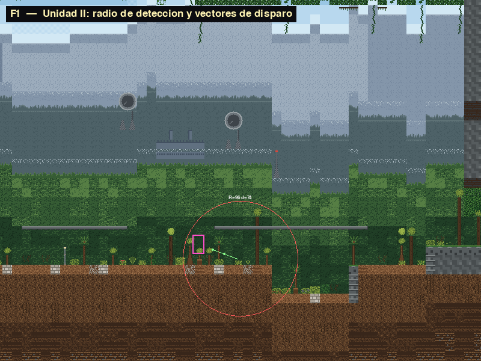
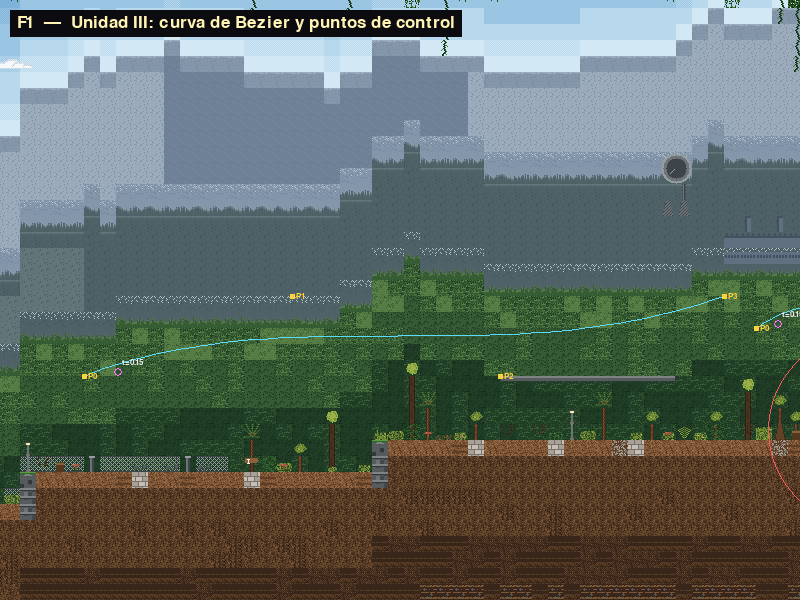
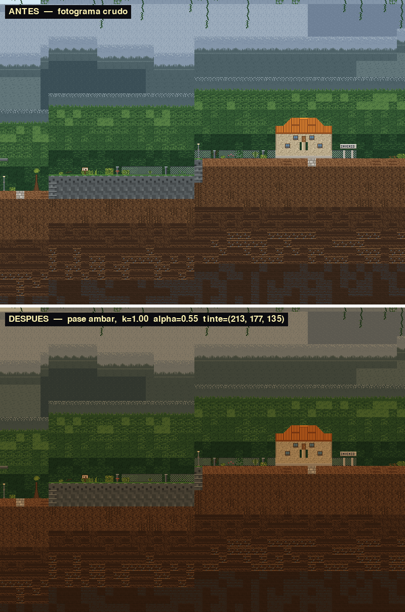

# Escenario 1-1 — La Entrada

Zona 1, Universidad Invenio. El primer escenario jugable del juego.

---

## 1. Concepto

Un sendero largo y solitario que sube por una montaña selvática hasta la entrada
del campus. El protagonista llega a pie. El dosel cierra por arriba, el camino se
angosta a la mitad del recorrido bajo un saliente de roca, y al final aparece el
edificio de la universidad.

El escenario es de **travesía**: no hay fosos ni muerte por caída. El único
castigo es el contacto con los enemigos, según lo fija
`docs/16_WORLD_DESIGN.md` §3.2. Lo que sí hay es una hondonada que obliga a medir
un salto, pero el fondo está tres filas más abajo y se sale con un salto de 48 px:
caerse cuesta tiempo, no una vida.

La luz cambia mientras se avanza. Se sale de día y se llega casi al atardecer —
esa es la operación de color de la Unidad V, y se explica en §4.4.

**Medidas:** 240 × 40 tiles = 3840 × 640 px. A la resolución real del motor
(800 × 600, `src/engine/core/settings.py:11-12`) son 4,8 pantallas de ancho y
40 px de desplazamiento vertical.

---

## 2. Cómo ejecutar

```bash
python main.py --stage stage1_1
```

El escenario también está en la progresión normal del juego: `STAGE_ORDER`
reserva la casilla `stage1_1`, así que `discover_stages()` lo encuentra solo y
queda entre `stage0` y el jefe.

**Controles**

| Tecla | Acción |
|---|---|
| `A` / `D` o flechas | caminar |
| `ESPACIO` o `W` | saltar |
| `S` | agacharse |
| `SHIFT` | dash |
| `Z` | ataque corto |
| `X` | ataque largo |
| `CTRL` o `Q` | guardia (solo estando quieto en el suelo) |
| **`F1`** | **overlay de depuración — dibuja las curvas y los vectores** |
| `TAB` | bestiario |
| `ESC` | pausa |

`F1` es la forma directa de ver las Unidades II y III funcionando: dibuja la
curva de Bézier de cada ave con sus cuatro puntos de control, y el radio de
detección de cada rana con el vector de velocidad de sus proyectiles.

---

## 3. Estructura de archivos

```
src/stages/stage1_1/
├── stage1_1.py                 Stage1_1_LaEntrada(StageScene) — la escena
├── entities/
│   ├── jungle_frog.py          JungleFrog + FrogProjectile    (Unidad II)
│   └── canopy_bird.py          CanopyBird                     (Unidad III)
├── processing/
│   └── sunset_light.py         SunsetLight                    (Unidad V)
├── overlays/
│   └── debug_overlay.py        DebugOverlay — la tecla F1
├── combat/
│   └── guard_system.py         GuardSystem — postura de defensa
├── tests/                      128 pruebas
└── capturas/                   las imágenes de este documento

assets/maps/stage1_1/
├── stage1_1.tmx                el mapa
└── tileset_*.png               6 tilesets (§5)
```

`FrogProjectile` vive dentro de `jungle_frog.py` y no en su propio archivo,
siguiendo el criterio del framework: `src/framework/entities/enemy_shooter.py`
tiene ahí mismo su clase de proyectil.

---

## 4. Las cuatro unidades académicas

### 4.1 Unidad II — Sistemas de coordenadas y vectores

**Dónde:** `entities/jungle_frog.py`
**API usada:** `vec2_normalize`, `vec2_distance`, `vec2_dot`, `vec2_length`
de `src/engine/utils/math_utils.py`

La rana dardo es un enemigo estático que detecta al jugador en un **radio** y le
escupe un proyectil. Cuatro operaciones vectoriales distintas, cada una porque
hace falta y no de adorno:

#### (1) Detección radial — `vec2_distance`

$$d = \lVert \vec{p}_{jugador} - \vec{p}_{rana} \rVert = \sqrt{(x_j-x_r)^2 + (y_j-y_r)^2}$$

```python
def distance_to_player(self) -> float:
    return vec2_distance(self._center(), objetivo)

def _check_detection_range(self) -> bool:
    return self.distance_to_player() <= self.detection_radius
```

Esto **sobreescribe** la detección del framework, que es una caja rectangular
(`detection_range_x` × `detection_range_y`). La diferencia es observable: con una
caja, la rana te ve antes en diagonal que de frente, porque la esquina de un
rectángulo está más lejos del centro que su lado. Con un círculo, la distancia a
la que te detecta es la misma en todas direcciones. Con `F1` se ve el círculo
dibujado.

#### (2) Orientación — `vec2_dot`

$$\vec{a} \cdot \vec{b} = a_x b_x + a_y b_y = \lVert \vec a \rVert \lVert \vec b \rVert \cos\theta$$

```python
s = vec2_dot(self.aim_vector(), pygame.Vector2(1.0, 0.0))
self.facing_direction = 1 if s >= 0.0 else -1
```

Como $\lVert \vec a \rVert$ y $\lVert \vec b \rVert$ son siempre positivos, **el
signo del producto punto es el signo del coseno**. Contra el vector unitario
$\hat{x} = (1,0)$: positivo si el ángulo es menor de 90° —el jugador está a la
derecha— y negativo si es mayor. Es una comparación de signo, sin trigonometría
ni división.

#### (3) Disparo a rapidez constante — `vec2_normalize`

$$\hat{v} = \frac{\vec v}{\lVert \vec v \rVert}, \qquad \vec{v}_{proyectil} = s \cdot \hat{v}$$

```python
direccion = vec2_normalize(target - spawn_position)
self.velocity = direccion * speed
```

Sin normalizar, un proyectil disparado a un objetivo lejano saldría más rápido
que uno disparado de cerca, porque la magnitud del vector diferencia entraría en
la velocidad. Normalizar separa **dirección** de **rapidez**: la dirección la da
el vector unitario, la rapidez la da el escalar `speed`.

#### (4) Descarte por alcance — `vec2_length`

El proyectil se desactiva cuando $\lVert \vec p - \vec p_0 \rVert$ supera su
alcance máximo, en vez de contar fotogramas. Así el alcance es una distancia real
y no depende de la tasa de refresco.

#### (5) Hitbox local → mundo, con matriz homogénea

La boca de la rana está en coordenadas **locales** al sprite. Para convertirla a
mundo se aplica una traslación en coordenadas homogéneas:

$$
\begin{bmatrix} x_w \\ y_w \\ 1 \end{bmatrix} =
\begin{bmatrix} 1 & 0 & t_x \\ 0 & 1 & t_y \\ 0 & 0 & 1 \end{bmatrix}
\begin{bmatrix} x_l \\ y_l \\ 1 \end{bmatrix}
$$

La tercera coordenada en 1 es lo que permite expresar una **traslación** como
multiplicación de matrices; con matrices 2×2 solo se pueden representar
transformaciones lineales, y una traslación no lo es.

#### Evidencia medida



Números reales de esa captura, comprobables a mano:

| Magnitud | Valor |
|---|---|
| Radio de detección $R$ | 96 px |
| Vector al jugador $\vec v$ | $(-70,\ -24)$ |
| $\lVert \vec v \rVert = \sqrt{70^2 + 24^2} = \sqrt{5476}$ | **74,0 px** → dentro del radio |
| $\vec v \cdot \hat x = -70 < 0$ | mira a la **izquierda** |
| $\vec v_{proy} = 90 \cdot \hat v$ | $(-85{,}1,\ -29{,}2)$ |
| $\lVert \vec v_{proy} \rVert$ | **90,0 px/s** exactos |

Los dos proyectiles de la captura salieron en momentos distintos y tienen la
**misma** magnitud de velocidad: eso es la normalización funcionando.

---

### 4.2 Unidad III — Curvas

**Dónde:** `entities/canopy_bird.py`
**API usada:** `CurveTools.bezier` y `CurveTools.sample_path`
de `src/framework/processing/curve_tools.py`

Las aves del dosel recorren una **Bézier cúbica** definida por cuatro puntos de
control que salen del TMX como objetos `Waypoint` con la propiedad `owner_id`.

$$B(t) = \sum_{k=0}^{3} \binom{3}{k} (1-t)^{3-k}\, t^{k}\, P_k$$

Desarrollada:

$$B(t) = (1-t)^3 P_0 + 3(1-t)^2 t\, P_1 + 3(1-t) t^2 P_2 + t^3 P_3$$

Los coeficientes $\binom{3}{k}(1-t)^{3-k}t^k$ son la **base de Bernstein** de
grado 3. Suman 1 para cualquier $t$, y por eso $B(t)$ es siempre una combinación
convexa de los cuatro puntos.

#### Los 12 puntos de control

| Ave | $P_0$ | $P_1$ | $P_2$ | $P_3$ |
|---|---|---|---|---|
| `CanopyBird_01` | (832, 416) | (1040, 336) | (1248, 416) | (1472, 336) |
| `CanopyBird_02` | (1504, 368) | (1616, 288) | (1728, 448) | (1856, 320) |
| `CanopyBird_03` | (2848, 320) | (3040, 240) | (3248, 320) | (3456, 208) |

Están en píxeles de mundo y salen del TMX, no del código: el generador los
calcula **relativos al suelo** de cada columna, de modo que la trayectoria
acompaña el ascenso del sendero. Con alturas absolutas, un ave acababa enterrada
al subir el terreno y otra volaba dentro del saliente de roca — el generador
valida ahora que ningún punto muestreado de la curva caiga en terreno sólido.

#### Por qué la curva se calcula una sola vez

```python
self._path = CurveTools.bezier(control_points, samples=64)   # al construir
...
posicion = CurveTools.sample_path(self._path, u)             # cada fotograma
```

Evaluar la Bézier de nuevo en cada fotograma sería recalcular 64 muestras 60
veces por segundo para una curva que **no cambia**. Se precalcula la polilínea
una vez y por fotograma solo se interpola dentro de ella, que es una búsqueda y
una interpolación lineal.

#### El vaivén

El parámetro $u$ va y viene entre 0 y 1, y se suaviza con
`ease_in_out_quad(t)`:

$$
E(t) = \begin{cases}
2t^2 & t < 0{,}5 \\
1 - \dfrac{(-2t+2)^2}{2} & t \ge 0{,}5
\end{cases}
$$

Sin el suavizado, el ave llega al extremo a velocidad máxima y se da la vuelta de
golpe. Con él, frena al acercarse y acelera al salir: el movimiento se lee como
un ser vivo y no como un objeto en un carril.

#### La propiedad de la envolvente convexa

Como las bases de Bernstein son no negativas y suman 1, **la curva entera queda
dentro de la envolvente convexa de sus cuatro puntos de control**. Esa es la
garantía de que un ave nunca se sale del corredor: basta con que los cuatro
puntos estén en zona libre, sin necesidad de comprobar la curva punto por punto.

#### Evidencia



En cian la polilínea muestreada, en amarillo los cuatro puntos de control
etiquetados `P0`–`P3`, y en magenta la posición actual de cada ave con su valor
de `t`. Se ve que la curva pasa **por** $P_0$ y $P_3$ pero **no** por $P_1$ ni
$P_2$: los intermedios tiran de la curva sin estar sobre ella.

---

### 4.3 Unidad IV — Representación de escena y orden de dibujo

**Dónde:** `assets/maps/stage1_1/stage1_1.tmx`

Las ocho capas obligatorias de `docs/06_TMX_SPEC.md`, todas presentes:

| # | Capa | Tipo | Qué lleva en este escenario |
|---|---|---|---|
| 1 | `BG_Far` | tiles | Cielo en bandas + dos cordilleras |
| 2 | `BG_Mid` | tiles | Bosque, nubes y el Data Center al fondo |
| 3 | `BG_Near` | tiles | Arbolado suelto pegado al suelo |
| 4 | `Terrain` | tiles | Sendero, escalones, subsuelo, saliente de roca |
| 5 | `Terrain_Detail` | tiles | Vegetación, hitos del campus, farolas, carteles |
| 6 | `Objects` | objetos | Spawn, checkpoints, enemigos, waypoints, salida |
| 7 | `Collision` | objetos | 15 rects (12 sólidos + 3 plataformas de una vía) |
| 8 | `FG_Overlay` | tiles | Dosel colgando del borde superior |

#### La profundidad por perspectiva aérea

Los tres planos de fondo no se distinguen por la capa en que están —eso el motor
no lo usa para nada visual— sino por **el color**. Cuanto más lejos, más claro y
más azul, porque el aire dispersa la luz:

| Plano | Tono base |
|---|---|
| Cordillera lejana | `(132, 150, 170)` — claro, azulado |
| Cordillera cercana | `(78, 98, 104)` — medio, gris verdoso |
| Bosque | `(54, 92, 52)` — oscuro, verde saturado |

La **forma** de las montañas no está dentro del tile: se elige el tile según
hacia dónde cae la pendiente de la cresta, así que hay caras enteras de decenas
de tiles al sol o en sombra. Meter el relieve dentro del tile no funciona —el
tile se repite cada 16 px y cualquier patrón direccional se convierte en una pana
regular que se lee como paneles de hormigón.

#### 🔴 Cómo ordena el motor el dibujo (y qué dice mal el enunciado)

`BaseEntity` declara un campo `layer` (`src/framework/entities/base_entity.py:26`)
y varias entidades lo asignan. **Ese campo no ordena nada.**

El orden real está en `src/framework/stage/drawing_system.py:274`:

```python
drawables.sort(key=lambda pair: pair[1])   # pair[1] == rect.centery
```

Es el **algoritmo del pintor** sobre `rect.centery`: lo que está más abajo en
pantalla —más cerca de la cámara en una perspectiva 2.5D— se dibuja encima. El
propio comentario del método (líneas 249-254) lo confirma: sin esa ordenación, el
orden lo decidía la lista de entidades del TMX y un enemigo del fondo podía
taparle la cara al jugador.

Comprobado: `grep -n "\.layer\b" src/framework/stage/drawing_system.py` no
devuelve nada. El campo solo se escribe, nunca se lee para ordenar.

Segunda corrección: **`FG_Overlay` no se dibuja sobre las entidades.** Las ocho
capas de tiles se pintan de una sola pasada antes del bucle de entidades; el
motor solo usa ese nombre para validar que la capa exista
(`src/framework/stage/stage_loader.py:143`). El efecto de primer plano real hay
que hacerlo sobreescribiendo `draw()` en la escena.

---

### 4.4 Unidad V — Color y transparencia

**Dónde:** `processing/sunset_light.py`
**API usada:** `ColorTools.rgb_to_hsv`, `hsv_to_rgb`, `apply_tint`, `alpha_blend`

Conforme el jugador avanza, la escena se calienta hacia el atardecer. Cinco
pasos:

**(1) Conversión a HSV.** El ámbar se define en HSV y no en RGB, porque el matiz
es un solo número que se puede fijar y variar saturación y valor
independientemente. **El matiz va en GRADOS**, de 0 a 360, no normalizado:

```python
HUE_AMBAR: float = 32.0        # ámbar cálido
ambar = ColorTools.hsv_to_rgb(HUE_AMBAR, s, v)
```

**(2) Intensidad según el avance.** Con `ease_out_quad`, que sube rápido al
principio y se aplana:

$$k = E(a) = a\,(2 - a), \qquad a = \frac{x_{jugador}}{\text{ancho del mapa}}$$

**(3) Tinte** — `apply_tint`, multiplicación por canal:

$$\text{tintado}_c = \frac{\text{frame}_c \cdot \text{ambar}_c}{255}$$

**(4) Mezcla alfa** — `alpha_blend`, interpolación lineal por píxel:

$$\text{salida} = \text{tintado}\cdot\alpha + \text{frame}\cdot(1-\alpha), \qquad \alpha = k \cdot 0{,}55$$

⚠️ Esto importa para la rúbrica: `apply_tint` **sola no cumple** el criterio, que
pide *«conversion or alpha blend»*. `apply_tint` no es ninguna de las dos — es
una multiplicación por canal. La conversión HSV↔RGB y la mezcla alfa son las que
satisfacen el criterio, y las dos están en la cadena.

**(5) La identidad que hace la ruta rápida exacta.** Sustituyendo (3) en (4):

$$
\text{salida}_c
= \frac{F_c A_c}{255}\alpha + F_c(1-\alpha)
= F_c \cdot \frac{A_c\alpha + 255(1-\alpha)}{255}
= F_c \cdot \frac{\operatorname{lerp}(255,\ A_c,\ \alpha)}{255}
$$

Es decir: **el tinte seguido de la mezcla alfa equivale a UNA sola multiplicación
por el color $\operatorname{lerp}(255, A, \alpha)$** — exactamente lo que hace
`pygame.BLEND_MULT`. Por eso el escenario aplica el pase con una sola operación
de superficie en vez de recorrer 480 000 píxeles en Python: no es una
aproximación, es la misma cuenta reagrupada.

`apply_reference()` conserva la versión larga paso a paso, y hay una prueba que
comprueba que las dos coinciden.

#### Evidencia



Al 93 % de avance:

| | Valor |
|---|---|
| $k = E(0{,}93)$ | 0,996 |
| $\alpha = k \cdot 0{,}55$ | 0,548 |
| Ámbar HSV(32°, s, v) → RGB | (178, 112, 36) |
| Tinte efectivo $\operatorname{lerp}(255, A, \alpha)$ | (213, 177, 135) |

Comprobación en el píxel (400, 300), que pasa de `(150, 158, 162)` a
`(125, 110, 86)`:

$$150 \cdot \tfrac{213}{255} = 125{,}3 \quad 158 \cdot \tfrac{177}{255} = 109{,}7 \quad 162 \cdot \tfrac{135}{255} = 85{,}8$$

Redondeado: **(125, 110, 86)**. Coincide.

---

## 5. Tilesets

Seis tilesets propios, todos de 128 × 128 px = 8 × 8 tiles de 16 px, con paleta
indexada y sombreado por dithering, sin degradados ni alfa parcial.

| gid | Tileset | Contenido |
|---|---|---|
| 1–64 | `tileset_la_entrada` | Tierra, roca, detalle, dosel, plataformas |
| 129–192 | `tileset_campus` | Edificio, caseta del guarda, cartelón, cercas, pisos |
| 193–256 | `tileset_lejano` | Data Center, antenas y los planos de fondo |
| 257–320 | `tileset_vegetacion` | Helechos, arbustos, flores, troncos, lianas |
| 321–384 | `tileset_cielo` | Día, atardecer, noche, luna, estrellas, nubes |
| 385–448 | `tileset_arboles` | Árboles, palmeras, arbustos, hierba |

Se autoraron porque los tilesets de zona que trae el repo son placeholders:
`assets/tilesets/tileset_jungle_stone.png` tiene 64 celdas con **8 tiles únicos**
repetidos, tres de ellos de color plano. Lo dice el propio generador del
profesor, `tools/generate_all_assets.py`, que cicla 8 tipos con
`ttype = (gy * cols + gx) % 8`.

Los tilesets viven en `assets/maps/stage1_1/` junto al `.tmx` y no en
`assets/tilesets/`, para no añadir nada a una carpeta que no es de la asignación.

---

## 6. Entidades

El reparto es exactamente el que pide `docs/16_WORLD_DESIGN.md` §3.2:
6 insectos, 3 aves, 2 ranas.

| Nombre | `type` en el TMX | x | y | Propiedades |
|---|---|---:|---:|---|
| `WalkerInsect_01` | `Walker` | 640 | 544 | `patrol_length=48` |
| `WalkerInsect_02` | `Walker` | 992 | 512 | `patrol_length=48` |
| `WalkerInsect_03` | `Walker` | 1536 | 480 | `patrol_length=48` |
| `WalkerInsect_04` | `Walker` | 1856 | 480 | `patrol_length=48` |
| `WalkerInsect_05` | `Walker` | 2912 | 416 | `patrol_length=48` |
| `WalkerInsect_06` | `Walker` | 3552 | 352 | `patrol_length=48` |
| `CanopyBird_01` | `FlyingBird` | 832 | 416 | `flight_speed=0.22` + 4 `Waypoint` |
| `CanopyBird_02` | `FlyingBird` | 1504 | 368 | `flight_speed=0.22` + 4 `Waypoint` |
| `CanopyBird_03` | `FlyingBird` | 2848 | 320 | `flight_speed=0.22` + 4 `Waypoint` |
| `JungleFrog_01` | `ShooterFrog` | 1600 | 480 | `fire_rate=1.6`, `projectile_speed=90`, `detection_range_x=96` |
| `JungleFrog_02` | `ShooterFrog` | 3200 | 384 | `fire_rate=1.6`, `projectile_speed=90`, `detection_range_x=96` |

**Sobre el `type` de los insectos.** El documento de diseño los llama
`WalkerInsect`, que es una de las 21 especies del bestiario y carga
perfectamente. Pero `WalkerInsect` **no está** en `KNOWN_ENEMY_TYPES` de
`scripts/grade_stage.py`, así que colocarlos así deja `enemies_placed` en 0. La
solución: `type="Walker"` —el arquetipo, que sí cuenta— y `name="WalkerInsect_NN"`
documentando la especie. El comportamiento es el mismo.

**Cómo se registran las clases propias.** `StageScene.on_enter()` es quien llama
a `StageLoader.load()`, no `__init__`. Por eso registrar en el constructor llega a
tiempo, y no hace falta tocar `entity_factory.py`:

```python
StageLoader.register_entity("ShooterFrog", JungleFrog)
StageLoader.register_entity("FlyingBird", CanopyBird)
super().__init__(context, Path(self.TMX_PATH))
```

Las clases propias sustituyen a las especies genéricas del bestiario. En el juego
corre el código propio; el calificador, que carga el TMX sin pasar por la escena,
usa la especie genérica — y a la geometría, que es lo que mide, le da igual.

**Coleccionables.** Tres, con `type="Light"`. El calificador los cuenta por el
nombre e ignora el tipo, el cargador acepta `Light`, y además existen de verdad
en el juego como puntos de luz cálidos y parpadeantes sobre el sendero.

---

## 7. Checkpoints

Siete, uno cada 30 columnas (480 px):

| id | x | y | | id | x | y |
|---|---:|---:|---|---|---:|---:|
| 0 | 640 | 512 | | 4 | 2560 | 416 |
| 1 | 1120 | 448 | | 5 | 3040 | 384 |
| 2 | 1600 | 448 | | 6 | 3520 | 320 |
| 3 | 2080 | 416 | | | | |

El análisis de nivel del motor mide la distancia entre puntos de control
consecutivos —contando el spawn y la salida como extremos— y penaliza por encima
de 500 px. Con tres checkpoints quedaban 1376 px de tirón: morir ahí obligaba a
rehacer casi un tercio del nivel.

---

## 8. Lógica propia

### 8.1 Postura de defensa — `combat/guard_system.py`

Con `CTRL` o `Q` el jugador levanta la guardia y **anula** el daño entrante.
Sin ventana de tiempo: mientras la tecla esté pulsada, protege.

Dos reglas de diseño: solo funciona **en el suelo**, y **no se puede caminar** con
la guardia activa. El movimiento se congela guardando la X antes del `update()`
del motor y restaurándola después, porque la máquina de estados fija la velocidad
e integra la posición dentro de `player.update()`, sin ningún punto intermedio
accesible desde fuera.

Se implementa envolviendo `apply_damage` del jugador, no modificándolo:
`REDUCCION = 1.0` deja pasar `amount * (1 - REDUCCION) = 0`. Si más adelante se
quisiera una guardia parcial, basta con bajar esa constante.

### 8.2 Overlay de depuración — `overlays/debug_overlay.py`

La tecla `F1`. Dibuja lo que las Unidades II y III hacen, en pantalla y en vivo:
la polilínea de cada Bézier, sus cuatro puntos de control etiquetados, la posición
actual del ave con su `t`, el círculo de detección de cada rana con su radio y la
distancia medida, y el vector velocidad de cada proyectil.

La conversión mundo → pantalla es una resta:
$p_{pantalla} = p_{mundo} - \text{offset}_{camara}$.

### 8.3 Dos correcciones a fallos del motor, hechas desde esta carpeta

El motor y el framework son del profesor y no se tocan. Estos dos fallos se
compensan desde la escena propia, después de que corra el `update()` heredado.

**(a) El tilemap no se desplazaba.** `StageScene.update()` mueve el mapa asignando
directamente `map_layer._map_layer.view_rect`
(`src/framework/scenes/stage_scene.py:268` y `:1004`). En pyscroll eso cambia el
valor del rectángulo pero **no reposiciona el búfer interno de tiles**, así que
`draw()` vuelve a pintar lo mismo: las entidades se movían y el fondo se quedaba
clavado. El desplazamiento real solo ocurre llamando `center()`.

Comprobado sobre `stage0.tmx`, o sea que no es un problema de este escenario:
asignar `view_rect` deja el MD5 del fotograma **idéntico**; llamar `center()` lo
cambia.

```python
map_layer.center((offset.x + ANCHO // 2, offset.y + ALTO // 2))
```

`center()` espera el **centro** de la vista y `camera.offset` es la esquina
superior izquierda: de ahí la media pantalla.

**(b) Spawn inválido con una partida guardada vieja.** Un checkpoint guardado de
una versión anterior del mapa podía dejar al jugador en el aire o dentro de roca.
`spawn_es_valido()` comprueba el punto guardado contra la geometría de colisión
actual y cae al spawn del TMX si no es válido.

---

## 9. Pruebas

```bash
python -m pytest src/stages/stage1_1/tests -q
```

**128 pruebas**, escritas con TDD: primero la prueba fallando, después el código.
Cubren la matemática de las cuatro unidades, la guardia, el overlay, los tips de
entrada y las dos correcciones al motor.

La del hitstop merece una nota. El escenario llevaba un parche propio porque el
motor se quedaba en cámara lenta para siempre tras el primer golpe conectado. El
profesor lo corrigió en la entrega del 28-jul: `update_hitstop` es ahora el único
dueño de `time_scale`. El parche se retiró, **pero la prueba se quedó**,
reescrita para verificar que el motor cumple la propiedad. Si una versión futura
reintroduce el fallo, quien se entera es este escenario.

---

## 10. Estado de la entrega

```
python scripts/grade_stage.py assets/maps/stage1_1/stage1_1.tmx
```

**126 / 130 (96,9 %).** El escenario de referencia del profesor, `stage0`, saca
121 / 130.

Los 4 puntos que faltan:

- **3 puntos**, un aviso de «plataforma sin ruta desde el spawn» que corresponde
  al **saliente de roca del estrechamiento**. Un techo tiene su cara superior en
  `y = 0`, así que nunca es alcanzable, y con 368 px de alto no llega al umbral
  que lo clasificaría como muro (dos tercios del alto del mapa). Es el mismo
  falso positivo que AUD-096 corrigió para los muros laterales, sin contemplar los
  techos. Los tres tramos se fusionaron en uno para bajar el aviso de tres a uno;
  eliminarlo del todo exigiría subir el techo nueve filas y perder el pasadizo
  estrecho que pide el documento de diseño.
- **1 punto** de `metadata`, inalcanzable por construcción: son 3 propiedades × 3
  puntos contra un máximo declarado de 10.

---

## 11. Reflexión

Lo más difícil no fue la matemática de las unidades, sino **distinguir un fallo
propio de uno heredado**. Tres veces di por sentado que algo lo había roto yo y
resultó estar en el motor: el mapa que no se desplazaba, la cámara lenta que se
quedaba pegada, y un repecho «imposible» que el analizador de niveles se
inventaba porque considera que dos cajas se solapan aunque solo se toquen por el
borde. Aprendí a reproducir el fallo sobre `stage0` antes de tocar nada mío: si
también le pasa al escenario del profesor, no es mío.

También aprendí algo de arte que no esperaba: **el detalle no se mete dentro del
tile**. Intenté dar relieve a las montañas texturando el tile, y como el tile se
repite cada 16 px salió una pana perfectamente regular que parecía un muro de
paneles. La forma de una masa grande se consigue eligiendo tiles distintos a
escala de mapa, no dibujando más dentro de uno.

Si tuviera más tiempo, implementaría los coleccionables como objetos recogibles de
verdad —ahora son luces decorativas— y haría la cinemática de introducción en
pseudo-3D que llegué a diseñar pero no a construir.
