# Stage 1-2 — La Soda

Documento reorganizado para la **Evaluación Práctica II — Vertical Slice
(15%)**. Conserva las cuatro secciones obligatorias de
`docs/entregables/entregables.md` (Contexto narrativo, Conceptos
académicos, Cómo ejecutar, Screenshots) con sus títulos exactos, y agrega
Testing, Iteración, Uso de IA y Hallazgos del motor que pide el enunciado
de esta evaluación. El detalle completo por Unidad de la Evaluación
Práctica I (24-25/7) queda preservado, sin borrar nada, en el Anexo al
final.

Todos los números de este documento salen de correr el comando indicado o
de `LA_SODA_PROGRESO.md` (el tracker de la asignación, fuera del repo);
ningún número está inventado.

## Contexto narrativo

**Nombre del nivel:** Stage 1-2 — La Soda, Zona 1.

**Objetivo del nivel:** llegar a la salida (`NextTrigger_01`, x=3392) tras
vencer al `ShooterCocinero` de la repisa de la cocina, que bloquea con
llave (`abre_con="cocinero_muerto"`) la única puerta trasera del mapa
(`Door_Trasera`, x=3360).

**Concepto/tema:** la soda (cafetería) de la universidad, a mitad del caos
de la infestación — basada en fotos reales del lugar (camino de tierra y
piedra, fachada, mostrador de cocina) que el estudiante compartió durante
el desarrollo. El recorrido atraviesa tres ambientes con luz e identidad
propias: camino exterior (de día) → sala (fría, `valor=0.58`) → cocina
(cálida, `valor=0.78`).

**Mecánica principal:** combate contra 13 enemigos propios repartidos en 5
tipos + traversal (saltos, una plataforma de un sentido, un tramo de piso
resbaladizo) + una interacción de llave/cofre opcional + un jefe
estacionario con telegrafiado y dos fases que hay que vencer para destrabar
la puerta trasera y completar el nivel.

**Recorrido (x de mundo, mapa de 216×38 tiles = 3456×608 px):**

| x | Qué hay ahí |
|---|---|
| 32 | `PlayerSpawn_01` — inicio, camino exterior |
| 592 | `MSG_02_RutaAlta` — cartel: ruta alta opcional con objetos y una llave |
| 704 | Farolito exterior (`Light_263`) |
| 2288 | `MSG_03_Fachada` — cartel: fachada de La Soda, aviso de lo que hay adentro |
| 2384-2448 | Vano de la puerta de la fachada (transición exterior→sala, fundido 0.2s/0.27s) |
| 2560 | `ROOM_LIMIT_X` — límite real del cuarto; a partir de acá el jugador está en la sala |
| 2762/3012/3192 | `FlyingCucaracha_01/02/03`, patrullando sobre el mostrador de la sala |
| 2880 | `X_ENTRADA_COCINA` — aparece el letrero de objetivo "derrota al cocinero..." |
| 3002 | `ShooterCocinero_01`, en la repisa de la cocina |
| 3024 | `MSG_04_Cocina` — cartel: la cocina, dónde está el cofre |
| 3240-3430 | `FrictionZone_Cocina_Trapeado` — piso trapeado, fricción reducida |
| 3360 | `Door_Trasera` — bloqueada hasta vencer al cocinero |
| 3392 | `NextTrigger_01` — fin del nivel |

**Interacciones:** 4 `MessageTrigger_Once` guía (bienvenida + ruta alta +
fachada + cocina, con un `set` de índices que sobrevive a un respawn,
AUD-640); 5 `Pickup` (+50 puntos y su cartel cada uno, `_RecompensaDePickup`,
AUD-632/636); `Key_273` (`llave_deposito`) sobre la pasarela alta,
persistente entre respawns (`_LlavesPersistentes`, AUD-639/643); `Chest_274`
en el entrepiso de la cocina, exige la llave y entrega `souvenir_soda`; 6
`Checkpoint` (respawn); `Door_Trasera` que se abre sola al vencer al
cocinero, vía `EventBus` (AUD-641).

**Obstáculos/enemigos — 5 tipos, 13 unidades** (`entities.py`; `Walker*`/
`Flying*` nunca persiguen, solo patrullan/disparan; stats reales de
`kwargs.setdefault`):

| Tipo | Cantidad | Vida | Daño de contacto | Comportamiento |
|---|---|---|---|---|
| `WalkerRaton` | 3 | 1.0 | 0.25 | patrulla 128px a 55 px/s, empujón vectorial ("scent lock") a 90 px/s si el jugador queda alineado |
| `FlyingCucaracha` | 3 | 1.0 | 0.25 | vuela una curva Catmull-Rom fija, dispara proyectil (dmg 0.25, 110 px/s) cada 1.8s si detecta al jugador |
| `WalkerCulebra` | 3 | 1.0 | 0.25 | clon de `WalkerRaton` (mismos stats) |
| `FlyingZancudo` | 3 | 1.0 | 0.25 | clon de `FlyingCucaracha` con proyectil más rápido (130 px/s, cooldown 1.5s) y flotación suavizada con easing |
| `ShooterCocinero` (jefe) | 1 | 5.0 | 0.25 | estacionario, dispara con telegrafiado; a ≤50% de vida entra en fase 2 (lanza doble, más rápido, tinte rojo) |

Ninguna de las 5 clases hereda la persecución/repliegue del framework: el
diseño elegido (Goomba-style) es que cada plaga se queda en su franja o
curva, y a poca vida (`RETREAT`) tampoco se aleja huyendo — se anuló
explícitamente después de encontrar que sí lo hacía (AUD-644, ver Testing).

**Inicio y final:** `PlayerSpawn_01` (x=32, camino exterior) → cruzar la
fachada → sala → cocina → vencer al `ShooterCocinero` → `Door_Trasera` se
abre con `ease_out_cubic` en 0.8s → `NextTrigger_01` (x=3392).

**Progresión:** 6 `Checkpoint` (`checkpoints: 15/15` en el calificador); la
llave del depósito sobrevive a la muerte/respawn (`_LlavesPersistentes`,
verificado por `TestLaLlaveSobreviveAUnRespawn`); el jefe respawnea en fase
1 con 5 de vida si el jugador muere antes de vencerlo
(`test_respawn_repone_el_cocinero_en_fase1_con_5_de_vida`).

**Dificultad:** el cocinero subió de 3 a 5 de vida con una segunda fase al
50% (AUD-651) — con un bot de ataque real caía en ~9s promedio con 3 de
vida; con 5 de vida y la fase 2, cae en ~13s promedio (8.5-15s), sin matar
al jugador en ninguna corrida (cifras del tracker, sesión AUD-651).
`time_limit=360` (subido de 240 en AUD-643, ver Testing) —
`time_limit_reasonable: 5/5` en el calificador. `design_pacing: 8/8` (un
salto exigente en el camino exterior).

## Cómo ejecutar

```powershell
$env:SDL_VIDEODRIVER='dummy'; $env:SDL_AUDIODRIVER='dummy'
$env:PYGAME_HIDE_SUPPORT_PROMPT='1'
python main.py --stage stage1_2_la_soda
```

En ventana real (sin las variables `SDL_*`) el comando es el mismo. El
`.venv` del repositorio está roto (apunta a un Python inexistente en esta
máquina) — se usa el Python 3.12 del sistema
(`C:\Users\josem\AppData\Local\Programs\Python\Python312\python.exe`) con
las variables de entorno de arriba y `PYTHONPATH` apuntando a la raíz del
repo.

**Pruebas automáticas de la stage** (165 pruebas, `test_la_soda.py` +
`test_la_soda_cocinero.py` + `test_la_soda_sprites.py`):

```
pytest src/stages/stage1_2_la_soda/ -q
```

**Calificador automático del profesor** (130/130 — ver desglose completo en
Testing):

```
python scripts/grade_stage.py assets/maps/stage1_2_la_soda/stage1_2_la_soda.tmx
```

**Validación de TMX y de assets** (ambos en verde):

```
python scripts/validate_tmx.py assets/maps/stage1_2_la_soda/stage1_2_la_soda.tmx --ci
python scripts/validate_assets.py
```

## Conceptos académicos

**Computación Gráfica I.** Seis conceptos, cada uno con dónde vive en el
código o en el `.tmx`, por qué tiene una finalidad de juego (no solo
decorativa) y qué captura de `screenshots/` lo evidencia.

### Curvas y modelado

**Curva:** `FlyingCucaracha`/`FlyingZancudo` (`entities.py:702-799` y
`:1080-1180`) patrullan una spline de **Catmull-Rom cúbica** evaluada con
`CurveTools.build_bezier_path()` (`src/framework/processing/curve_tools.py:120-135`,
utilidad del framework, no reimplementada) a través de **4 puntos de
control** documentados en código
(`FlyingCucaracha.CONTROL_POINTS`, `entities.py:725-730`: `(-40,10)`,
`(-14,-18)`, `(14,-18)`, `(40,10)`, relativos al spawn). El parámetro `t`
sigue una onda triangular con período `CURVE_PERIOD=3.2s`
(`_patrol_behavior`, `entities.py:784-791`) para que la criatura vaya y
vuelva por el mismo arco en vez de saltar de golpe al llegar a `P3`.
**Finalidad de juego:** es la trayectoria de patrulla real de 6 de los 13
enemigos del mapa (3 `FlyingCucaracha` + 3 `FlyingZancudo`), visible y
predecible para el jugador — no un adorno matemático aislado.
**Evidencia:** `screenshots/cg_curva_catmull_rom_cucaracha.png` (fotograma
real de la sala, cámara centrada en `FlyingCucaracha_01`, con la curva
muestreada en 64 puntos dibujada como polilínea, los 4 puntos de control
`P0..P3` rotulados, y la cucaracha compuesta en 3 posiciones del recorrido
con alpha decreciente).

**Modelado:** todo el arte de esta stage es pixel art propio generado por
procedimiento con **PIL** (`Claude - Uso General/playtest/dibujar_sprites_plagas.py`,
primitivas `ImageDraw.ellipse/polygon/line` sobre `RGBA`, sin anti-alias
para conservar la lectura de pixel art), no placeholders del framework:
las 5 hojas de sprite de las plagas (`sprite_raton.png`, `sprite_cucaracha.png`,
`sprite_culebra.png`, `sprite_zancudo.png`, `sprite_cocinero.png`,
AUD-648) y los tilesets propios `tileset_soda_decor.png` y
`tileset_camino_soda.png` (dibujados a mano en sesiones previas, ver
Anexo — Unidad IV).
**Proporción y escala:** el tile base del proyecto mide 16×16 px
(`settings.TILE_SIZE`); el jugador mide 20×32 px de hitbox
(`player.py:1349`); las hojas propias de las plagas usan cuadros de
24×24 px (`WalkerRaton`, `FlyingCucaracha`, `FlyingZancudo`,
`entities.py:429-430,757-758,1135-1136`), 32×16 px (`WalkerCulebra`,
`entities.py:964-965`) y 32×32 px (`ShooterCocinero`,
`entities.py:1414-1415`) — mayores que el molde de zona de 16×12 px que
el framework asigna por defecto, porque a 16×12 el roster pedía "gris,
ojos rojos" y el resultado era una mancha de pocos píxeles indistinguible
del piso (comentario en `entities.py:415-428`, hallazgo del playtest del
dueño). **Integración:** el sprite propio reemplaza al genérico vía el
mismo hook documentado por el framework (`_load_extra_sprites`), sin
tocar `enemy_base.py`/`enemy_walker.py`/`enemy_flying.py`/`enemy_shooter.py`.
**Evidencia:** las capturas `unit6_*`/`unit7_*` de `screenshots/` muestran
las 5 plagas con su sprite propio en contexto de juego real.

### Representación de escenas

**Composición:** el `.tmx` tiene las 8 capas obligatorias de
`docs/06_TMX_SPEC.md` (`BG_Far`, `BG_Mid`, `BG_Near`, `Terrain`,
`Terrain_Detail`, `FG_Overlay` como `<layer>`, más `Objects` y `Collision`
como `<objectgroup>`, en ese orden) y 10 tilesets (uno del profesor,
`tileset_cafeteria`, y 9 propios o del set del framework recombinados:
`tileset_soda_decor`, `tileset_camino_soda`, `tileset_cielo`,
`tileset_lejano`, `tileset_vegetacion`, `tileset_arboles`,
`tileset_campus`, `tileset_la_entrada`, `tileset_soda_real`).
**Composición narrativa** en tres tramos con transición real: exterior
(x<2560, luz de día) → sala (2560-2880, `AmbientLightZone_Sala` `valor=0.58`)
→ cocina (x≥2880, `AmbientLightZone_Cocina` `valor=0.78`), cruzando la
puerta con un fundido a negro real (`_RoomTransition`, `stage1_2_la_soda.py:76-235`).
**Profundidad:** 6 capas de tiles dan planos de paralaje/detalle
(cielo/lejano/vegetación al fondo, terreno jugable, detalle sobre el
terreno, overlay al frente) — no es una sola capa plana.
**Jerarquía visual:** HUD del framework (vida, puntos, reloj) siempre
arriba; encima de eso, el minimapa propio (200×35 px, proporción real del
mapa 3456×608, `_ajustar_minimapa_al_nivel`, `stage1_2_la_soda.py:2247-2291`,
AUD-647); el letrero de objetivo y la barra de jefe (`Y_BARRA=150`,
AUD-652) se dibujan por encima del mundo pero sin pisar el HUD ni el
`MessageBox`, medido contra los rects reales de `_hud.regiones()` y
`_msg_box.rect_del_panel()` (`TestBarraDeJefeYSacudida::test_la_barra_no_pisa_hud_letrero_ni_messagebox`).
**Navegación:** 3 carteles guía (`MSG_02/03/04`, AUD-640) marcan las
decisiones del recorrido (ruta alta opcional, fachada, cocina) y el
minimapa proporcional evita que un mapa 5.7:1 se vea comprimido en una
tira casi vacía (el defecto que AUD-647 corrigió). **Integración con
gameplay:** las 8 capas no son solo fondo — `Collision` define la física
real, `Objects` coloca cada entidad/interacción/zona jugable, y las zonas
de luz alimentan tanto el render como la lógica de `_LecturaDeLuz` (ver
Color, abajo). **Evidencia:** `screenshots/camino_*.png` (tramos del
exterior), `screenshots/motor_nuevo_final.png` (vista general).

### Color

**Paleta y contraste:** cada tramo tiene su propia temperatura de color —
exterior de día, sala fría (`valor=0.58`), cocina cálida (`valor=0.78`,
calibrados jugando en AUD-633 tras partir de 0.48/0.68, demasiado oscuros
para ver al jugador). **Jerarquía:** 10 objetos `Light` en el `.tmx`
(ids 263-272, AUD-638) anclados a elementos reales — farolito exterior,
guirnalda de feria, apliques de pared, lámpara colgante, letrero neón
(`#ff6fae`), foco `fire` sobre el mostrador caliente — con `intensity=1.0`
porque el motor compone `color·intensity·(1-d/r)` y con menos de 0.9 sobre
los ambientes 0.58/0.78 no se llegaban a ver (verificado con diff de
capturas). **Espacio de color usado:** HSV, vía `ColorTools.hsv_to_rgb()`
(`framework/processing/color_tools.py`) en la barra de vida de cada
enemigo (`stage1_2_la_soda.py`, `_draw_enemy_health_bars`) —
`hue = 120.0 * pct` recorre verde (120°, vida llena) → amarillo (~60°) →
rojo (0°, poca vida) — horneado sobre una `pygame.Surface` real con
`ColorTools.apply_tint()`, no solo una tupla de enteros. **Tinte de fase
2:** al entrar en su segunda fase, `ShooterCocinero` se tiñe de rojizo
(`FASE2_TINTE_COLOR=(255,150,150)`, `entities.py:1393`, aplicado con
`pygame.BLEND_RGB_MULT` en `_dibujar_tinte_fase2`, `entities.py:1696-1725`)
como señal de dificultad legible sin leer la barra de vida.
**Ambientación medida con histograma:** `_LecturaDeLuz`
(`stage1_2_la_soda.py:242-397`, AUD-645, corregida en AUD-646) mide la
luminancia real del fotograma con `FilterTools.compute_histogram()` al
cruzar hacia la sala y, si cae bajo `UMBRAL_LUMINANCIA=70.0`, sube el
brillo con `FilterTools.adjust_brightness()` — cifras medidas contra el
mapa real: sala 55.32/255 antes → 88.48/255 después (factor 1.6, tope);
cocina 77.52/255 (no dispara). **Finalidad de juego:** la barra de vida en
color comunica el estado del combate sin leer un número; el ajuste de
brillo hace legible la sala sin lavar la ambientación calibrada.
**Evidencia:** `screenshots/unit5_health_tint_full.png`/`_detail.png`
(barra de vida verde→naranja), `screenshots/unit7_histograma_antes.png`/`_despues.png`.

### Transparencia

**Alfa dinámico (código propio):** el desvanecido de muerte de las 5 plagas
usa `alpha = 255 * (1 - ease_out_quad(t))` (`_alpha_de_muerte`,
`entities.py:313-319`) sobre una copia del cuadro "die"
(`cuadro.set_alpha(...)`, `entities.py:341-342`) mientras 6-8 partículas
caen y se apagan solas (AUD-649). El letrero de objetivo entra/se queda/se
desvanece con `alpha` propio calculado con `ease_out_cubic`
(`_ObjetivoCocinero`, `stage1_2_la_soda.py:1053-1246`, AUD-641). La barra
de jefe se desvanece igual al morir el cocinero (`ease_out_cubic`, 0.5s).
El contorno de alerta por Sobel (`_ContornoDeAlerta`,
`stage1_2_la_soda.py:432-705`, AUD-645/646) pinta solo los píxeles cuya
magnitud de gradiente supera un umbral, con alpha proporcional a esa
magnitud — un blit normal (no `BLEND_RGBA_ADD`, el bug que corrigió
AUD-646). El overlay cálido de `_LecturaDeLuz` tiene alpha acotado a
`ALPHA_MAXIMO=36/255` (~14%) para no lavar la escena. El panel del letrero
de objetivo se desenfoca sobre una copia real del mundo detrás
(`_ObjetivoCocinero._fondo_para`, ver Texturas) — el propio recorte
conserva su alpha original al componerse.
**Alfa estática (en la textura):** las hojas de sprite de `FlyingCucaracha`
y `FlyingZancudo` dibujan sus alas con relleno RGBA translúcido —
cucaracha `ALA=(246,195,155,210)` (~82% opaco,
`dibujar_sprites_plagas.py:187`), zancudo `ALA=(222,233,245,150)` (~59%
opaco, más traslúcidas a propósito para que se lean "livianas",
`dibujar_sprites_plagas.py:321`) — y todas las hojas se cargan con canal
alfa real (`AssetLoader` usa `convert_alpha()`, `asset_loader.py:246`, y
`pygame.SRCALPHA` para los recortes de respaldo, `asset_loader.py:262`),
no un color clave de recorte binario. **Finalidad de juego:** el
desvanecido de muerte evita el corte abrupto que tenía el motor por
defecto (un fotograma la entidad está, al siguiente no); el overlay
acotado deja leer la sala sin destruir la ambientación; las alas
translúcidas son parte de que cada bicho se "sienta" como lo que es
(cucaracha sólida vs. zancudo liviano). **Evidencia:**
`screenshots/unit6_muerte_particulas.png`, `screenshots/unit7_kernel_blur_antes.png`/`_despues.png`,
`screenshots/unit7_sobel_contorno_detalle_antes.png`/`_despues.png`.

### Texturas

**Tilesets propios, con finalidad y correspondencia textura-objeto:**
`tileset_soda_decor.png` (decoración del pasillo/cuarto: ventana, cortina,
luces de feria, pizarra de menú, reloj, planta, letrero neón, repisas) y
`tileset_camino_soda.png` (tierra, rocas, árboles, marco de puerta) —
ambos dibujados a mano por procedimiento con PIL (ver Curvas y modelado),
referenciados como tilesets adicionales del `.tmx` sin tocar el tileset
compartido del profesor. Piso de terracota con dos variantes de tono
(gid 81/82 de `tileset_soda_decor`), refrigerador de gaseosas y nevera de
acero junto al mostrador (gid 83/84) inspirados directamente en fotos
reales de la cocina — no un color liso. Postes/tablones de madera clara
en las dos pasarelas exteriores (gid 525/527 de `tileset_soda_real`,
AUD-630/631) reemplazando un tablón oscuro que casi no se distinguía del
talud detrás — corrección de contraste sobre la misma textura.
**Escala/resolución:** todos los tiles a 16×16 px (`settings.TILE_SIZE`),
consistente en los 10 tilesets del mapa — ninguno estirado ni con otra
resolución. **Coherencia:** paleta terrosa/cálida para el camino y la
cocina, fría/ladrillo para la sala, sin mezclar estilos de pixel art entre
tilesets propios y el del profesor. **Integración:** `validate_assets.py`
(0 errores, 0 avisos) confirma que los 10 tilesets referenciados existen y
tienen las dimensiones que el `.tmx` declara.
**Mapa autocontenido (AUD-655):** los 10 tilesets del `.tmx`, incluida la
copia `tileset_cafeteria_soda.png` del tileset de cafetería del profesor
(idéntica byte a byte, `TestMapaAutocontenido`), viven dentro de esta misma
carpeta del nivel — así el nivel no depende de que los assets compartidos
del motor (`assets/tilesets/`) no cambien de tamaño en otra rama del
profesor. **Evidencia:**
`screenshots/camino_x1700.png`, `screenshots/camino_x1750_fachada_soda_real.png`,
`screenshots/camino_x200_cerca_del_spawn.png`, `screenshots/camino_x2400_cerca_de_la_soda.png`,
`screenshots/camino_x900.png`.

### Animación

**Cuadros por estado:** cada una de las 5 plagas tiene cuadros propios de
`walk`/`hurt`/`die` (o `fly`/`hurt`/`die` las voladoras) cargados desde su
propia hoja (`_load_extra_sprites`, ver Curvas y modelado); el
`ShooterCocinero` agrega además `aim`/`telegraph`/`fire`
(`entities.py:1523-1527`). **Telegrafiado:** el cocinero retrasa el brazo
y destella antes de disparar (AUD-648,
`test_cocinero_en_telegraphing_usa_el_cuadro_de_brazo_atras`), y en fase 2
el telegrafiado dura una fracción del tiempo normal (más rápido de leer,
más difícil de esquivar). **Transiciones con easing:** `ease_out_cubic`
(`math_utils.py`) en la hoja de la puerta trasera que se levanta
(`_PuertaTraseraVisual._alto_hoja`, `stage1_2_la_soda.py:1751-1821`,
0.8s) y en el letrero de objetivo que entra/se desvanece; `ease_in_out_quad`
en la flotación vertical del `FlyingZancudo` (`entities.py:1164-1171`,
compuesto en una campana `4·u·(1-u)` para que el giro sea suave en los
extremos, no lineal). **Sincronización con la acción:** destello blanco +
2px de retroceso visual en los 4 fotogramas dibujados siguientes a
cualquier golpe que de verdad conecta (`_dibujar_destello_de_golpe`,
`entities.py:236-268`, AUD-649) — comparando `current_health` antes/después
para no disparar en un golpe que no conectó (invencibilidad/DYING). Muerte
con 6-8 partículas con la paleta del propio sprite y desvanecido
`ease_out_quad` (AUD-649). Barra de jefe con daño diferido: el tramo
perdido queda un segmento blanco "fantasma" 0.25s y se retrae con
`ease_out_quad` (`_BarraDeJefe`, `stage1_2_la_soda.py:1246-1655`, AUD-650).
Sacudida de cámara (`_SacudidaDeCamara`, `stage1_2_la_soda.py:1655-1751`,
fachada sobre `Camera.apply_shake` del motor) en cada golpe conectado,
en la apertura de la puerta y al morir el cocinero, con dirección
pseudoaleatoria determinista (contador × ángulo áureo, sin `random`) para
activar el decaimiento real del motor. **Integración:** ninguna animación
reemplaza el estado real de la máquina de estados del framework — todas
envuelven `apply_hit`/`update`/`draw` sin tocar `enemy_base.py`.
**Evidencia:** `screenshots/unit6_puerta_cerrada_objetivo.png`,
`screenshots/unit6_puerta_abriendo_easing.png`, `screenshots/unit6_puerta_abierta.png`,
`screenshots/unit6_muerte_particulas.png`, `screenshots/unit6_barra_jefe_sacudida.png`.

## Testing y playtesting

### a) Pruebas automáticas

```
pytest src/stages/stage1_2_la_soda/ -q
```

**165 passed** — `test_la_soda.py` (123: iluminación, zonas de
fricción/zoom, jerarquía de luz, vano de la puerta, llave/cofre, íconos,
carteles, cola de mensajes, puerta del cocinero, cocinero sin flotar,
plagas sin retirada, bot de verificación con la puerta, límite de tiempo,
lectura de luz, umbral de luminancia, fondo borroso del letrero, contorno
de alerta, minimapa proporcional, barra de jefe y sacudida de cámara, mapa
autocontenido AUD-655),
`test_la_soda_cocinero.py` (9: fase 2 del jefe — umbral, lanzamiento
doble, tinte, respawn en fase 1) y `test_la_soda_sprites.py` (33: las 5
hojas de sprite propias, destello de golpe, muerte con partículas).

Calificador automático del profesor (mismo script que usa para calificar):

```
python scripts/grade_stage.py assets/maps/stage1_2_la_soda/stage1_2_la_soda.tmx
```

**130/130 (100.0%)** — 15 categorías en verde: `checkpoints 15/15` (6
checkpoints), `climate_valid 5/5` (`clear`), `collectibles 10/10` (7:
5 `Pickup` + `Key` + `Chest`), `design_completable 12/12`,
`design_geometry 10/10`, `design_pacing 8/8` (1 salto exigente),
`enemies_placed 10/10`/`enemies_valid_types 10/10` (13 enemigos, 5 tipos),
`file_parses 5/5`, `map_bounds_reasonable 5/5` (216×38), `metadata 10/10`,
`player_spawn 10/10`, `required_layers 10/10`, `tileset_valid 5/5` (10
tilesets), `time_limit_reasonable 5/5` (360s).

Validadores del profesor:

```
python scripts/validate_tmx.py assets/maps/stage1_2_la_soda/stage1_2_la_soda.tmx --ci
→ [OK], 1/1 passed
python scripts/validate_assets.py
→ All assets validated successfully. 0 errors, 0 warning(s)
```

### b) Iteración — ciclo VERSIÓN → PRUEBA → PROBLEMA → CORRECCIÓN → NUEVA PRUEBA → MEJORA

Sesiones de playtest real en ventana (no headless) del 26/8, con capturas
guardadas en `Claude - Uso General\playtest\sesion_20260826_<hora>\`:

| Sesión | Prueba (qué se jugó) | Problema encontrado | Corrección | Nueva prueba / mejora |
|---|---|---|---|---|
| 15:13-15:21 (carpetas `1512` y `1518`, una sola partida continua) | Recorrido completo hasta la cocina, combate contra el `ShooterCocinero` | (1) todo lo que `draw()` agregaba (letrero, barras de vida, iconos, marco de puerta) era invisible — `App._draw` nunca llama a `draw()` de la escena; (2) el cocinero quedaba flotando fuera de alcance tras el primer golpe; (3) la llave recogida se perdía al morir/respawnear; (4) los carteles de guía se mostraban apilados/atrasados; la partida cerró con 00:54 en el reloj | **AUD-643** (4 arreglos): contenido movido a `dibujar_mundo()`/`dibujar_ui()`; `ShooterCocinero.update()` lo ancla a la repisa; `_LlavesPersistentes` reinyecta la llave en `on_stage_start`; cola de carteles corregida y `time_limit` 240→360 | `pytest` 62→74 passed; `grade_stage.py` 130/130; bot 97.6%/98.5% sin cambios |
| 16:06-16:10 | Bajar a las 4 plagas propias a poca vida con el jugador cerca | Una rata herida caminaba hacia atrás hasta clavarse en una esquina de la sala; la cucaracha abandonaba su curva Catmull-Rom al entrar en `RETREAT` | **AUD-644**: `WalkerRaton`/`FlyingCucaracha`/`WalkerCulebra`/`FlyingZancudo` anulan `_should_retreat()` → `False` (anular solo `_retreat_behavior` dejaba al bicho congelado, sin salir de `RETREAT`) | `TestLasPlagasNoSeRetiran` nueva (74→78 passed); `grade_stage.py`/bot sin cambios |
| 16:54-16:57 | Repetir el recorrido con los 4 arreglos de AUD-643 ya aplicados | Sin hallazgos nuevos: llave recogida sin retraso de carteles, letrero OBJETIVO visible, cocinero vencido en ~20s sin flotar, cofre abierto con G — confirma que AUD-643 funcionó jugando, no solo headless | — (sesión de validación) | Ninguna corrección nueva; confirma AUD-643 en vivo |
| 18:19-18:23 | Recorrido completo con AUD-646 (overlay cálido + contorno Sobel corregidos) ya aplicado, incluyendo dos muertes reales | Overlay cálido correcto (ya no lava la pantalla); dos respawns limpios en el checkpoint con el letrero OBJETIVO reapareciendo solo; cocinero vencido tras los dos respawns — valida en vivo un arreglo que se había encontrado revisando capturas, no jugando (ver abajo) | — (sesión de validación) | Confirma AUD-646 en vivo; la llave-tras-muerte quedó cubierta solo por la prueba automática (el dueño no pulsó G en el cofre esa vez) |

**Correcciones que no surgieron de jugar, sino de revisar capturas o medir
contra el motor real** (mismo rigor, evidencia distinta):

- **AUD-646** — revisando las propias capturas de AUD-645 (Unidad VII, no
  jugando): el overlay de brillo era blanco con alpha hasta 132/255
  (~52%) y lavaba toda la pantalla; el contorno Sobel usaba
  `BLEND_RGBA_ADD` sin pesar por alpha y tapaba al enemigo con un bloque
  sólido en vez de un contorno. Corregido (overlay cálido, alpha≤36;
  blit normal, recorte del sprite propio) y **validado en vivo en la
  sesión 18:19-18:23** de arriba.
- **AUD-652** — la barra de jefe (AUD-650) se colocó en `Y_BARRA=320`
  razonando sobre `MessageBox.caja_rect()` (la banda de diseño completa,
  `Rect(0,160,800,140)`), pero lo que `MessageBox.draw()` realmente pinta
  es `rect_del_panel()`, con `y` siempre en 160 y solo la altura creciendo
  hacia abajo. Medido contra el rect real (no a ojo) con la cocina
  mostrada a la vez, la barra baja a `Y_BARRA=150`, probado en
  `TestBarraDeJefeYSacudida::test_la_barra_no_pisa_hud_letrero_ni_messagebox`.

### c) Las 10 preguntas de playtesting del profesor

| Pregunta | Respuesta, con evidencia |
|---|---|
| ¿Puedo quedar atrapado? | El cocinero quedaba flotando indefinidamente tras un golpe no letal — encontrado jugando (15:13-15:21) y arreglado (AUD-643, `TestElCocineroNoQuedaFlotando`). Las 4 plagas propias quedaban congeladas en `RETREAT` en una esquina con poca vida — encontrado jugando (16:06-16:10) y arreglado (AUD-644, `TestLasPlagasNoSeRetiran`). |
| ¿Puedo atravesar zonas incorrectamente? | El vano de la puerta se lee como entrar por una puerta, no como atravesar una pared (`TestElVanoSeLeeComoPuerta`, AUD-629); 3 plataformas con colisión pero sin tile pintado (posible confusión visual, no un atravesamiento real) se corrigieron en AUD-630. |
| ¿Puedo saltarme una sección importante? | `Door_Trasera` solo abre al vencer al cocinero, vía `EventBus` — sin eso no hay ningún `EventTrigger` del mapa que la abra. `design_completable 12/12`; el bot sin matar al cocinero se frena en la puerta (`test_el_bot_de_solo_caminar_y_saltar_ya_no_llega_a_la_salida`, `reached_exit=False`). |
| ¿Puedo romper la progresión? | La llave se perdía al morir — encontrado jugando y arreglado (AUD-643, `TestLaLlaveSobreviveAUnRespawn`); el jefe respawnea en fase 1 con 5 de vida si el jugador muere antes de vencerlo (`test_respawn_repone_el_cocinero_en_fase1_con_5_de_vida`). |
| ¿Las colisiones funcionan? | `design_geometry 10/10`; 3 plataformas sin tile de colisión visible corregidas (AUD-630); `FrictionZone_Cocina_Trapeado` medida (`TestFrictionZoneDelPisoTrapeado`). |
| ¿Hay animaciones con errores? | Dos regresiones reales encontradas revisando las propias capturas (overlay que lavaba la pantalla, contorno Sobel como bloque sólido) y corregidas en AUD-646, validadas jugando en la sesión 18:19-18:23. |
| ¿Las texturas se ven bien? | `validate_assets.py`: 0 errores, 0 avisos sobre 10 tilesets. Madera oscura casi indistinguible del talud reemplazada por madera clara en las 2 pasarelas exteriores (AUD-631). |
| ¿La navegación es clara? | Minimapa proporcional a la forma real del nivel (AUD-647, antes se veía "una tira arriba y todo vacío"); 3 carteles guía en los tramos clave (AUD-640); letrero de objetivo al entrar a la cocina (AUD-641). |
| ¿La dificultad es coherente? | El cocinero pasa de 3 a 5 de vida con fase 2 al 50% (AUD-651): con bot de ataque real caía en ~9s (antes) → ~13s (8.5-15s, ahora), sin matar nunca al jugador en las corridas medidas. Un `CameraZoomZone` sobre el salto exigente se retiró porque el zoom del motor sacaba al jugador del cuadro (AUD-635, límite del motor documentado, no arreglable desde el nivel) — el salto exigente en sí sigue existiendo (`design_pacing 8/8`). |
| ¿Puedo completar el nivel? | Sí: con el cocinero vencido antes de soltarlo, el bot llega a la salida sin morir (`test_matando_al_cocinero_antes_el_bot_llega_a_la_salida_como_siempre`: `reached_exit=True`, `progress_ratio≈0.985`, `elapsed≈66.3s`, `deaths=[]`); en vivo, sesión 18:19-18:23 completó el recorrido con dos muertes y dos respawns limpios, cocinero vencido al final. |

### d) Resultado actual

`pytest src/stages/stage1_2_la_soda/ -q` → **165 passed**.
`grade_stage.py` → **130/130 (100.0%)**.
`validate_tmx.py --ci` → **[OK]**, 1/1 passed.
`validate_assets.py` → **0 errores, 0 avisos**.
Bot determinista (`run_playthrough` + `walk_right_bot`, `tests/playtest/bot.py`,
pruebas `TestBotDeVerificacionConLaPuertaDelCocinero`): sin vencer al
cocinero, se frena en la puerta cerrada sin morir
(`reached_exit=False`, `progress_ratio≈0.976`, `deaths=[]` — la puerta
bloquea de verdad, no es un bug); habiéndolo vencido antes,
`reached_exit=True`, `progress_ratio≈0.985`, `elapsed≈66.3s`, `deaths=[]`.

## Iteración respecto a la Evaluación I

**Nota oficial de la Evaluación Práctica I** (`docs/entregables/NOTAS_EVALUACION_PRACTICA_I.md:88,185-193`,
calificada por el profesor, informe del 31/7): **104/130 (80.0%)**, puesto
5 de 10. Cuatro señalamientos puntuales, los cuatro corregidos desde
entonces:

| Señalamiento del profesor (31/7) | Estado hoy |
|---|---|
| Sin propiedad `climate` (-5 pts) | `climate="clear"` — `climate_valid: 5/5` |
| Falta `author` | `author="Guillermo Morice Diaz"` — parte de `metadata: 10/10` |
| Ningún salto pone a prueba al jugador ("aviso de ritmo, el que más pesa") | 1 salto exigente en el camino exterior — `design_pacing: 8/8` |
| Solo 1 checkpoint y 2 enemigos en todo el mapa | 6 checkpoints y 13 enemigos de 5 tipos — `checkpoints: 15/15`, `enemies_placed`/`enemies_valid_types: 10/10` cada uno |

**Nota actual con el mismo calificador automático que usa el profesor:
130/130 (100%)**, sostenida sin bajar en ningún commit desde AUD-619 hasta
el HEAD actual (verificable en cada entrada de `LA_SODA_PROGRESO.md`).

**Alcance agregado desde la Evaluación I** (que en su momento solo tenía
el cuarto interior original, un `Walker` genérico convertido en
`WalkerRaton`, una `FlyingCucaracha`, y la barra de vida en HSV): camino
exterior completo con 4 enemigos y un checkpoint (2/8-3/8); interior/cocina
completa con 4 enemigos nuevos y el jefe (31/7); sistema de iluminación
completo (10 `Light` + `AmbientLightZone` calibradas, 13-24/8); llave,
cofre, 3 carteles guía y la puerta del cocinero con `EventBus` + easing
(24-26/8); pipeline completo de Unidad VII (histograma, convolución,
Sobel) con dos regresiones auto-detectadas y corregidas (26/8); sprites
propios de las 5 plagas + telegrafiado + partículas de muerte + barra de
jefe con daño diferido + sacudida de cámara + segunda fase del jefe
(26/8).

## Uso de inteligencia artificial

Se usó Claude Code (Anthropic) como asistente durante todo el desarrollo:
programación de las entidades y sistemas propios, depuración de los bugs
encontrados jugando, escritura de las 165 pruebas automatizadas,
generación procedural del arte propio (tilesets y hojas de sprite) con
PIL, y análisis de las capturas de cada sesión de playtest para encontrar
regresiones visuales (como AUD-646). Las decisiones de diseño —qué puerta
debía ser obligatoria, cuánta vida darle al cocinero y cuándo activar su
segunda fase, cómo tenía que verse el minimapa, qué sprites y qué paleta
usar para cada plaga, cuándo un hallazgo era un bug del motor y no algo
para arreglar en el nivel— las tomó el estudiante jugando el nivel y
revisando las capturas y los números medidos en cada sesión, no una
elección automática de la herramienta. Todo el código de esta entrega
vive en `src/stages/stage1_2_la_soda/` y `assets/maps/stage1_2_la_soda/`
(las dos únicas carpetas editables), y el estudiante puede ejecutarlo,
leerlo y explicarlo en persona.

## Screenshots

Todas las capturas están en `src/stages/stage1_2_la_soda/screenshots/`:

- `camino_x200_cerca_del_spawn.png` — camino exterior, cerca de `PlayerSpawn_01`.
- `camino_x900.png` — tramo intermedio del camino exterior.
- `camino_x1700.png` — camino exterior, tramo avanzado.
- `camino_x1750_fachada_soda_real.png` — fachada de La Soda, textura `tileset_soda_real`.
- `camino_x2400_cerca_de_la_soda.png` — camino exterior, justo antes de la entrada.
- `motor_nuevo_final.png` — vista general del nivel tras la migración al motor actualizado del profesor.
- `unit5_health_tint_full.png` — vista completa con la barra de vida de `WalkerRaton_01` ya teñida (Unidad V, color HSV).
- `unit5_health_tint_detail.png` — detalle recortado de la misma barra de vida al ~35% de HP.
- `unit6_puerta_cerrada_objetivo.png` — letrero de objetivo visible, `Door_Trasera` todavía cerrada.
- `unit6_puerta_abriendo_easing.png` — la hoja de la puerta a mitad de la animación de apertura (`ease_out_cubic`).
- `unit6_puerta_abierta.png` — `Door_Trasera` completamente abierta tras vencer al cocinero.
- `unit6_muerte_particulas.png` — tira de 5 fotogramas de una plaga muriendo, con partículas y desvanecido.
- `unit6_barra_jefe_sacudida.png` — tira de 6 fotogramas: barra de jefe llena, daño diferido (segmento blanco), muerte del cocinero con la cámara sacudida.
- `unit7_histograma_antes.png` — sala justo al cruzar la puerta, sin el ajuste de brillo (luminancia medida ~55).
- `unit7_histograma_despues.png` — misma sala con `FilterTools.adjust_brightness()` aplicado (luminancia ~88).
- `unit7_kernel_blur_antes.png` — recorte crudo del fondo del letrero de objetivo, sin desenfocar.
- `unit7_kernel_blur_despues.png` — mismo recorte tras `FilterTools.apply_kernel()` con el kernel `box_blur`.
- `unit7_kernel_blur_letrero_en_juego.png` — el letrero de objetivo completo, en contexto, con el fondo ya borroso.
- `unit7_sobel_contorno_antes.png` — el ratón con vida completa, sin contorno.
- `unit7_sobel_contorno_despues.png` — el mismo ratón a 20% de vida, con el contorno de alerta por Sobel activo.
- `unit7_sobel_contorno_detalle_antes.png` — detalle recortado y escalado del ratón sano.
- `unit7_sobel_contorno_detalle_despues.png` — detalle recortado del ratón a 20% de vida, línea roja fina alrededor de su silueta (AUD-646, ya no el bloque sólido de AUD-645).
- `cg_curva_catmull_rom_cucaracha.png` — fotograma real de la sala con la trayectoria Catmull-Rom de `FlyingCucaracha_01` dibujada encima, sus 4 puntos de control rotulados y la cucaracha compuesta en 3 posiciones del recorrido.

**Video de la partida real** (`la_soda_vertical_slice.mp4`): compartido al profesor por Microsoft Teams
por separado, junto con esta entrega.

## Hallazgos del motor reportados al profesor

Detalle completo, con sugerencia de arreglo, en
`Claude - Uso General\REPORTE_AL_PROFE.md` (fuera del repo). Ninguno de
estos archivos fue tocado — son de solo lectura fuera del alcance de esta
entrega.

1. **Log duplicado al morir el jugador** — `PLAYER_DIED` se emite sin
   guardia compartida desde tres sitios independientes:
   `src/framework/entities/player.py:784`,
   `src/framework/scenes/stage_scene.py:885-886/1323-1325` y
   `src/framework/stage/hazard_system.py:87`.
2. **(Bug de terceros, `pyscroll`, no del motor propio)** un salto de
   cámara mayor a un tile en un solo frame puede dejar un rectángulo mal
   pintado — `src/framework/stage/drawing_system.py:579-581` llama a
   `pyscroll/orthographic.py:196-304` (`_redraw_cutoff` fijo en 1 tile,
   con un `TODO` propio de la librería reconociendo la fragilidad). No se
   ve jugando este nivel: el único salto de cámara mayor a un tile cae
   detrás del fundido a negro de la transición de la puerta.
3. **El zoom cinematográfico puede sacar al jugador del cuadro** —
   `dibujo.py:46-62` recorta el lienzo por `zoom` pero
   `player.py:967-968` sigue proyectando como si fuera 800×600 completo;
   con el suelo de este mapa cerca del borde inferior, un factor ≥1.25
   deja al jugador con 0 píxeles visibles. Se retiró el
   `CameraZoomZone` que La Soda tenía sobre el salto exigente (AUD-635)
   en vez de esperar el arreglo.
4. **`App._draw` no llama a `draw()` de la escena** —
   `src/engine/core/app.py:584-588` solo llama a `dibujar_mundo()`/
   `dibujar_ui()` cuando la escena los implementa (todo `StageScene`);
   `draw()` nunca corre en el juego real, solo en capturas que lo llaman
   directo. Causó que todo lo que `Stage1_2_LaSoda.draw()` agregaba fuera
   invisible jugando de verdad hasta AUD-643.
5. **`EnemyBase` solo aplica gravedad en `LAUNCHED`** —
   `src/framework/entities/enemy_base.py:870-888`: un enemigo sin
   gravedad propia (`gravity=0.0`, el caso de `EnemyShooter`) puede
   quedar flotando indefinidamente tras un golpe que lo deja en `HURT`
   con impulso vertical. Encontrado jugando con `ShooterCocinero`
   (AUD-643).
6. **`hazard_system.py` ignora la propiedad `duration` del `.tmx`** —
   `src/framework/stage/hazard_system.py:110` fija `duration=8.0` para
   todo `MessageTrigger`; el propio dataclass
   (`src/framework/stage/stage_data.py:101-116`) ni siquiera tiene un
   campo `duration`, aunque `docs/06_TMX_SPEC.md` lo declara.
7. **Tres observaciones menores en `InteractableSystem`** (encontradas
   implementando la puerta del cocinero, AUD-641): (a)
   `Llavero.tiene("")` devuelve `True` con `key_id` vacío
   (`src/framework/stage/interactables.py:219`) — una `Door`/`Chest` sin
   `key_id` se abre con GRAB solo, sin pedir nada; (b) el mensaje de
   bloqueo que calcula `InteractableSystem._avisar()`
   (`interactable_system.py:297-299`) no lo dibuja ningún sistema del
   framework; (c) `abrir_por_evento`
   (`interactable_system.py:153`) solo lo llama el propio `Disparador`
   del `.tmx` — no hay forma de abrir una cerradura en respuesta a un
   evento del `EventBus` sin llamarlo directamente desde la escena.
8. **AUD-656 — el profesor ya corrigió el punto 7(b) en
   `feature/master-plan`** ("Fix reporte Guillermo 7b"):
   `InteractableSystem._avisar()` ahora también emite `Events.
   SHOW_MESSAGE` al bus, además de fijar `mensaje`/`mensaje_timer`. Esta
   stage ya cubría ese hueco por su cuenta (`_AvisoDeBloqueo`,
   `_PuertaDelCocinero`), así que sobre esa rama los avisos salían
   duplicados — verificado en un worktree de `origin/feature/master-plan`.
   `Stage1_2_LaSoda._silenciar_avisos_genericos_del_motor()`
   (`stage1_2_la_soda.py`) reemplaza `_avisar` en la INSTANCIA de
   `_interactables` (nunca la clase) por una versión que sólo hace lo
   que hacía en `dev`, silenciando la publicación genérica sin tocar los
   carteles propios. El nivel se probó completo sobre `feature/master-plan`
   en ese worktree: arranca, `pytest` 165+3 en verde, `grade_stage.py`
   130/130, bot con el cocinero muerto llega a la salida.

## Anexo — detalle por unidad del curso (Evaluación I)

Contenido completo de la Evaluación Práctica I (24-25/7), preservado sin
borrar. Los conceptos ya resumidos arriba con su finalidad de juego y su
evidencia tienen acá el detalle línea por línea, fórmula por fórmula, con
el que se escribieron originalmente.

### Alcance de la Evaluación Práctica I

La instrucción oficial de esa evaluación pedía 4 cosas: **representación
gráfica**, **sistemas de coordenadas**, **transformaciones geométricas** y
**curvas básicas**. Estas cuatro caen dentro de las Unidades I, II, III y
IV del temario (`docs/08_SYLLABUS_MAPPING.md`). Además, por el ítem de
rúbrica de `docs/27_ACADEMIC_RUBRICS.md` §4 ("Color/transparency — Unit
V", 15 puntos), esa entrega también incluyó una operación de **Unidad V**
(espacio de color) aplicada y visible en juego.

### Unidad I — Representación gráfica (game loop, dt)

No se implementa directamente (es responsabilidad del framework), pero se
documenta acá: el juego corre a resolución interna 320×224 a 60 FPS
(`engine/core/app.py`, `engine/core/clock.py`), escalada a la ventana. Todo
movimiento en esta stage usa el patrón `posición += velocidad * dt`
(delta time), visible en `WalkerRaton._alert_behavior` y
`FlyingCucaracha._patrol_behavior` (`src/stages/stage1_2_la_soda/entities.py`).

### Unidad II — Sistemas de coordenadas y transformaciones (`WalkerRaton`)

**Dónde:** `src/stages/stage1_2_la_soda/entities.py`, clase `WalkerRaton`
(subclase de `EnemyWalker` del framework, sin tocar `enemy_walker.py`).

**Sistema de coordenadas:** el ratón vive en coordenadas de mundo
(`self.position`, `self.rect`); la cámara lo transforma a espacio de
pantalla (`world_to_screen`, mismo patrón que usa
`Stage1_2_LaSoda._draw_enemy_health_bars` al dibujar la barra de vida:
`screen_x = rect.x - camera.offset.x`).

**Transformación local → mundo:** el hitbox/hurtbox de todo enemigo (heredado
de `EnemyBase._update_rects`) se calcula como
`hitbox_mundo = posición_entidad + offset_local`, es decir, una traslación
del rect local del enemigo al espacio de mundo — se aplica automáticamente
a `WalkerRaton` y a `FlyingCucaracha` sin código adicional.

**Vectores explícitos (lo nuevo de esta entrega):** `WalkerRaton` agrega un
"scent lock" — un empujón extra de velocidad cuando corre directo hacia el
jugador — usando aritmética vectorial explícita en vez de solo la lógica
heredada del framework:

```
distancia             = vec2_distance(P_jugador, P_ratón)                      (math_utils.vec2_distance)
dirección_al_jugador  = vec2_normalize(P_jugador - P_ratón)                    (math_utils.vec2_normalize)
alineación            = vec2_dot(dirección_al_jugador, (facing_direction, 0))  (math_utils.vec2_dot)
si alineación > 0.8:  posición.x += dirección_al_jugador.x * 14.0 * dt         (escalado)
```

`alineación` va de -1 (huyendo) a 1 (corriendo directo hacia el jugador);
0.8 ≈ un cono de 37° respecto a la dirección de encare. `> 0.8` dispara el
empujón, siempre acotado a la franja de patrulla (`_patrol_origin.x ±
patrol_length/2`). A diferencia de una versión anterior que usaba los
métodos propios de `pygame.Vector2` (`.length()`, `.normalize()`, `.dot()`),
el código importa y llama directamente a `vec2_distance`, `vec2_normalize`
y `vec2_dot` de `engine/utils/math_utils.py` — no reimplementa la
matemática, *usa* la utilidad del módulo, tal como pide esta unidad.

**Nota de diseño — nunca persigue:** `WalkerRaton._alert_behavior` no llama
a `super()._alert_behavior()` (la IA de persecución/carga heredada de
`EnemyWalker`). El ratón patrulla de lado a lado igual en PATROL, ALERT y
SEARCH (estilo Goomba de Mario) — perder la persecución fue justo lo que
causó un bug real durante el desarrollo (el ratón podía atravesar paredes y
salir del mapa al recibir un golpe mientras perseguía; ver
`LA_SODA_PROGRESO.md`). El burst de "scent lock" sigue siendo matemática
vectorial real, solo que ahora es un empujón de velocidad *dentro* de la
franja de patrulla en vez de una persecución sin límite.

**Demo en juego:** `WalkerRaton_01` en el `.tmx`, cerca del checkpoint. Con
el jugador cerca y alineado de frente, se ve una aceleración notable
dentro de su ida y vuelta normal — no te sigue fuera de su franja.

### Unidad III — Curvas básicas (`FlyingCucaracha`)

**Dónde:** `src/stages/stage1_2_la_soda/entities.py`, clase
`FlyingCucaracha` (subclase de `EnemyFlying`).

**Tipo de curva:** spline de Catmull-Rom cúbica, evaluada con
`CurveTools.build_bezier_path()` (`framework/processing/curve_tools.py`,
método provisto por el framework — no se reimplementa la matemática de la
curva, se *usa* la utilidad como indica la unidad).

**Puntos de control** (offset relativo a la posición de spawn):

| Punto | Offset (px) |
|---|---|
| P0 | (-40, 10) |
| P1 | (-14, -18) |
| P2 | (14, -18) |
| P3 | (40, 10) |

**Qué representa `t`:** parámetro de la curva en `[0, 1]`, de P0 a P3. En
vez de que la cucaracha "salte" de vuelta a P0 al llegar a P3, `t` sigue una
onda triangular en el tiempo (`_curve_t % 2.0`, reflejada si `> 1.0`) con
período de 3.2s — así la cucaracha se desliza hacia adelante y hacia atrás
por el mismo arco, suave en ambos extremos.

**Por qué Catmull-Rom y no el modo "sine" del roster:** el diseño oficial
(`docs/18_ENEMY_ROSTER.md` #2.5) especifica vuelo sinusoidal para
`FlyingCucaracha`. El patrullaje se reescribió para usar `CurveTools`
explícitamente — así la matemática de la curva queda visible e
inspeccionable en código propio del estudiante, en vez de vivir enterrada
en la estrategia interna del framework.

**Nota de diseño — nunca interrumpe la curva:** `_alert_behavior` y
`_search_behavior` llaman a `_patrol_behavior` en vez de a la persecución
sinusoidal/dive-bomb heredada de `EnemyFlying` — la cucaracha nunca
abandona su arco, ni siquiera al detectar al jugador. En vez de perseguir,
dispara un proyectil hacia el jugador cada ~1.8s mientras lo detecta,
reutilizando la clase `Projectile` del framework (`enemy_shooter.py`) sin
reimplementarla — mismo cálculo de ángulo (`atan2`), misma detección de
colisión contra paredes, mismo soporte de parry que ya tiene ese enemigo.

**Demo en juego:** `FlyingCucaracha_01` en el `.tmx`, flotando sobre el
mostrador de la sala. Acercate y quedate cerca: sigue planeando por su
arco de siempre, pero empieza a lanzarte proyectiles. Ver también
`screenshots/cg_curva_catmull_rom_cucaracha.png` (Unidad de "Curvas y
modelado" arriba) para la trayectoria dibujada sobre un fotograma real.

### Unidad IV — Representación de escena

El `.tmx` tiene las 8 capas requeridas: `BG_Far`, `BG_Mid`, `BG_Near`,
`Terrain`, `Terrain_Detail`, `FG_Overlay` (tile layers) + `Collision` +
`Objects` (object groups). Tilesets: `tileset_cafeteria` (del profesor) y
9 más, propios o recombinados del set del framework (ver "Representación
de escenas" arriba). Ambos enemigos originales usan sprites animados por
ciclo de frames (`walk`/`hurt`/`die`, `fly`) — hoy con hojas propias
(AUD-648, ver "Curvas y modelado" arriba). `BG_Far` y `BG_Mid` están
rellenas con el tile de pared de ladrillo de la cafetería (gid 7,
`tileset_cafeteria` — el mismo que forma los pilares visibles en
`Terrain_Detail`), como pared sólida de fondo detrás del resto de la
escena, en vez de quedar vacías.

**Piso y cocina (realismo, a partir de fotos reales de la soda real):** el
piso de `BG_Near` usa dos tiles de terracota propios (`tileset_soda_decor`,
gid 81/82) con variación sutil de tono y textura, en vez del checker
rojo/blanco liso — más fiel a las fotos de referencia del lugar real
(piso de barro cocido). Junto al mostrador de madera se agregaron un
refrigerador de gaseosas rojo y una nevera de acero (gid 83/84, mismo
tileset), inspirados directamente en la cocina real de la soda.

### Unidad V — Color/transparencia (`_draw_enemy_health_bars`)

**Dónde:** `src/stages/stage1_2_la_soda/stage1_2_la_soda.py`, método
`Stage1_2_LaSoda._draw_enemy_health_bars` (llamado desde `dibujar_mundo()`
desde AUD-643 — ver el hallazgo de motor #4 arriba sobre por qué ya no
vive en `draw()`).

**Espacio de color usado y por qué:** HSV (Hue-Saturation-Value), vía
`ColorTools.hsv_to_rgb()` (`framework/processing/color_tools.py`). HSV se
eligió porque el efecto necesita recorrer un arco de matiz (hue) —
verde → amarillo → rojo — manteniendo saturación y brillo constantes al
máximo; en RGB directo ese recorrido de matiz requeriría interpolar los tres
canales a mano sin garantía de mantener el color "puro" (saturación 1) en
todo el camino. HSV expone el matiz como un solo parámetro angular, que es
exactamente lo que se necesita interpolar.

**Fórmula aplicada:** con `pct` la fracción de vida restante del enemigo
(`current_health / max_health`, en `[0, 1]`):

```
hue   = 120.0 * pct     (grados; 120° = verde puro, 0° = rojo puro en HSV)
color = ColorTools.hsv_to_rgb(hue, s=1.0, v=1.0)
```

A vida llena (`pct = 1.0`) la barra no se dibuja (solo aparece una vez que
el enemigo ya recibió daño). Apenas baja de 100%, `hue` empieza justo
debajo de 120° (verde) y decrece linealmente hacia 0° (rojo) a medida que
`pct → 0`, pasando por amarillo (~60°) a media vida.

**Aplicación a una superficie real:** el color calculado no se usa para
"pintar un pixel y ya" — se hornea en una `pygame.Surface` real con una
segunda llamada a `ColorTools`:

```
fill_surf = pygame.Surface((fill_w, 3))
fill_surf.fill((255, 255, 255))          # blanco puro
fill_surf = ColorTools.apply_tint(fill_surf, color)   # Surface -> Surface
surface.blit(fill_surf, (x, y))
```

`ColorTools.apply_tint` multiplica cada canal de la superficie por
`color/255` (aquí, partiendo de blanco puro, el resultado es el `color`
exacto calculado). Esto cumple el requisito de que la operación de Unidad V
se aplique a una `pygame.Surface` real, no solo a una tupla de enteros.

**Demo en juego:** ataca a `WalkerRaton_01` o `FlyingCucaracha_01` sin
matarlo de un solo golpe — la barra de vida sobre el enemigo aparece verde
apenas recibe el primer golpe y se desliza hacia amarillo y luego rojo a
medida que su vida baja, antes de morir.

**Screenshots (antes/después del tinte de color):**

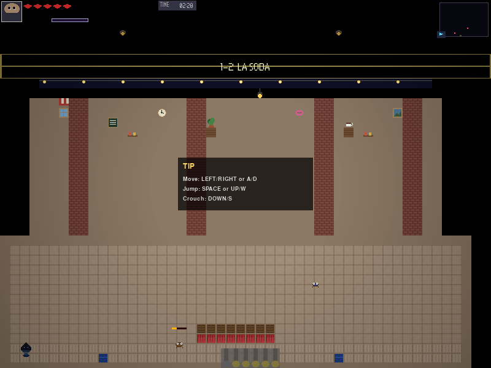

*Antes:* a vida llena (`pct = 1.0`) no se dibuja ninguna barra sobre el
enemigo (comportamiento sin la operación de Unidad V visible).
*Después:* `WalkerRaton_01` al ~35% de vida — `ColorTools.hsv_to_rgb()`
calculó un matiz cercano a 40° (naranja/amarillo) y `ColorTools.apply_tint()`
lo horneó sobre la `pygame.Surface` de la barra, visible en detalle abajo.

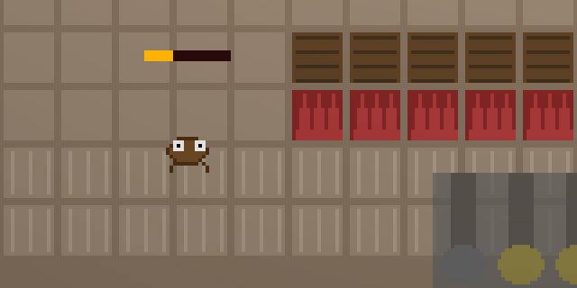

### Decisión de diseño — límite de tiempo (360 s, no los 150 s de la ficha)

El `.tmx` fija `time_limit=360` (subido de 240 en AUD-643, tras una pasada
normal con una muerte que terminó con solo 00:54 en el reloj), no los
150 s que da la ficha rápida de `docs/niveles/02_STAGE_1_2.md`. Es una
desviación deliberada, no un olvido.

**Por qué:** ese mismo documento define un tamaño de referencia de 768×608 px
y un mínimo de 1600×608 px para el nivel — los 150 s se diseñaron para esa
escala. Este mapa terminó en 3456×608 px (216×38 tiles), más del doble del
mínimo de la ficha, y con un jefe de dos fases que el jugador puede tardar
en vencer. Mantener 150 s (o incluso los 240 s originales) dejaba morir al
jugador por reloj sin relación con su desempeño real en combate.

**Dato medido que lo respalda:** el bot determinista, con el cocinero ya
vencido, llega a la salida en ~66.3 s de tiempo de juego
(`test_matando_al_cocinero_antes_el_bot_llega_a_la_salida_como_siempre`).
Un jugador humano, que combate a los 13 enemigos, resuelve la llave/cofre
y observa el escenario, necesita bastante más que eso — 360 s da margen
real sin ser tan generoso como para no presionar en absoluto.

### Decisión de diseño — cinco tipos de enemigo (la ficha pide 2-3)

La ficha rápida de `docs/niveles/02_STAGE_1_2.md` pide 2-3 tipos de
enemigo como máximo, y este nivel usa 5: `WalkerRaton`, `FlyingCucaracha`,
`FlyingZancudo`, `WalkerCulebra` y `ShooterCocinero` (renombradas desde
`Zancudo`/`Culebra` en AUD-637). Es una desviación deliberada, no un
descuido, y sigue el mismo criterio que la desviación del límite de
tiempo de arriba (y el de la cantidad de checkpoints, registrado en
`LA_SODA_PROGRESO.md`): los números de la ficha están escritos para su mapa
de referencia de 768 px de ancho, y este mapa mide 3456 px (216×38 tiles),
4,5 veces más.

**Por qué no es variedad inflada:** 5 tipos repartidos en 3456 px es una
densidad de variedad equivalente (de hecho, menor) a los 2-3 tipos que la
ficha imagina para sus 768 px — el criterio de variedad de la ficha no
escala con el tamaño del nivel, así que aplicar la misma densidad al mapa
real la deja holgada, igual que se hizo con el límite de tiempo y los
checkpoints.

**Dato medido que lo respalda:** `scripts/grade_stage.py` da 130/130
(100 %) con los 5 tipos instanciándose desde el `.tmx` — el calificador
automático los descubre por AST y no penaliza ninguno; la variedad extra no
cuesta puntos de ninguna categoría.

### Unidad VI — Texturas, animación, interpolación, colisiones, interacción

Tres piezas para el ítem de rúbrica "Animación con Easing" (10 pts: elegir una
función de `math_utils.py` y usarla *con* `EventBus` para una interacción que
el estudiante define):

- **Easing disparado por el `EventBus`, combinado en una sola interacción
  (AUD-641):** vencer al `ShooterCocinero` de la repisa (Z) hace que
  `EnemyBase._die()` emita `Events.ENEMY_DIED` (`enemy_base.py:591-595`).
  `_PuertaDelCocinero.suscribir` (`stage1_2_la_soda.py:773`) se suscribe una
  sola vez desde `Stage1_2_LaSoda.__init__`, y `_on_enemy_died` (línea 780)
  filtra por `entity_id.startswith("ShooterCocinero")` antes de: abrir
  `Door_Trasera` vía `InteractableSystem.abrir_por_evento("cocinero_muerto")`,
  mostrar un cartel de aviso (`Events.SHOW_MESSAGE`) y disparar dos
  animaciones con easing.

  **Función:** `ease_out_cubic(t) = 1 - (1-t)³` (`engine/utils/math_utils.py`).
  Es "out" porque su derivada es máxima en `t=0` y cae a 0 en `t=1`: el
  movimiento arranca rápido y frena suave — como una hoja de madera real que
  alguien levanta de un tirón y que frena sola al acercarse al marco, en vez
  de acelerar de golpe justo al encajar.

  **Dónde:** dos usos, ambos con `t` normalizado por un timer propio
  acumulado con `dt` (nunca `time.time()`, para que la animación sea
  determinista y reproducible en los tests):
  - `_PuertaTraseraVisual._alto_hoja` (`stage1_2_la_soda.py:665-673`): la
    hoja de la puerta se levanta hacia el dintel durante
    `DURACION_APERTURA = 0.8` s;
    `alto_hoja = rect.height * (1 - ease_out_cubic(t))`, anclada arriba, con
    el borde inferior subiendo.
  - `_ObjetivoCocinero.alpha` y `._offset_y` (líneas 571-584): el letrero de
    objetivo entra deslizándose 40 px desde arriba con `ease_out_cubic`
    durante 0.5 s (`DURACION_DESLIZAMIENTO`), se queda fijo 4 s
    (`DURACION_QUEDARSE`) mostrando "CUMPLIDO", y se desvanece (alpha) con
    la misma función durante 0.6 s (`DURACION_DESVANECIMIENTO`).

  **Hallazgo del motor que justifica el diseño:**
  `InteractableSystem.abrir_por_evento` (`interactable_system.py:153-180`)
  sólo lo llama un `Disparador` cuando un `EventTrigger` del `.tmx` se activa
  — el motor no tiene ningún concepto de "abrir una puerta al matar a un
  enemigo concreto" (ver hallazgo de motor #7c más arriba).

  **Cómo probarlo jugando:** entrar a la cocina (x≥2880) — aparece el
  letrero de objetivo; matar al `ShooterCocinero` de la repisa con Z; ver el
  letrero cambiar a "CUMPLIDO" y la hoja de la puerta trasera levantarse en
  0.8 s.

  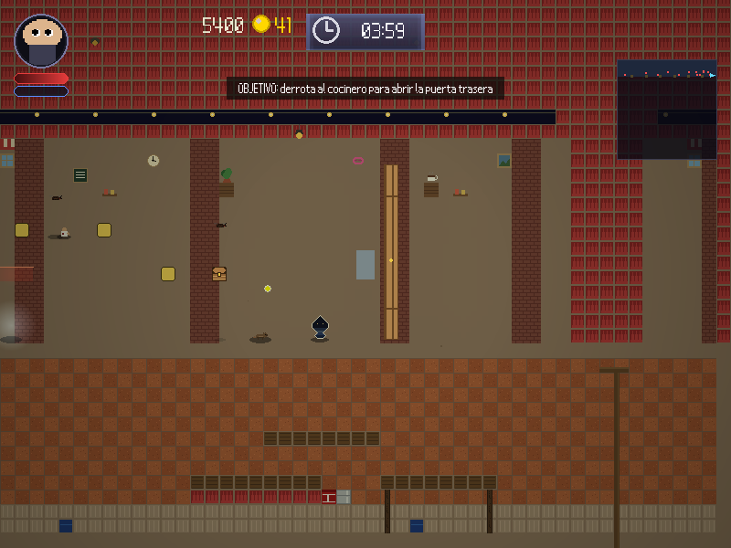

  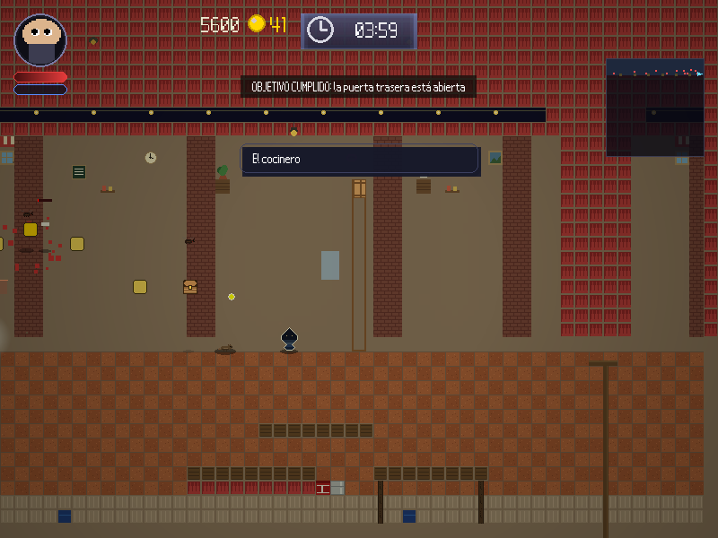

  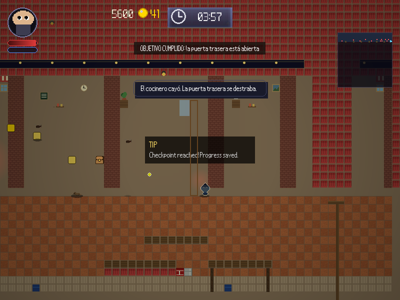

- **Easing en movimiento (AUD-617):** la flotación vertical del
  `FlyingZancudo` (`entities.py`; se llamaba `Zancudo` hasta AUD-637) usa
  `ease_in_out_quad` de `engine/utils/math_utils.py` compuesto en una
  campana `4·u·(1-u)` sobre la onda triangular, en vez de muestrear la
  spline Catmull-Rom con `t` lineal. El giro del fondo pasa de ir a ~21 px/s
  a casi 0, y el rango vertical de la patrulla no cambia.
- **Interacción propia vía `EventBus` (AUD-632):** `_RecompensaDePickup`
  se suscribe a `EVENTO_RECOGIDO` (`"INTERACT_ITEM_PICKED"`, el evento que
  emite `InteractableSystem._recoger()` del framework al recoger cualquiera
  de los 5 `Pickup` del mapa) y suma 50 puntos al HUD por cada uno
  (`ScoreSystem.set_score`, sin tocar el contador de monedas ni el
  inventario) y muestra el mensaje del pickup. Antes de esto, recoger un
  `Pickup` no tenía ningún efecto visible: el único suscriptor del
  framework solo sabe hablar con `Inventory`, y ninguno de estos `item_id`
  está en su catálogo. AUD-636 bajó el valor de 100 a 50, por debajo de
  cualquier entrada de `_SCORE_BY_TYPE` del motor (100-1000).
- **Desvanecido de muerte con easing (AUD-649):** las cinco plagas ya no
  desaparecen de golpe al morir: el cuadro "die" se desvanece durante
  0.3s con `alpha = 255 * (1 - ease_out_quad(t))`, a la vez que 6-8
  partículas caen con gravedad propia y se apagan solas.

  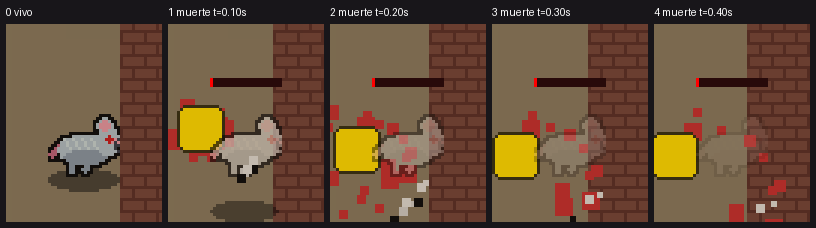

- **Barra de jefe con daño diferido + sacudida de cámara (AUD-650, AUD-651, AUD-652):**
  mientras el jugador esté en la cocina (x≥2880) y el `ShooterCocinero`
  siga vivo, `_BarraDeJefe` muestra "COCINERO DE MAL HUMOR" y una barra que
  se llena de 0 a la vida actual la primera vez que aparece
  (`ease_out_cubic`, 0.6s) y después sigue `current_health/max_health`
  leídos de la instancia en cada fotograma (`max_health` cambió de 3 a 5
  con la fase 2 de AUD-651). Al recibir un golpe, el tramo perdido queda
  un segmento blanco ("fantasma") 0.25s y luego se retrae con
  `ease_out_quad`; al morir, la barra se vacía y se desvanece con
  `ease_out_cubic` en 0.5s. `_SacudidaDeCamara` es una fachada sobre
  `Camera.apply_shake` del propio motor: dispara 2px/0.12s en cada golpe
  que conecta, 3px/0.25s al abrirse la puerta y 6px/0.35s al morir el
  cocinero, con dirección pseudoaleatoria determinista (contador × ángulo
  áureo, sin `random`). `Y_BARRA=150` (AUD-652, no los `Y_BARRA=320` de
  AUD-650 — ver la tabla de iteración en Testing más arriba).

  

### Unidad VII — Histograma, brillo, contraste, convolución, Sobel (AUD-645, corregida en AUD-646)

Tres piezas de `FilterTools` (`src/framework/processing/filter_tools.py`),
cada una leyendo el fotograma REAL del juego (no una superficie inventada
aparte) y usando la cifra medida para decidir algo — no como decoración. El
patrón es el mismo en las tres: medir una sola vez (en el instante del
cruce/evento, nunca por fotograma), cachear el resultado, y reutilizarlo con
un costo por fotograma cercano a cero.

#### Ítem 1 — Histograma + brillo/contraste: `_LecturaDeLuz`

**Dónde:** clase `_LecturaDeLuz`, disparada al FINAL de
`Stage1_2_LaSoda.dibujar_mundo()` (después de TODO lo demás del mundo:
entidades, contorno de alerta, iconos, puerta, marco) — nunca en
`dibujar_ui`.

**El gancho real:** `_RoomTransition` ya modela el cruce "exterior" →
"interior" al pasar la puerta, y las `AmbientLightZone` del `.tmx` ya
oscurecen la sala/cocina. Lo que no existía es que el propio *juego* se
enterara de cuánto más oscuro está — `_LecturaDeLuz` cierra ese hueco con
datos, no con una suposición.

**Qué hace, en orden:** apenas `_room_transition.room` pasa a `"interior"`
(una sola vez por vida de la escena):
1. Reduce el fotograma a una muestra de 100×75 px (`pygame.transform.
   smoothscale`, ~1/64 de los 800×600 reales) y le corre
   `FilterTools.compute_histogram()`.
2. `_luminancia_media()` — el promedio ponderado del histograma
   `luminance` — es la cifra que decide todo lo que sigue.
3. Si esa luminancia cae por debajo de `UMBRAL_LUMINANCIA = 70.0`:
   corre `FilterTools.adjust_brightness()` sobre la misma muestra para
   calcular el factor que la acerca a `LUMINANCIA_OBJETIVO = 90.0` (tope
   propio `FACTOR_MAXIMO = 1.6`), hornea ese factor en un `overlay`
   CÁLIDO translúcido de 800×600 con alpha acotado a `ALPHA_MAXIMO = 36`,
   y avisa al jugador con `Events.SHOW_MESSAGE` ("Está oscuro aquí...").
4. Fotogramas siguientes: `dibujar_overlay()` sólo hace un `Surface.blit`
   del overlay ya calculado.

**Regresión AUD-646 (corregida acá).** La medición y el factor de
`adjust_brightness` de AUD-645 ya estaban bien, pero la ACCIÓN de juego no:
era un `overlay` **blanco** `(255,255,255,alpha)` con `alpha` hasta
**132/255 (~52%)**, blitteado en `dibujar_ui()` sobre TODO el fotograma
mientras el jugador seguía adentro — el resultado no era "adaptación a la
penumbra", era la pantalla entera lavada/pálida, destruyendo la
ambientación 0.58/0.78 calibrada jugando en AUD-633. Dos correcciones:
1. Overlay **cálido** `(255, 230, 190)`, alpha con tope duro
   `ALPHA_MAXIMO = 36` (~14%), escalado en proporción al factor calculado.
2. Se mueve de `dibujar_ui()` al FINAL de `dibujar_mundo()` — el mundo ya
   está pintado por completo en ese punto y `dibujar_ui()` (HUD,
   letreros) todavía no corrió, así que el teñido queda exclusivamente
   sobre el mundo.
3. `UMBRAL_LUMINANCIA` sube de 90 a 70 (con `LUMINANCIA_OBJETIVO` bajado
   de 115 a 90 en la misma proporción): a 90 el umbral era tan generoso
   que casi cualquier interior lo cruzaba. Medido contra el mapa real: la
   sala da **55-62/255** (sigue disparando) y la cocina **74-78/255** (con
   `valor=0.78` en el .tmx, ya iluminada para trabajar — nunca se dispara
   ahí, con margen de sobra).

**Cifras medidas contra el mapa real** (parado justo pasando
`ROOM_LIMIT_X`, dentro de la sala):

| Cifra | Valor |
|---|---|
| Luminancia antes (`compute_histogram`, canal `luminance`) | **55.32** / 255 |
| Umbral (`UMBRAL_LUMINANCIA`) | 70.0 |
| Factor aplicado (`adjust_brightness`) | **1.6** (tope `FACTOR_MAXIMO`) |
| Luminancia después (mismo cálculo sobre el resultado) | **88.48** / 255 |
| Alpha real del overlay en juego (`ALPHA_MAXIMO`) | **36** / 255 (~14%) |
| Luminancia de la cocina en el mismo punto de referencia | **77.52** / 255 (no dispara) |
| Costo del cálculo único (`compute_histogram` ×2 + `adjust_brightness`) | **~3 ms** |

Los 3 ms del cálculo único ocurren durante el fundido a negro de
`_RoomTransition` (0.2 s de fade-out + 0.25 s de fade-in, ~27 fotogramas) —
quedan completamente ocultos detrás de la pantalla negra de la transición.

**Cómo probarlo jugando:** cruzar la puerta hacia la sala (x ≥ 2560). El
cartel "Está oscuro aquí..." aparece y el interior se ve apenas más
cálido/claro que sin el ajuste — no lavado.

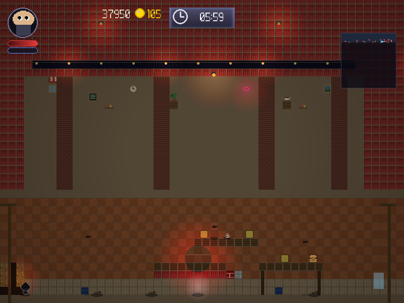

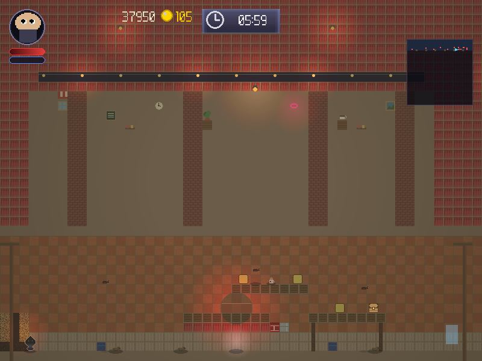

#### Ítem 2 — Convolución: `_ObjetivoCocinero._fondo_para`

**Dónde:** método `_fondo_para` de `_ObjetivoCocinero` (la misma clase del
letrero de objetivo con easing de la Unidad VI, AUD-641).

**Qué hace:** el fondo del letrero "OBJETIVO: derrota al cocinero..." ya no
es un rectángulo de color plano — es un desenfoque real de los píxeles del
mundo que hay detrás, calculado con `FilterTools.apply_kernel()` y el
kernel `box_blur` precargado. El recorte se cachea por tamaño de panel
(`_fondo_tam`): el panel sólo cambia de tamaño dos veces en toda su vida
(texto "OBJETIVO: ..." → texto "CUMPLIDO"), así que la convolución corre
como máximo **dos veces por partida**, nunca por fotograma.

**Cifras medidas:** panel real al entrar a la cocina, **304×25 px**
(depende del ancho del texto renderizado); la convolución corrió **1 vez**
para ese tamaño y no se repitió en los fotogramas siguientes.

**Cómo probarlo jugando:** entrar a la cocina (x ≥ 2880) — el letrero de
objetivo aparece con un fondo de vidrio esmerilado, no un panel liso.

Recorte del fondo del letrero, antes y después de `apply_kernel` (escalado
×6 para que el desenfoque se note):

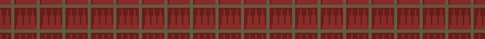

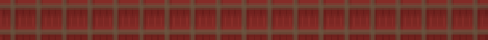

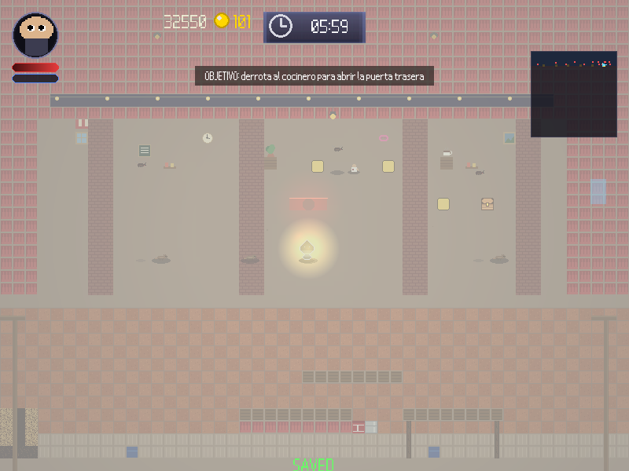

#### Ítem 3 — Detección de bordes: `_ContornoDeAlerta`

**Dónde:** clase `_ContornoDeAlerta`, llamada desde
`Stage1_2_LaSoda.dibujar_mundo()` justo después de `super().dibujar_mundo()`
y antes de `_draw_enemy_health_bars`.

**Qué hace:** cuando un enemigo cae a ≤25% de vida (`UMBRAL_VIDA`), le corre
`FilterTools.sobel_edge()` a su SPRITE PROPIO (el `frame` actual de
`entity._sprite_frames`, compuesto sobre un fondo negro) **una sola vez** —
cacheada por `id(entity)`, nunca recalculada mientras la vida siga baja.
`pixeles_borde` (cuántos píxeles de la magnitud de gradiente superan el
umbral efectivo) es la cifra que decide si de verdad hay una silueta
reconocible que resaltar: por debajo de `MIN_PIXELES_BORDE = 12` no se
dibuja nada. El contorno coloreado (rojo, alpha = magnitud del gradiente,
sólo en los píxeles que superaron el umbral) se blitea con un blit NORMAL
sobre el enemigo, como un resplandor de alerta.

**Regresión AUD-646 (corregida acá).**
`unit7_sobel_contorno_detalle_despues.png` mostraba un bloque rosa SÓLIDO
del tamaño del rect del enemigo tapando al ratón, no un contorno. Tres
causas, la primera con diferencia la dominante:

1. **`BLEND_RGBA_ADD` no pesa por alpha.** AUD-645 pintaba TODOS los
   píxeles del recorte con el mismo color `(255,40,30)` y sólo variaba su
   ALPHA (magnitud donde superaba el umbral, 0 en el resto), asumiendo que
   `special_flags=pygame.BLEND_RGBA_ADD` iba a usar ese alpha como peso de
   mezcla. No es así: `BLEND_RGBA_ADD` SUMA los canales R,G,B del origen al
   destino tal cual, sin escalar por alpha. **Arreglo: blit normal, sin
   `special_flags`.**
2. **El recorte salía de la pantalla, no del sprite.** `_medir` recortaba
   `surface.subsurface(entity.rect)` — el fotograma YA dibujado. El rect
   de colisión del ratón (24×28) es más grande que su sprite real (16×12
   del molde de zona, hoy 24×24 propio tras AUD-648): `EnemyBase.draw()`
   lo centra horizontal y lo apoya abajo, dejando piso/pared visibles
   arriba y a los costados DENTRO del propio recorte. **Arreglo: recortar
   `entity._sprite_frames` (el frame propio), no la pantalla.**
3. **El propio sprite, aislado, ya es denso.** Incluso recortando sólo el
   frame del ratón y componiéndolo sobre negro, `UMBRAL_MAGNITUD=40`
   dejaba más de la mitad del recorte "opaco" — el detalle interno del
   propio pixel art a esa resolución ya es denso. **Arreglo:
   `_umbral_adaptativo` sube el umbral (percentil de la propia magnitud)
   sólo cuando el base deja más de `AREA_DISPARA_ADAPTATIVO` (50%) opaco,
   hasta bajar a `AREA_MAXIMA_CONTORNO` (30%) o menos.**

**Cifras medidas** (`WalkerRaton_01`, llevado a 20% de vida con la vida
real de la entidad):

| Cifra | Valor |
|---|---|
| Umbral de vida (`UMBRAL_VIDA`) | 25% |
| Umbral de magnitud base (`UMBRAL_MAGNITUD`) | 40 / 255 |
| Umbral efectivo tras `_umbral_adaptativo` (percentil 70 de la magnitud) | **220** / 255 |
| Mínimo para activar el contorno (`MIN_PIXELES_BORDE`) | 12 |
| Costo del cálculo único, primera vez del proceso (incluye el `import cv2` perezoso de `sobel_edge`) | **~30-40 ms** |
| Costo de una medición posterior (cv2 ya cargado) | **< 0.1 ms** |

El costo alto de la *primera* medición de todo el proceso es casi entero el
`import cv2` de `FilterTools.sobel_edge` (perezoso, compartido con Unidad
III/IV del curso de visión) — un costo de proceso, pagado una única vez en
toda la partida, no por enemigo ni por fotograma.

**Cómo probarlo jugando:** dañar a cualquier enemigo hasta dejarlo a ≤25%
de vida sin matarlo — una línea roja fina aparece alrededor de su silueta,
con el sprite visible adentro, calculada a partir de sus bordes reales, no
un bloque plano.


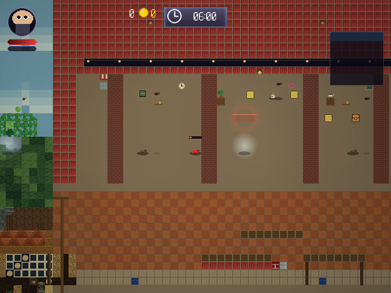

Detalle recortado y escalado (×5) del mismo par, para ver el contorno de
cerca:

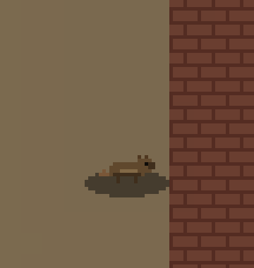

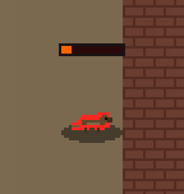

#### Matriz del kernel (copiada literal de `src/framework/processing/filter_tools.py:19-28`)

Los 9 kernels precargados:

| Nombre | Matriz (numpy, fila por fila) |
|---|---|
| `identity` | `[[0,0,0],[0,1,0],[0,0,0]]` |
| `sharpen` | `[[0,-1,0],[-1,5,-1],[0,-1,0]]` |
| `box_blur` | `ones(3,3)/9` |
| `box_blur_5` | `ones(5,5)/25` |
| `edge_laplacian` | `[[0,1,0],[1,-4,1],[0,1,0]]` |
| `emboss` | `[[-2,-1,0],[-1,1,1],[0,1,2]]` |
| `ridge` | `[[-1,-1,-1],[-1,8,-1],[-1,-1,-1]]` |
| `sobel_x` | `[[-1,0,1],[-2,0,2],[-1,0,1]]` |
| `sobel_y` | `[[-1,-2,-1],[0,0,0],[1,2,1]]` |

**`sobel_x`** — detecta bordes verticales:

```
-1   0  +1
-2   0  +2
-1   0  +1
```

Calcula una derivada discreta de la intensidad a lo largo del eje **X**
(compara la columna izquierda con la derecha), suavizando en Y con la fila
central más pesada. Responde fuerte donde la imagen cambia rápido en
horizontal — es decir, frente a **bordes verticales** — y devuelve ~0 en
zonas planas.

**`sobel_y`** — detecta bordes horizontales:

```
-1  -2  -1
 0   0   0
+1  +2  +1
```

Es la versión transpuesta de `sobel_x`: deriva a lo largo del eje **Y**
(compara la fila superior con la inferior), con la columna central más
pesada para suavizar en X. Responde a **bordes horizontales**.

La magnitud `sqrt(sobel_x² + sobel_y²)` es la "magnitud del gradiente", la
base de `sobel_edge()` y del contorno de alerta de `_ContornoDeAlerta`
(ítem 3, arriba) — `FilterTools.sobel_edge()` la calcula con OpenCV
(`cv2.Sobel` en X e Y + `cv2.magnitude`), no a mano.

> Las capturas antes/después de cada ítem están en las secciones de arriba,
> junto a las cifras que las producen — no se inventa ningún resultado: los
> cálculos (luminancia, tamaño de panel, píxeles de borde) están medidos
> contra la escena real del `.tmx` (`test_la_soda.py`, `TestLecturaDeLuz`,
> `TestFondoBorrosoDelObjetivo`, `TestContornoDeAlerta`).
