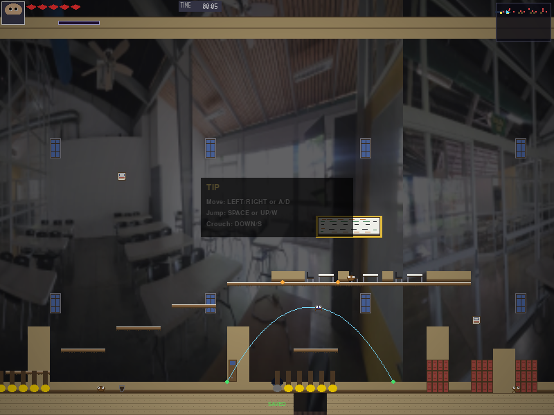
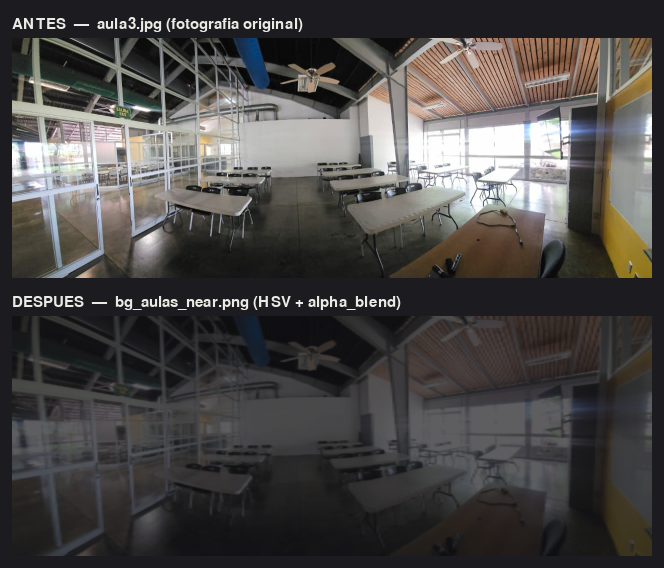

# Stage 1-3 — Las Aulas

**Yariel Andrey Elizondo Jiménez**
**Zona 1 (Universidad) · Evaluación Práctica I · Entrega 30 de julio de 2026**

## Cómo ejecutarlo

```bash
python main.py --stage stage1_3_las_aulas
```

---

## 1. Concepto del nivel

Las aulas de la universidad después de la infestación. El jugador recorre tres
salones conectados por pasillos de casilleros, esquivando estudiantes infectados
que patrullan entre los pupitres y hojas de cuaderno que planean por el aire.
El piso está roto en cuatro tramos: hay que saltar los huecos o caer al vacío.
Desde cada salón sale una escalera de estantes que sube a un entrepiso, donde
hay un aula del piso superior con su propia pizarra.

La paleta no es inventada: los colores se midieron sobre **fotografías del aula
física** — blanco `(238,238,232)` de la pizarra, amarillo `(224,186,62)` de la
pared de acento, negro `(38,38,42)` de las sillas, crema `(238,238,232)` de las
mesas plegables. Las mismas fotos son el fondo parallax del nivel (§5).

---

## 2. Unidad II — Sistemas de coordenadas y transformaciones vectoriales

Archivo: [`estudiante_infectado.py`](estudiante_infectado.py)

El `EstudianteInfectado` **no** usa la detección por caja de `EnemyBase`
(`|dx| <= rango_x and |dy| <= rango_y`, que describe un rectángulo). Implementa
un modelo de visión con tres operaciones vectoriales explícitas de
`src/engine/utils/math_utils.py`.

### 2.1 Distancia euclidiana — `vec2_distance`

$$d = \lVert \vec{p}_{jugador} - \vec{p}_{enemigo} \rVert = \sqrt{(\Delta x)^2 + (\Delta y)^2}$$

Define un **círculo** de visión de radio 140 px en vez de un rectángulo, así que
el enemigo reacciona igual venga el jugador desde donde venga. Verificado:
`vec2_distance((0,0),(3,4)) = 5.0`, que es el triángulo 3-4-5.

### 2.2 Normalización — `vec2_normalize`

$$\hat{d} = \frac{\vec{d}}{\lVert \vec{d} \rVert}, \qquad \lVert \hat{d} \rVert = 1$$

La persecución avanza así:

$$\vec{p} \mathrel{+}= \hat{d} \cdot v \cdot \Delta t$$

Como $\hat{d}$ es unitario, el módulo del desplazamiento por frame es
exactamente $v \cdot \Delta t$ **sin importar la distancia al jugador**. Medido
con `alert_speed = 85` px/s y `dt = 1/60`:

| Distancia al jugador | Avance por frame |
| --- | --- |
| 50 px | 1.41666 px |
| 150 px | 1.41666 px |
| 400 px | 1.41666 px |

Sin normalizar, el enemigo a 400 px se movería 8 veces más rápido que a 50 px:
es el error clásico de esta mecánica.

### 2.3 Producto punto — `vec2_dot`

$$\vec{a} \cdot \vec{b} = a_x b_x + a_y b_y = \lVert\vec{a}\rVert \lVert\vec{b}\rVert \cos\theta$$

Con **dos vectores unitarios**, $\lVert\vec{a}\rVert = \lVert\vec{b}\rVert = 1$,
así que el producto punto **es** el coseno del ángulo entre ellos. El cono de
visión evalúa:

$$\hat{d} \cdot \hat{f} \ \geq\ \cos\!\left(\frac{\alpha}{2}\right)$$

donde $\hat{f}$ es la dirección de la mirada y $\alpha = 120°$ la apertura, de
modo que el umbral es $\cos 60° = 0.5$. Se comparan **cosenos** en vez de
calcular arcocosenos, que son costosos y se evaluarían 60 veces por segundo.

El coseno se precalcula una sola vez en el constructor (`_cos_media_apertura`).

Casos verificados (enemigo mirando a la derecha, apertura 120°):

| Posición del jugador | ¿Lo ve? | Motivo |
| --- | --- | --- |
| 100 px al frente | Sí | dentro del círculo y del cono |
| 100 px detrás | No | fuera del cono ($\cos\theta = -1$) |
| 200 px al frente | No | fuera del círculo |
| 70 px arriba-adelante (45°) | Sí | $\cos 45° = 0.707 \geq 0.5$ |
| 100 px justo arriba (90°) | No | $\cos 90° = 0 < 0.5$ |
| 30 px detrás | Sí | percepción periférica (radio 40 px) |

La percepción periférica es una excepción deliberada: sin ella, el jugador podría
pegarse a la espalda del enemigo indefinidamente.

### 2.4 Enemigos colocados

| Nombre | X | Y | Mira | Patrulla | Radio | Apertura |
| --- | --- | --- | --- | --- | --- | --- |
| Estudiante_14 | 448 | 576 | derecha | 96 px | 140 px | 120° |
| Estudiante_15 | 1088 | 576 | izquierda | 96 px | 140 px | 120° |
| Estudiante_16 | 1696 | 576 | derecha | 128 px | 140 px | 120° |
| Estudiante_17 | 2368 | 576 | izquierda | 96 px | 140 px | 120° |
| Estudiante_18 | 2944 | 576 | izquierda | 80 px | 140 px | 120° |
| Estudiante_19 | 768 | 416 | derecha | 96 px | 140 px | 120° |
| Estudiante_20 | 1984 | 416 | izquierda | 96 px | 140 px | 120° |
| Estudiante_21 | 2688 | 416 | derecha | 96 px | 140 px | 120° |

Los tres últimos patrullan sobre los entrepisos. La Y del TMX son los **pies**
del enemigo, según `06_TMX_SPEC.md` §6.1.

---

## 3. Unidad III — Curvas básicas (Bézier)

Archivo: [`cuaderno_volador.py`](cuaderno_volador.py)

El `CuadernoVolador` recorre una **curva de Bézier cúbica** calculada con
`CurveTools.bezier()`, que evalúa la base de Bernstein:

$$B(t) = \sum_{i=0}^{n} \binom{n}{i}\, t^{i}\,(1-t)^{n-i}\, P_i, \qquad t \in [0,1]$$

Con $n = 3$ (cuatro puntos de control) queda:

$$B(t) = (1-t)^3 P_0 + 3(1-t)^2 t\, P_1 + 3(1-t)t^2 P_2 + t^3 P_3$$

### 3.1 Puntos de control

Están declarados **dentro del TMX** como objetos `type="Waypoint"` con la
propiedad `owner_id` apuntando al nombre del cuaderno, así que se pueden abrir
e inspeccionar en Tiled. `StageLoader` los inyecta como argumento `waypoints`.

| Cuaderno | P₀ | P₁ | P₂ | P₃ |
| --- | --- | --- | --- | --- |
| Cuaderno_A | (640, 560) | (720, 416) | (800, 416) | (880, 560) |
| Cuaderno_B | (1280, 560) | (1360, 416) | (1440, 416) | (1520, 560) |
| Cuaderno_C | (1952, 560) | (2032, 416) | (2112, 416) | (2192, 560) |
| Cuaderno_D | (2560, 560) | (2640, 416) | (2720, 416) | (2800, 560) |

Cada arco cruza uno de los cuatro huecos del piso: la curva **señala el peligro**
antes de que el jugador llegue.

P₁ y P₂ se colocan a un tercio del ancho total desde cada extremo. Si se juntan
en el centro el arco sale puntiagudo; si se corren a los extremos se aplana.

### 3.2 Propiedades verificadas

Comparando `CurveTools.bezier()` contra la fórmula de Bernstein calculada a mano
para el Cuaderno_A:

| t | B(t) esperado | B(t) obtenido |
| --- | --- | --- |
| 0.00 | (640.0, 560.0) | (640.0, 560.0) |
| 0.25 | coincide | coincide |
| 0.50 | coincide | coincide |
| 0.75 | coincide | coincide |
| 1.00 | (880.0, 560.0) | (880.0, 560.0) |

- **$B(0) = P_0$ y $B(1) = P_3$**: la curva arranca y termina en los extremos,
  así que el recorrido se puede alinear con la geometría del aula.
- **No pasa por P₁ ni P₂**: la distancia mínima de la curva a P₁ es 50.8 px.
  Son tiradores, no puntos de paso.
- **Casco convexo**: toda la curva queda dentro de la caja formada por P₀…P₃,
  o sea que no puede atravesar el techo ni el piso si los puntos están bien
  puestos.

### 3.3 Decisiones de implementación

**Muestreo único.** La curva se evalúa una sola vez en el constructor (160
muestras) y cada frame solo se interpola linealmente sobre esa lista con
`CurveTools.sample_path()`. Evaluar Bernstein 60 veces por segundo recalcularía
siempre los mismos puntos.

**Geometría y tiempo desacoplados.** El parámetro $t$ es adimensional y avanza a
razón de $1/\text{periodo}$ por segundo. Cambiar `periodo` (5.0 s en este nivel)
cambia la rapidez **sin deformar la curva**.

**Orientación por la tangente.** El sprite mira hacia donde avanza, usando la
dirección entre dos muestras consecutivas como aproximación de la tangente:

$$\hat{T} \approx \text{normalize}\big(B(t + h) - B(t)\big), \qquad h = 0.01$$

**Sobre `build_bezier_path()`.** El motor trae `EnemyFlying` con
`flight_mode="bezier"`, pero ese camino llama a `CurveTools.build_bezier_path()`,
que internamente evalúa `_eval_catmull()`: es una spline de **Catmull-Rom**, no
una Bézier. Por eso esta entidad usa `CurveTools.bezier()`, que sí evalúa la base
de Bernstein, y la fórmula documentada coincide con el código ejecutado.

### 3.4 Visualización



Apretando **F1** dentro del juego (`on_debug_toggle()` en
`stage1_3_las_aulas.py`) se dibuja la curva muestreada en **celeste**, P₀ y P₃
en **verde** —la curva pasa por ellos— y P₁ y P₂ en **naranja**, que solo la
atraen sin ser tocados.

En la captura el cuaderno está en t = 0.55, cerca del vértice del arco, cruzando
el primer hueco del piso. Se aprecia que la curva nace y muere sobre el suelo
(P₀ y P₃ verdes, al ras) mientras los tiradores naranjas quedan muy por encima:
esa diferencia es justamente lo que produce el arco.

---

## 4. Unidad IV — Representación gráfica y sistema de capas

### 4.1 Las ocho capas

El mapa mide **200 × 38 tiles = 3200 × 608 px**, cuatro pantallas de ancho
(la resolución interna es 800 × 600).

| Orden | Capa | Tipo | Contenido | Tiles |
| --- | --- | --- | --- | --- |
| 1 | `BG_Far` | tiles | zócalo y pilastras del fondo | 306 |
| 2 | `BG_Mid` | tiles | pizarras y ventanas | 144 |
| 3 | `BG_Near` | tiles | casilleros de los pasillos | 36 |
| 4 | `Terrain` | tiles | piso, techo, paredes, plataformas | 1036 |
| 5 | `Terrain_Detail` | tiles | pupitres, sillas, papeleras, molduras | 78 |
| 6 | `Objects` | objetos | spawn, checkpoints, enemigos, waypoints | 41 |
| 7 | `Collision` | objetos | 8 `Solid` + 22 `Platform` | 30 |
| 8 | `FG_Overlay` | tiles | columnas por delante del jugador | 24 |

`BG_Far` se dejó **deliberadamente sin relleno completo**: el parallax con las
fotografías se dibuja detrás del mapa de azulejos, así que una pared opaca lo
taparía (ver §7.3).

### 4.2 Tileset propio

`assets/tilesets/tileset_aulas_yariel.png` — 64 tiles de 16 × 16 px en rejilla
8 × 8, dibujados para este nivel. Los 24 definidos:

| GID | Tile | ¿Colisiona? |
| --- | --- | --- |
| 1–2 | Piso y borde de piso | Sí (`Solid`) |
| 3–5 | Pared, zócalo, techo | Sí (`Solid`) |
| 6 | Estante (plataforma) | Sí (`Platform`, atravesable desde abajo) |
| 7–8 | Mesa plegable (2 tiles de ancho) | No |
| 9–10 | Silla negra (mirando a cada lado) | No |
| 11–13, 21–23 | Pizarra blanca (3 × 2 tiles) | No |
| 14, 24 | Ventana (1 × 2 tiles) | No |
| 15–16 | Puerta (1 × 2 tiles) | No |
| 17 | Casilleros | No |
| 18–20 | Papelera, reloj, afiche | No |

**Lenguaje visual.** El GID 6 (plataforma) lleva un filo claro en el borde
superior; nada más en el tileset lo tiene. Es la señal de "aquí se puede pisar".
Durante las pruebas de juego se detectó que las pizarras de una sola fila de alto
se confundían con plataformas, así que se rediseñaron a dos filas con marco y
bandeja de marcadores.

### 4.3 Orden de renderizado (Z-order)

`DrawingSystem` ordena las entidades por profundidad antes de dibujarlas:

```python
drawables.sort(key=lambda x: x[1])   # x[1] == rect.centery
```

Es un **z-order por posición vertical**: lo que está más abajo en pantalla se
dibuja después, o sea encima. Simula profundidad en una vista lateral sin
necesidad de un buffer de profundidad. Sobre esa capa se dibuja `FG_Overlay`,
que siempre queda por delante del jugador.

### 4.4 Física del salto y diseño del terreno

Constantes del motor (`src/engine/core/settings.py`):

```
GRAVITY = 800.0    PLAYER_JUMP_FORCE = -380.0    PLAYER_WALK_SPEED = 90.0
```

Altura máxima de un salto:

$$h_{max} = \frac{v^2}{2g} = \frac{380^2}{2 \times 800} = 90.25\ \text{px}$$

Pero la altura sola no basta: importa **cuánto tiempo** se está por encima de
cierta altura. Resolviendo $\frac{g}{2}t^2 - vt + h = 0$:

$$t_{1,2} = \frac{380 \pm \sqrt{144400 - 1600\,h}}{800}$$

y el alcance horizontal es $(t_2 - t_1) \times 90$:

| Subir | Ventana | Alcance horizontal |
| --- | --- | --- |
| 0 px | 0.95 s | 85 px |
| 32 px | 0.76 s | 69 px |
| 48 px | 0.65 s | 58 px |
| 64 px | 0.51 s | 46 px |
| 80 px | 0.32 s | 28 px |

Todo el terreno se diseñó contra esta tabla, con un **margen de seguridad del
70 %**. Las tres escaleras suben de dos filas en dos filas (32 px) avanzando solo
una columna (16 px), muy por debajo del límite de 48 px. El generador valida las
18 transiciones automáticamente y reporta cero saltos inválidos.

Los cuatro huecos del piso miden **48 px** contra un máximo permitido de 60 px:
hay que saltar, pero con margen. Cada uno lleva un `DeathPit` debajo y un
**checkpoint inmediatamente antes**, para que morir no obligue a repetir tramos
largos.

### 4.5 Objetos de control

| Tipo | Cantidad | Posición |
| --- | --- | --- |
| `PlayerSpawn` | 1 | (64, 576) |
| `Checkpoint` | 7 | ids 0–6, en x = 288, 704, 1344, 1504, 2016, 2208, 2624 |
| `NextTrigger` | 1 | (3040, 512), 32 × 64 px |
| `DeathPit` | 4 | x = 736, 1376, 2048, 2656 · 48 × 16 px |

---

## 5. Unidad V — Color y transparencia

Archivo generador: `generar_fondos.py` · Salida:
`assets/backgrounds/aulas/bg_aulas_{far,mid,near}.png`

Las tres capas de parallax se derivaron de **tres fotografías del aula real**
tomadas por el estudiante, procesadas con `ColorTools`.

### 5.1 Perspectiva atmosférica vía HSV

Cuanto más lejos está un objeto, más aire hay entre él y el ojo: pierde
saturación y contraste. Ese efecto no se puede reproducir en RGB sin alterar
también el tono, así que se convierte cada píxel a HSV y se tocan **S** y **V**
por separado:

$$\text{RGB} \xrightarrow{\ \texttt{ColorTools.rgb\_to\_hsv}\ } (H, S, V)$$
$$S' = S \cdot k_s \qquad V' = V \cdot k_v + \delta$$
$$(H, S', V') \xrightarrow{\ \texttt{ColorTools.hsv\_to\_rgb}\ } \text{RGB}$$

| Capa | Foto | $k_s$ | $k_v$ | $\delta$ | Parallax |
| --- | --- | --- | --- | --- | --- |
| `BG_Far` | aula1 | 0.25 | 0.55 | 0.12 | 0.15× |
| `BG_Mid` | aula2 | 0.55 | 0.70 | 0.06 | 0.40× |
| `BG_Near` | aula3 | 0.85 | 0.85 | 0.02 | 0.70× |

El tono $H$ **nunca se toca**: el aula conserva su identidad cromática.

### 5.2 Mezcla alfa

Sobre el resultado se aplica `ColorTools.alpha_blend()` contra un lienzo oscuro:

$$C_{final} = \alpha \cdot C_{foto} + (1 - \alpha)\cdot C_{fondo}$$

con $\alpha$ = 0.30 / 0.34 / 0.38 para far / mid / near. Sin esto la fotografía
compite con el pixel art del primer plano y el terreno deja de leerse.

El lienzo es un gris oscuro casi neutro `(20,20,24)`. Se probó primero con el
azul marino del motor `(15,15,40)` y, por ser un azul muy saturado, la
saturación final **subía** de 0.136 a 0.308, contradiciendo la perspectiva
atmosférica que se buscaba.

### 5.3 Resultado medido

Saturación media antes y después del pipeline completo:

| Capa | Antes | Después | Reducción |
| --- | --- | --- | --- |
| `BG_Far` | 0.136 | 0.058 | **−57 %** |
| `BG_Mid` | 0.196 | 0.095 | **−52 %** |
| `BG_Near` | 0.135 | 0.086 | **−36 %** |

La reducción es **mayor cuanto más lejos está la capa**, que es exactamente lo
que predice el modelo.

### 5.4 Antes y después



Arriba la fotografía tal como salió del teléfono; abajo la misma imagen después
de la conversión HSV y la mezcla alfa. El aula sigue siendo reconocible —mesas,
sillas, techo de listones, pared amarilla— pero pierde la fuerza cromática que
la haría competir con el pixel art. La saturación media de esta capa baja de
0.137 a 0.090 en la comparación mostrada.

---

## 6. Lógica personalizada

- **Detección vectorial** (`estudiante_infectado.py`): sobrescribe
  `_player_in_range()` de `EnemyBase` para reemplazar la caja rectangular por
  círculo + cono de visión.
- **Recorrido de curva** (`cuaderno_volador.py`): `_recorrer()` avanza $t$ en
  ida y vuelta y reubica la entidad sobre la Bézier premuestreada.
- **Visualización de curvas** (`stage1_3_las_aulas.py`): `on_debug_toggle()`
  activa el dibujo de la curva y sus puntos de control con **F1**.
- **Registro de entidades**: cada módulo llama a
  `StageLoader.register_entity()` al importarse, para que los objetos del TMX
  con `type="EstudianteInfectado"` o `type="CuadernoVolador"` se instancien
  automáticamente.

---

## 7. Problemas del framework encontrados y resueltos

Los tres se resolvieron **sobrescribiendo métodos en la subclase**, sin
modificar ningún archivo de `src/engine/` ni de `src/framework/`.

### 7.1 `on_stage_start()` sin `super()`

La plantilla `stage_template.py` sobrescribe `on_stage_start()` con `pass`, pero
la implementación de `StageScene` dispara el overlay de tutorial. Sin llamar a
`super().on_stage_start()` el tutorial nunca aparece.

### 7.2 El mapa de azulejos no scrollea

`StageScene` sincroniza pyscroll asignando directamente el rectángulo de vista:

```python
stage.map_layer._map_layer.view_rect = pygame.Rect(...)
```

Esa asignación **no invalida el búfer interno** del `BufferedRenderer`. Resultado:
la cámara y las entidades se mueven, pero las capas de azulejos quedan congeladas
en la posición inicial. Afecta a todos los niveles del juego.

**Solución** (`draw()` en la subclase): llamar a `center()`, que es el método que
pyscroll expone justamente para esto.

```python
self._stage_data.map_layer._map_layer.center((
    camara.x + settings.INTERNAL_WIDTH / 2,
    camara.y + settings.INTERNAL_HEIGHT / 2,
))
```

### 7.3 Los fondos parallax nunca se ven

`DrawingSystem.draw()` ejecuta en este orden:

```
fill(BG_COLOR)  ->  _draw_background(fotos)  ->  map_layer.draw()
```

pyscroll crea su `BufferedRenderer` con `alpha=False`, es decir un búfer
**opaco**: al dibujar el mapa pinta también las celdas vacías y borra el parallax
recién pintado. Por eso ningún nivel del juego muestra su fondo, aunque
`StageLoader` los cargue correctamente.

**Solución** (`on_enter()` en la subclase): reconstruir el renderer con
`alpha=True`, de modo que las celdas sin azulejo queden transparentes.

---

## 8. Verificación

| Prueba | Resultado |
| --- | --- |
| Fórmulas de `math_utils` contra cálculo a mano | 15/15 correctas |
| Cono de visión (6 posiciones límite) | 6/6 correctas |
| Rapidez constante en persecución | idéntica a 50, 150 y 400 px |
| `CurveTools.bezier` contra Bernstein a mano | 15/15 correctas |
| Validación de saltos (18 transiciones) | 0 inválidas |
| Recorrido completo con 12 entidades activas | sin excepciones |
| Salida de consola en partida real | solo el banner de pygame |

---

## 9. Reflexión

Lo más difícil no fue programar las fórmulas, sino descubrir que el motor tenía
tres fallos que hacían invisible el trabajo: el mapa no scrolleaba, los fondos
nunca se dibujaban y el tutorial no aparecía. Diagnosticarlos exigió renderizar
frames en modo headless y compararlos píxel a píxel, porque a simple vista
parecía que el error estaba en mi nivel.

El segundo aprendizaje fue que la altura de salto no alcanza para diseñar
plataformas. Mi primera versión separaba las plataformas 80 px verticalmente,
dentro del límite de 90 px, pero eran inalcanzables: a esa altura solo quedan
0.32 s de vuelo, o sea 28 px de alcance horizontal, y yo las había separado
192 px. Hubo que derivar la ecuación completa del tiro parabólico y validar cada
salto por código.

Si tuviera más tiempo, añadiría enemigos que usen el producto punto para
disparar proyectiles con predicción de trayectoria, y derivaría el tileset
directamente de las fotografías mediante segmentación por color, que es
justamente lo que pide la Evaluación III.

---

## 10. Archivos entregados

```
src/stages/stage1_3_las_aulas/
├── stage1_3_las_aulas.py       escena del nivel
├── estudiante_infectado.py     enemigo con matemática vectorial (Unidad II)
├── cuaderno_volador.py         entidad sobre curva de Bézier (Unidad III)
├── __init__.py
├── README.md                   este documento
├── capturas/
│   ├── curva_bezier_f1.png     curva y puntos de control (§3.4)
│   └── color_antes_despues.png foto original vs procesada (§5.4)
└── herramientas/
    ├── crear_tileset.py        dibuja el tileset propio
    ├── generar_mapa.py         genera el TMX y valida los saltos
    └── generar_fondos.py       procesa las fotos con ColorTools

assets/maps/stage1_3_las_aulas/
└── stage1_3_las_aulas.tmx      mapa, 200x38 tiles

assets/tilesets/
└── tileset_aulas_yariel.png    tileset propio, 64 tiles de 16x16

assets/backgrounds/aulas/
├── bg_aulas_far.png            parallax derivado de fotos del aula real
├── bg_aulas_mid.png
└── bg_aulas_near.png
```
