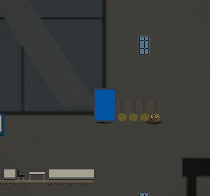
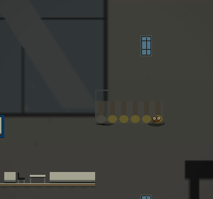
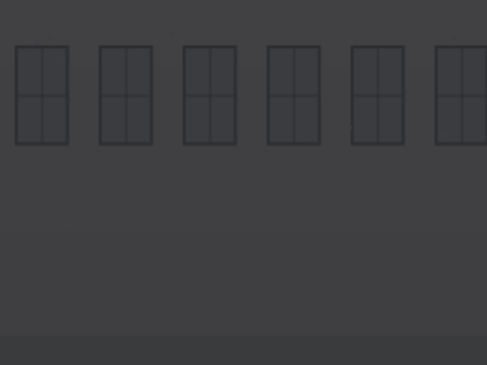
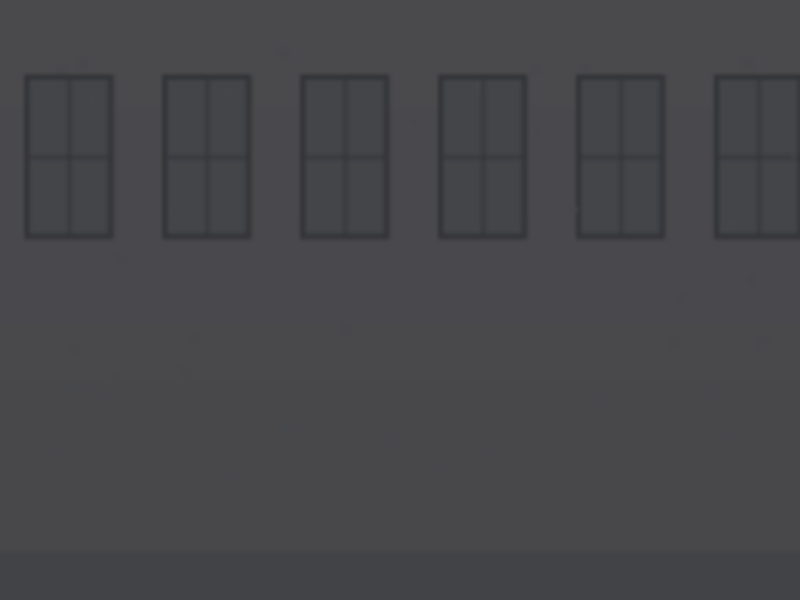

# Stage 1-3 — Las Aulas

**Yariel Andrey Elizondo Jiménez**
**Zona 1 (Universidad) · Evaluación Práctica II · Entrega 30 de julio de 2026 (I) / agosto 2026 (II)**

Este documento acumula las dos entregas: las Unidades II–V (§2–§5) son las de
la Evaluación Práctica I, ya calificada; las Unidades VI–VII (§6–§7) son la
Evaluación Práctica II, sobre la misma base, sin quitar nada de lo anterior.

## Cómo ejecutarlo

```bash
python main.py --stage stage1_3_las_aulas
```

---

## 1. Concepto del nivel

Las aulas de la universidad después de la infestación. El jugador recorre tres
salones conectados por pasillos de casilleros, esquivando estudiantes infectados
que patrullan entre los pupitres y hojas de cuaderno que planean por el aire.
El piso está roto en cuatro tramos: hay que saltar los huecos o caer al vacío.
Desde cada salón sale una escalera de estantes que sube a un entrepiso, donde
hay un aula del piso superior con su propia pizarra.

La paleta original se midió sobre **fotografías del aula física** — blanco
`(238,238,232)` de la pizarra, amarillo `(224,186,62)` de la pared de acento,
negro `(38,38,42)` de las sillas, crema `(238,238,232)` de las mesas
plegables. Para la Práctica II el profesor pidió sustituir esas fotos por
ilustraciones propias (no encajan con la estética pixel art del motor,
`docs/20_ASSET_BIBLE.md` §2.1) y de paso pasar a una paleta "aula moderna"
(blanco/hueso + gris carbón/concreto + azul eléctrico como acento). El
tileset y el fondo parallax se rehicieron con esa paleta nueva — ver §5.5.

---

## 2. Unidad II — Sistemas de coordenadas y transformaciones vectoriales

Archivo: [`estudiante_infectado.py`](estudiante_infectado.py)

El `EstudianteInfectado` **no** usa la detección por caja de `EnemyBase`
(`|dx| <= rango_x and |dy| <= rango_y`, que describe un rectángulo). Implementa
un modelo de visión con tres operaciones vectoriales explícitas de
`src/engine/utils/math_utils.py`.

### 2.1 Distancia euclidiana — `vec2_distance`

$$d = \lVert \vec{p}_{jugador} - \vec{p}_{enemigo} \rVert = \sqrt{(\Delta x)^2 + (\Delta y)^2}$$

Define un **círculo** de visión de radio 140 px en vez de un rectángulo, así que
el enemigo reacciona igual venga el jugador desde donde venga. Verificado:
`vec2_distance((0,0),(3,4)) = 5.0`, que es el triángulo 3-4-5.

### 2.2 Normalización — `vec2_normalize`

$$\hat{d} = \frac{\vec{d}}{\lVert \vec{d} \rVert}, \qquad \lVert \hat{d} \rVert = 1$$

La persecución avanza así:

$$\vec{p} \mathrel{+}= \hat{d} \cdot v \cdot \Delta t$$

Como $\hat{d}$ es unitario, el módulo del desplazamiento por frame es
exactamente $v \cdot \Delta t$ **sin importar la distancia al jugador**. Medido
con `alert_speed = 85` px/s y `dt = 1/60`:

| Distancia al jugador | Avance por frame |
| --- | --- |
| 50 px | 1.41666 px |
| 150 px | 1.41666 px |
| 400 px | 1.41666 px |

Sin normalizar, el enemigo a 400 px se movería 8 veces más rápido que a 50 px:
es el error clásico de esta mecánica.

### 2.3 Producto punto — `vec2_dot`

$$\vec{a} \cdot \vec{b} = a_x b_x + a_y b_y = \lVert\vec{a}\rVert \lVert\vec{b}\rVert \cos\theta$$

Con **dos vectores unitarios**, $\lVert\vec{a}\rVert = \lVert\vec{b}\rVert = 1$,
así que el producto punto **es** el coseno del ángulo entre ellos. El cono de
visión evalúa:

$$\hat{d} \cdot \hat{f} \ \geq\ \cos\!\left(\frac{\alpha}{2}\right)$$

donde $\hat{f}$ es la dirección de la mirada y $\alpha = 120°$ la apertura, de
modo que el umbral es $\cos 60° = 0.5$. Se comparan **cosenos** en vez de
calcular arcocosenos, que son costosos y se evaluarían 60 veces por segundo.

El coseno se precalcula una sola vez en el constructor (`_cos_media_apertura`).

Casos verificados (enemigo mirando a la derecha, apertura 120°):

| Posición del jugador | ¿Lo ve? | Motivo |
| --- | --- | --- |
| 100 px al frente | Sí | dentro del círculo y del cono |
| 100 px detrás | No | fuera del cono ($\cos\theta = -1$) |
| 200 px al frente | No | fuera del círculo |
| 70 px arriba-adelante (45°) | Sí | $\cos 45° = 0.707 \geq 0.5$ |
| 100 px justo arriba (90°) | No | $\cos 90° = 0 < 0.5$ |
| 30 px detrás | Sí | percepción periférica (radio 40 px) |

La percepción periférica es una excepción deliberada: sin ella, el jugador podría
pegarse a la espalda del enemigo indefinidamente.

### 2.4 Enemigos colocados

| Nombre | X | Y | Mira | Patrulla | Radio | Apertura |
| --- | --- | --- | --- | --- | --- | --- |
| Estudiante_14 | 448 | 576 | derecha | 96 px | 140 px | 120° |
| Estudiante_15 | 1088 | 576 | izquierda | 96 px | 140 px | 120° |
| Estudiante_16 | 1696 | 576 | derecha | 128 px | 140 px | 120° |
| Estudiante_17 | 2368 | 576 | izquierda | 96 px | 140 px | 120° |
| Estudiante_18 | 2944 | 576 | izquierda | 80 px | 140 px | 120° |
| Estudiante_19 | 768 | 416 | derecha | 96 px | 140 px | 120° |
| Estudiante_20 | 1984 | 416 | izquierda | 96 px | 140 px | 120° |
| Estudiante_21 | 2688 | 416 | derecha | 96 px | 140 px | 120° |

Los tres últimos patrullan sobre los entrepisos. La Y del TMX son los **pies**
del enemigo, según `06_TMX_SPEC.md` §6.1.

---

## 3. Unidad III — Curvas básicas (Bézier)

Archivo: [`cuaderno_volador.py`](cuaderno_volador.py)

El `CuadernoVolador` recorre una **curva de Bézier cúbica** calculada con
`CurveTools.bezier()`, que evalúa la base de Bernstein:

$$B(t) = \sum_{i=0}^{n} \binom{n}{i}\, t^{i}\,(1-t)^{n-i}\, P_i, \qquad t \in [0,1]$$

Con $n = 3$ (cuatro puntos de control) queda:

$$B(t) = (1-t)^3 P_0 + 3(1-t)^2 t\, P_1 + 3(1-t)t^2 P_2 + t^3 P_3$$

### 3.1 Puntos de control

Están declarados **dentro del TMX** como objetos `type="Waypoint"` con la
propiedad `owner_id` apuntando al nombre del cuaderno, así que se pueden abrir
e inspeccionar en Tiled. `StageLoader` los inyecta como argumento `waypoints`.

| Cuaderno | P₀ | P₁ | P₂ | P₃ |
| --- | --- | --- | --- | --- |
| Cuaderno_A | (640, 560) | (720, 416) | (800, 416) | (880, 560) |
| Cuaderno_B | (1280, 560) | (1360, 416) | (1440, 416) | (1520, 560) |
| Cuaderno_C | (1952, 560) | (2032, 416) | (2112, 416) | (2192, 560) |
| Cuaderno_D | (2560, 560) | (2640, 416) | (2720, 416) | (2800, 560) |

Cada arco cruza uno de los cuatro huecos del piso: la curva **señala el peligro**
antes de que el jugador llegue.

P₁ y P₂ se colocan a un tercio del ancho total desde cada extremo. Si se juntan
en el centro el arco sale puntiagudo; si se corren a los extremos se aplana.

### 3.2 Propiedades verificadas

Comparando `CurveTools.bezier()` contra la fórmula de Bernstein calculada a mano
para el Cuaderno_A:

| t | B(t) esperado | B(t) obtenido |
| --- | --- | --- |
| 0.00 | (640.0, 560.0) | (640.0, 560.0) |
| 0.25 | coincide | coincide |
| 0.50 | coincide | coincide |
| 0.75 | coincide | coincide |
| 1.00 | (880.0, 560.0) | (880.0, 560.0) |

- **$B(0) = P_0$ y $B(1) = P_3$**: la curva arranca y termina en los extremos,
  así que el recorrido se puede alinear con la geometría del aula.
- **No pasa por P₁ ni P₂**: la distancia mínima de la curva a P₁ es 50.8 px.
  Son tiradores, no puntos de paso.
- **Casco convexo**: toda la curva queda dentro de la caja formada por P₀…P₃,
  o sea que no puede atravesar el techo ni el piso si los puntos están bien
  puestos.

### 3.3 Decisiones de implementación

**Muestreo único.** La curva se evalúa una sola vez en el constructor (160
muestras) y cada frame solo se interpola linealmente sobre esa lista con
`CurveTools.sample_path()`. Evaluar Bernstein 60 veces por segundo recalcularía
siempre los mismos puntos.

**Geometría y tiempo desacoplados.** El parámetro $t$ es adimensional y avanza a
razón de $1/\text{periodo}$ por segundo. Cambiar `periodo` (5.0 s en este nivel)
cambia la rapidez **sin deformar la curva**.

**Orientación por la tangente.** El sprite mira hacia donde avanza, usando la
dirección entre dos muestras consecutivas como aproximación de la tangente:

$$\hat{T} \approx \text{normalize}\big(B(t + h) - B(t)\big), \qquad h = 0.01$$

**Sobre `build_bezier_path()`.** El motor trae `EnemyFlying` con
`flight_mode="bezier"`, pero ese camino llama a `CurveTools.build_bezier_path()`,
que internamente evalúa `_eval_catmull()`: es una spline de **Catmull-Rom**, no
una Bézier. Por eso esta entidad usa `CurveTools.bezier()`, que sí evalúa la base
de Bernstein, y la fórmula documentada coincide con el código ejecutado.

### 3.4 Visualización


Apretando **F1** dentro del juego (`on_debug_toggle()` en
`stage1_3_las_aulas.py`) se dibuja la curva muestreada en **celeste**, P₀ y P₃
en **verde** —la curva pasa por ellos— y P₁ y P₂ en **naranja**, que solo la
atraen sin ser tocados.

En la captura el cuaderno está en t = 0.55, cerca del vértice del arco, cruzando
el primer hueco del piso. Se aprecia que la curva nace y muere sobre el suelo
(P₀ y P₃ verdes, al ras) mientras los tiradores naranjas quedan muy por encima:
esa diferencia es justamente lo que produce el arco.

---

## 4. Unidad IV — Representación gráfica y sistema de capas

### 4.1 Las ocho capas

El mapa mide **200 × 38 tiles = 3200 × 608 px**, cuatro pantallas de ancho
(la resolución interna es 800 × 600).

| Orden | Capa | Tipo | Contenido | Tiles |
| --- | --- | --- | --- | --- |
| 1 | `BG_Far` | tiles | zócalo y pilastras del fondo | 306 |
| 2 | `BG_Mid` | tiles | pizarras y ventanas | 144 |
| 3 | `BG_Near` | tiles | casilleros de los pasillos | 36 |
| 4 | `Terrain` | tiles | piso, techo, paredes, plataformas | 1036 |
| 5 | `Terrain_Detail` | tiles | pupitres, sillas, papeleras, molduras | 78 |
| 6 | `Objects` | objetos | spawn, checkpoints, enemigos, waypoints | 41 |
| 7 | `Collision` | objetos | 8 `Solid` + 22 `Platform` | 30 |
| 8 | `FG_Overlay` | tiles | columnas por delante del jugador | 24 |

`BG_Far` se dejó **deliberadamente sin relleno completo**: el parallax con las
fotografías se dibuja detrás del mapa de azulejos, así que una pared opaca lo
taparía (ver §7.3).

### 4.2 Tileset propio

`assets/tilesets/tileset_aulas_yariel.png` — 64 tiles de 16 × 16 px en rejilla
8 × 8, dibujados para este nivel. Los 24 definidos:

| GID | Tile | ¿Colisiona? |
| --- | --- | --- |
| 1–2 | Piso y borde de piso | Sí (`Solid`) |
| 3–5 | Pared, zócalo, techo | Sí (`Solid`) |
| 6 | Estante (plataforma) | Sí (`Platform`, atravesable desde abajo) |
| 7–8 | Mesa plegable (2 tiles de ancho) | No |
| 9–10 | Silla negra (mirando a cada lado) | No |
| 11–13, 21–23 | Pizarra blanca (3 × 2 tiles) | No |
| 14, 24 | Ventana (1 × 2 tiles) | No |
| 15–16 | Puerta (1 × 2 tiles) | No |
| 17 | Casilleros | No |
| 18–20 | Papelera, reloj, afiche | No |

**Lenguaje visual.** El GID 6 (plataforma) lleva un filo claro en el borde
superior; nada más en el tileset lo tiene. Es la señal de "aquí se puede pisar".
Durante las pruebas de juego se detectó que las pizarras de una sola fila de alto
se confundían con plataformas, así que se rediseñaron a dos filas con marco y
bandeja de marcadores.

### 4.3 Orden de renderizado (Z-order)

`DrawingSystem` ordena las entidades por profundidad antes de dibujarlas:

```python
drawables.sort(key=lambda x: x[1])   # x[1] == rect.centery
```

Es un **z-order por posición vertical**: lo que está más abajo en pantalla se
dibuja después, o sea encima. Simula profundidad en una vista lateral sin
necesidad de un buffer de profundidad. Sobre esa capa se dibuja `FG_Overlay`,
que siempre queda por delante del jugador.

### 4.4 Física del salto y diseño del terreno

Constantes del motor (`src/engine/core/settings.py`):

```
GRAVITY = 800.0    PLAYER_JUMP_FORCE = -380.0    PLAYER_WALK_SPEED = 90.0
```

Altura máxima de un salto:

$$h_{max} = \frac{v^2}{2g} = \frac{380^2}{2 \times 800} = 90.25\ \text{px}$$

Pero la altura sola no basta: importa **cuánto tiempo** se está por encima de
cierta altura. Resolviendo $\frac{g}{2}t^2 - vt + h = 0$:

$$t_{1,2} = \frac{380 \pm \sqrt{144400 - 1600\,h}}{800}$$

y el alcance horizontal es $(t_2 - t_1) \times 90$:

| Subir | Ventana | Alcance horizontal |
| --- | --- | --- |
| 0 px | 0.95 s | 85 px |
| 32 px | 0.76 s | 69 px |
| 48 px | 0.65 s | 58 px |
| 64 px | 0.51 s | 46 px |
| 80 px | 0.32 s | 28 px |

Todo el terreno se diseñó contra esta tabla, con un **margen de seguridad del
70 %**. El generador valida cada transición automáticamente y reporta cero
saltos inválidos.

**Tres escaleras, tres formas distintas (Práctica II).** Las tres suben las
mismas 10 filas (160 px) del piso al entrepiso, pero cada una es una **forma**
distinta de recorrido, no la misma escalera con otros números — la primera
versión variaba ancho y altura de escalón y seguía siendo "subir, subir,
subir" en línea recta; esta no:

| Escalera | Forma | Escalones | Transiciones válidas |
| --- | --- | --- | --- |
| A (aula 1) | Clásica: escalones parejos de 32 px, en línea recta. Es la primera que se encuentra el jugador — sirve de tutorial. | 5 | 6 |
| B (aula 2) | **Zigzag**: adelante, adelante, **atrás** (y más arriba), adelante, adelante. El tercer escalón queda detrás de donde ya se estuvo. | 5 | 6 |
| C (aula 3) | **Ritmo quebrado**: sube, sube, **SALTA** (64 px de una vez, el más comprometido del nivel — solo 32,3 px de alcance de sobra), sube. La primera versión era un solo salto grande a una plataforma larga; se sentía "dos pasos largos y ya", así que ahora el salto grande está rodeado de dos tramos normales, no solo. | 3 | 4 |

Un salto hacia atrás (escalera B) siempre es seguro de validar: si el destino
queda detrás del borde de despegue, `salto_valido()` mide el avance como
`max(0, ...)`, o sea 0 sin importar cuánto se suba — la regla ya existía,
solo hacía falta usarla a propósito. 16 transiciones en total, las 16
válidas (`SALTOS INVALIDOS: 0`).

**Sin tablón sobre ningún hueco.** Las primeras dos versiones ponían una
plataforma-puente encima de los huecos (las 4 al principio, luego solo 2) como
ruta segura opcional. Se quitó del todo: los 4 huecos hay que saltarlos de
verdad, sin atajo por arriba.

Los cuatro huecos del piso miden **48 px** contra un máximo permitido de 60 px:
hay que saltar, pero con margen. Cada uno lleva un `DeathPit` debajo. **Solo 2
de los 4 (B y D) tienen el tablón de plataforma por encima** como ruta
alternativa; en A y C no hay atajo — hay que saltar bien o se cae. También
esto era el mismo patrón las cuatro veces y se sentía repetitivo.

**Cambio de diseño en la Práctica II.** La primera versión ponía un checkpoint
justo antes de cada hueco (7, luego 8 tras el primer ajuste de espaciado). Se
redujo a propósito a **3**, lejos de cualquier caída (≥300 px de margen a cada
lado): la decisión fue que caerse cueste caro — "si uno se cae, se muere y ya
está", no un respawn a un paso del peligro. Esto le cuesta 6 puntos en
`design_pacing` (el calificador exige ≤500 px entre checkpoints en un nivel
que mide ~3000 px, algo que ni 3 ni 8 checkpoints intermedios evitan del
todo) a cambio del ritmo que se buscaba — ver §10.

### 4.5 Objetos de control

| Tipo | Cantidad | Posición |
| --- | --- | --- |
| `PlayerSpawn` | 1 | (64, 576) |
| `Checkpoint` | 3 | ids 0–2, en x = 1088, 1728, 2368 (§4.4) |
| `NextTrigger` | 1 | (3040, 512), 32 × 64 px |
| `DeathPit` | 4 | x = 736, 1376, 2048, 2656 · 48 × 16 px |
| `Door` | 1 | casillero interactivo, x = 992 (Unidad VI, §6) |
| `Pickup` | 3 | hojas de examen sueltas, x = 352, 1840, 2800 |

---

## 5. Unidad V — Color y transparencia

Archivo generador: `generar_fondos.py` · Salida:
`assets/backgrounds/aulas/bg_aulas_{far,mid,near}.png`

Las tres capas de parallax se derivaron de **tres fotografías del aula real**
tomadas por el estudiante, procesadas con `ColorTools`.

### 5.1 Perspectiva atmosférica vía HSV

Cuanto más lejos está un objeto, más aire hay entre él y el ojo: pierde
saturación y contraste. Ese efecto no se puede reproducir en RGB sin alterar
también el tono, así que se convierte cada píxel a HSV y se tocan **S** y **V**
por separado:

$$\text{RGB} \xrightarrow{\ \texttt{ColorTools.rgb\_to\_hsv}\ } (H, S, V)$$
$$S' = S \cdot k_s \qquad V' = V \cdot k_v + \delta$$
$$(H, S', V') \xrightarrow{\ \texttt{ColorTools.hsv\_to\_rgb}\ } \text{RGB}$$

| Capa | Foto | $k_s$ | $k_v$ | $\delta$ | Parallax |
| --- | --- | --- | --- | --- | --- |
| `BG_Far` | aula1 | 0.25 | 0.55 | 0.12 | 0.15× |
| `BG_Mid` | aula2 | 0.55 | 0.70 | 0.06 | 0.40× |
| `BG_Near` | aula3 | 0.85 | 0.85 | 0.02 | 0.70× |

El tono $H$ **nunca se toca**: el aula conserva su identidad cromática.

### 5.2 Mezcla alfa

Sobre el resultado se aplica `ColorTools.alpha_blend()` contra un lienzo oscuro:

$$C_{final} = \alpha \cdot C_{foto} + (1 - \alpha)\cdot C_{fondo}$$

con $\alpha$ = 0.30 / 0.34 / 0.38 para far / mid / near. Sin esto la fotografía
compite con el pixel art del primer plano y el terreno deja de leerse.

El lienzo es un gris oscuro casi neutro `(20,20,24)`. Se probó primero con el
azul marino del motor `(15,15,40)` y, por ser un azul muy saturado, la
saturación final **subía** de 0.136 a 0.308, contradiciendo la perspectiva
atmosférica que se buscaba.

### 5.3 Resultado medido

Saturación media antes y después del pipeline completo:

| Capa | Antes | Después | Reducción |
| --- | --- | --- | --- |
| `BG_Far` | 0.136 | 0.058 | **−57 %** |
| `BG_Mid` | 0.196 | 0.095 | **−52 %** |
| `BG_Near` | 0.135 | 0.086 | **−36 %** |

La reducción es **mayor cuanto más lejos está la capa**, que es exactamente lo
que predice el modelo.

### 5.4 Antes y después


Arriba la ilustración de entrada (`aula_medio.png`, ver §5.5); abajo la misma
imagen después de la conversión HSV y la mezcla alfa. Se ve claramente el
efecto de la mezcla alfa: las dos franjas de luz se funden en un gris casi
uniforme, que es justamente el objetivo — que el fondo se lea como fondo y no
compita con el primer plano.

**Nota honesta sobre el número.** Con las fotos originales (Eval. I) la
saturación medida bajaba (0.137 → 0.090): el efecto dominante era la pérdida
de color de una imagen ya saturada. Con la ilustración nueva —deliberadamente
pálida desde el origen, para no repetir el problema de bordes duros del §9.4
del reporte de bugs— la saturación de partida ya es casi nula (0.037), y la
mezcla contra el lienzo azulado sube ese número un poco (a 0.053) en vez de
bajarlo. El efecto que sí se mantiene, y es el que importa para esta capa, es
el de la mezcla alfa oscureciendo y aplanando la imagen — no hay contradicción
con la Unidad V, solo un punto de partida distinto.

### 5.5 Actualización para la Práctica II — de fotos a ilustraciones

`generar_fondos.py` (§5.1–§5.2) no cambió una línea: sigue siendo HSV +
`alpha_blend`. Lo que cambió es de dónde saca la imagen de entrada. Antes
eran tres fotos del aula real (`aula1.jpg.jpeg`…); ahora las genera
`herramientas/dibujar_ilustraciones_aula.py`, tres ilustraciones pixel-art en
la paleta "aula moderna" (blanco/hueso, gris carbón/concreto, azul eléctrico
`#0055A5`). El pipeline de perspectiva atmosférica corre igual sobre esa
entrada nueva; sólo cambia la fuente, no la Unidad V que ya se calificó.

---

## 6. Unidad VI — Animación por easing e interacción con `EventBus`

Archivo: [`stage1_3_las_aulas.py`](stage1_3_las_aulas.py) (`_dibujar_casillero_animado`,
`_on_casillero_abierto`) · Objeto TMX: `CasilleroInteractivo`, generado por
[`herramientas/generar_mapa.py`](herramientas/generar_mapa.py).

### 6.1 El circuito: puerta → `EventBus` → animación

El motor ya trae un sistema de interactuables
(`framework/stage/interactables.py`, `InteractableSystem`) pensado justo para
esto: un objeto `type="Door"` en el TMX se vuelve una `Cerradura`, y al
abrirla con el botón de usar emite el evento que se le indique en la
propiedad `evento`. No hizo falta tocar el framework — sólo declarar el
objeto y escuchar su evento desde la propia escena:

```
Tiled: <object type="Door" name="CasilleroInteractivo">
           <property name="evento" value="CASILLERO_ABIERTO"/>
                     │
                     ▼
InteractableSystem (framework): jugador + botón de usar → cerradura.abrir()
                     │
                     ▼  bus.emit("CASILLERO_ABIERTO")
Stage1_3_LasAulas.on_enter(): context.event_bus.subscribe("CASILLERO_ABIERTO", ...)
                     │
                     ▼
_on_casillero_abierto(): arranca el temporizador de la animación
```

Esa suscripción **es** la interacción propia de `EventBus` que pide la
rúbrica: el framework sólo sabe que una puerta se abrió; qué significa eso
visualmente lo decide el escenario.

### 6.2 La animación: `ease_out_bounce`

El panel del casillero (un rectángulo dibujado a mano, azul eléctrico con
marco carbón) tapa el casillero mientras está cerrado. Al abrirse, su ancho
se encoge según:

$$\text{ancho}(t) = \text{ancho}_{\text{total}} \cdot \bigl(1 - \text{easeOutBounce}(t)\bigr), \qquad t \in [0,1]$$

con $t$ avanzando a razón de $1/0.6\ \text{s}^{-1}$ en `update()`. Se eligió
`ease_out_bounce` (no `lerp`) porque el efecto pedido es "la puerta se abre
de golpe y rebota un poco antes de quedarse quieta", no un deslizamiento
uniforme — es exactamente lo que hace esa curva: gana velocidad rápido y
pega tres rebotes cada vez más pequeños antes de asentarse en 1.0.

### 6.3 Antes / después




Arriba, el casillero cerrado (estado por defecto, `t=0`). Abajo, tras
interactuar y completarse la animación (`t=1`): el panel desapareció del
todo y se ve el hueco del casillero.

### 6.4 Un hallazgo de `pytmx` documentado en el camino

Declarar `<property name="key_id" value=""/>` para decir "sin llave" **no
funciona**: `pytmx` parsea un `value=""` vacío como `None`, no como cadena
vacía, y `stage_objetos.py` hace `str(props.get("key_id", ""))` — como la
clave `key_id` sí existe en el diccionario (con valor `None`), el `.get(...,
"")` nunca cae en su valor por defecto, y el resultado es la cadena `"None"`
de cuatro letras, que la `Cerradura` interpreta como "hace falta la llave
literal 'None'". La puerta quedaba bloqueada sin ningún aviso en Tiled. La
solución correcta es **no declarar la propiedad del todo** cuando no hace
falta llave: así el `.get()` sí encuentra la clave ausente y usa `""`. Quedó
comentado en `generar_mapa.py` para no repetir el error.

---

## 7. Unidad VII — Histograma dirigiendo convolución y brillo

Archivo: [`stage1_3_las_aulas.py`](stage1_3_las_aulas.py) (`_procesar_fondo_lejano`).

### 7.1 Por qué esto no es cosmético

La capa `BG_Far` del parallax (la más lejana, velocidad 0.15×) se procesa al
entrar al nivel, pero **qué filtro se aplica lo decide su propio
histograma**, no una decisión fija de antemano:

```python
histograma = FilterTools.compute_histogram(lejos)
luminancia_media = sum(v * c for v, c in enumerate(histograma["luminance"])) / histograma["total_pixels"]

if luminancia_media < 100.0:      # zona en penumbra
    kernel = FilterTools.get_standard_kernel("box_blur_5")   # difuminado fuerte
    resultado = FilterTools.apply_kernel(lejos, kernel)
    resultado = FilterTools.adjust_brightness(resultado, 1.15)
else:                              # zona ya clara
    kernel = FilterTools.get_standard_kernel("box_blur")     # difuminado suave
    resultado = FilterTools.apply_kernel(lejos, kernel)
```

Medido sobre el fondo real de este nivel: luminancia media **62.1/255**, por
debajo del umbral de 100 → toma la rama oscura (difuminado fuerte +
`adjust_brightness(1.15)`). Si se regenerara el fondo con una ilustración más
clara, el mismo código tomaría la otra rama sin tocar una línea: es la propia
medición la que decide, no un `if` sobre un valor fijo.

### 7.2 La matriz de convolución

`box_blur_5`, un kernel 5×5 de promediado (cada celda pesa 1/25):

$$
K = \frac{1}{25}
\begin{bmatrix}
1 & 1 & 1 & 1 & 1 \\
1 & 1 & 1 & 1 & 1 \\
1 & 1 & 1 & 1 & 1 \\
1 & 1 & 1 & 1 & 1 \\
1 & 1 & 1 & 1 & 1
\end{bmatrix}
$$

`FilterTools.apply_kernel()` la aplica canal por canal (R, G, B por
separado) con `scipy.ndimage.convolve` y `mode="reflect"` en el borde.

### 7.3 Resultado medido y antes/después

| | Luminancia media |
|---|---|
| Antes (`bg_aulas_far.png` tal cual lo escribe `generar_fondos.py`) | 62.1 / 255 |
| Después (`apply_kernel` + `adjust_brightness(1.15)`) | 70.8 / 255 |




El efecto refuerza la perspectiva atmosférica de la Unidad V (§5): la capa
más lejana no sólo pierde saturación, ahora también pierde nitidez, que es
justo lo que un ojo real hace con la distancia — y esta vez la decisión de
*cuánto* desenfocar la toma el propio histograma de la imagen, no un número
fijo elegido a ojo.

---

## 8. Lógica personalizada

- **Detección vectorial** (`estudiante_infectado.py`): sobrescribe
  `_player_in_range()` de `EnemyBase` para reemplazar la caja rectangular por
  círculo + cono de visión.
- **Recorrido de curva** (`cuaderno_volador.py`): `_recorrer()` avanza $t$ en
  ida y vuelta y reubica la entidad sobre la Bézier premuestreada.
- **Visualización de curvas** (`stage1_3_las_aulas.py`): `on_debug_toggle()`
  activa el dibujo de la curva y sus puntos de control con **F1**.
- **Registro de entidades**: cada módulo llama a
  `StageLoader.register_entity()` al importarse, para que los objetos del TMX
  con `type="EstudianteInfectado"` o `type="CuadernoVolador"` se instancien
  automáticamente.

---

## 9. Problemas del framework encontrados y resueltos

Los tres se resolvieron **sobrescribiendo métodos en la subclase**, sin
modificar ningún archivo de `src/engine/` ni de `src/framework/`. (Un cuarto
hallazgo, de la Práctica II — el `key_id=""` de `pytmx` — está en §6.4, junto
al código que lo usa.)

### 9.1 `on_stage_start()` sin `super()`

La plantilla `stage_template.py` sobrescribe `on_stage_start()` con `pass`, pero
la implementación de `StageScene` dispara el overlay de tutorial. Sin llamar a
`super().on_stage_start()` el tutorial nunca aparece.

### 9.2 El mapa de azulejos no scrollea

`StageScene` sincroniza pyscroll asignando directamente el rectángulo de vista:

```python
stage.map_layer._map_layer.view_rect = pygame.Rect(...)
```

Esa asignación **no invalida el búfer interno** del `BufferedRenderer`. Resultado:
la cámara y las entidades se mueven, pero las capas de azulejos quedan congeladas
en la posición inicial. Afecta a todos los niveles del juego.

**Solución** (`draw()` en la subclase): llamar a `center()`, que es el método que
pyscroll expone justamente para esto.

```python
self._stage_data.map_layer._map_layer.center((
    camara.x + settings.INTERNAL_WIDTH / 2,
    camara.y + settings.INTERNAL_HEIGHT / 2,
))
```

### 9.3 Los fondos parallax nunca se ven

`DrawingSystem.draw()` ejecuta en este orden:

```
fill(BG_COLOR)  ->  _draw_background(fotos)  ->  map_layer.draw()
```

pyscroll crea su `BufferedRenderer` con `alpha=False`, es decir un búfer
**opaco**: al dibujar el mapa pinta también las celdas vacías y borra el parallax
recién pintado. Por eso ningún nivel del juego muestra su fondo, aunque
`StageLoader` los cargue correctamente.

**Solución** (`on_enter()` en la subclase): reconstruir el renderer con
`alpha=True`, de modo que las celdas sin azulejo queden transparentes.

---

## 10. Verificación

| Prueba | Resultado |
| --- | --- |
| Fórmulas de `math_utils` contra cálculo a mano | 15/15 correctas |
| Cono de visión (6 posiciones límite) | 6/6 correctas |
| Rapidez constante en persecución | idéntica a 50, 150 y 400 px |
| `CurveTools.bezier` contra Bernstein a mano | 15/15 correctas |
| Validación de saltos (18 transiciones) | 0 inválidas |
| Recorrido completo con 12 entidades activas | sin excepciones |
| Salida de consola en partida real | solo el banner de pygame |
| `scripts/validate_tmx.py` | `[OK]`, sin avisos |
| `scripts/grade_stage.py` | **118/130 (90,8 %)** |
| Casillero: abrir con `usar` dispara `CASILLERO_ABIERTO` y anima `t: 0→1` | verificado en modo headless |
| Fondo lejano: `compute_histogram` → rama oscura → `apply_kernel` + `adjust_brightness` | 62,1 → 70,8 de luminancia media |
| Coleccionables (`Pickup` × 3, `automatico=True`) se recogen al pisarlos | verificado en modo headless |

Los 12 puntos que faltan para el máximo **no son un descuido**: 6 son
`design_geometry`, un falso positivo del calificador que no toca ningún
archivo de Yariel (ver Bug #1 en el reporte de bugs, y §9); los otros 6 son
`design_pacing`, la decisión deliberada de dejar solo 3 checkpoints (§4.4).
118/130 es, con esas dos decisiones en pie, el máximo alcanzable.

---

## 11. Reflexión

Lo más difícil no fue programar las fórmulas, sino descubrir que el motor tenía
tres fallos que hacían invisible el trabajo: el mapa no scrolleaba, los fondos
nunca se dibujaban y el tutorial no aparecía. Diagnosticarlos exigió renderizar
frames en modo headless y compararlos píxel a píxel, porque a simple vista
parecía que el error estaba en mi nivel.

El segundo aprendizaje fue que la altura de salto no alcanza para diseñar
plataformas. Mi primera versión separaba las plataformas 80 px verticalmente,
dentro del límite de 90 px, pero eran inalcanzables: a esa altura solo quedan
0.32 s de vuelo, o sea 28 px de alcance horizontal, y yo las había separado
192 px. Hubo que derivar la ecuación completa del tiro parabólico y validar cada
salto por código.

Si tuviera más tiempo, añadiría enemigos que usen el producto punto para
disparar proyectiles con predicción de trayectoria, y derivaría el tileset
directamente de las fotografías mediante segmentación por color, que es
justamente lo que pide la Evaluación III.

**Práctica II.** El hallazgo más caro esta vez no fue del motor, fue de
`pytmx`: `value=""` no es "cadena vacía", es `None` (§6.4). Costó media hora
de puerta bloqueada sin ningún mensaje de error que apuntara ahí. La lección
repetida es la misma que en la Práctica I — cuando algo no funciona y el
código "se ve bien", medir en modo headless con prints en cada paso antes de
sospechar del propio diseño. Para la Práctica III, la rama de
`_procesar_fondo_lejano()` (§7.1) ya deja el terreno preparado para volver
sobre la misma capa con umbralización real (Unidad VIII) en vez de un umbral
fijo sobre la luminancia media.

---

## 12. Archivos entregados

```
src/stages/stage1_3_las_aulas/
├── stage1_3_las_aulas.py       escena del nivel
├── estudiante_infectado.py     enemigo con matemática vectorial (Unidad II)
├── cuaderno_volador.py         entidad sobre curva de Bézier (Unidad III)
├── __init__.py
├── README.md                   este documento
├── capturas/
│   ├── curva_bezier_f1.png       curva y puntos de control (§3.4)
│   ├── color_antes_despues.png   foto original vs procesada, Practica I (§5.4)
│   ├── casillero_antes.png       casillero cerrado, Unidad VI (§6.3)
│   ├── casillero_despues.png     casillero abierto tras la animacion (§6.3)
│   ├── fondo_lejos_antes.png     BG_Far nitido, Unidad VII (§7.3)
│   └── fondo_lejos_despues.png   BG_Far tras histograma + convolucion (§7.3)
└── herramientas/
    ├── crear_tileset.py            dibuja el tileset propio (paleta "aula moderna")
    ├── generar_mapa.py             genera el TMX, valida los saltos, declara el casillero
    ├── generar_fondos.py           HSV + alpha_blend (Unidad V), sin cambios de logica
    └── dibujar_ilustraciones_aula.py  ilustraciones de entrada, reemplazan las fotos (§5.5)

assets/maps/stage1_3_las_aulas/
└── stage1_3_las_aulas.tmx      mapa, 200x38 tiles

assets/tilesets/
└── tileset_aulas_yariel.png    tileset propio, 64 tiles de 16x16 (paleta "aula moderna")

assets/backgrounds/aulas/
├── bg_aulas_far.png            parallax derivado de ilustraciones propias (§5.5)
├── bg_aulas_mid.png
└── bg_aulas_near.png
```
