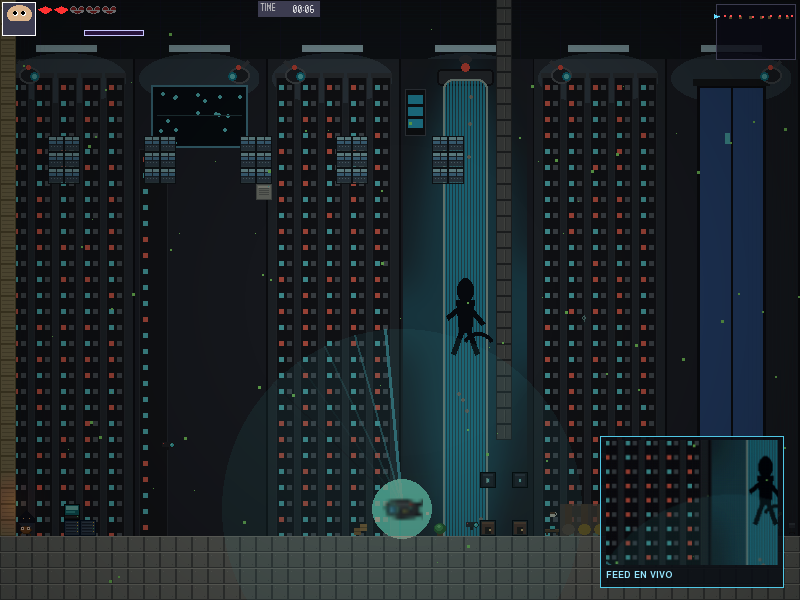
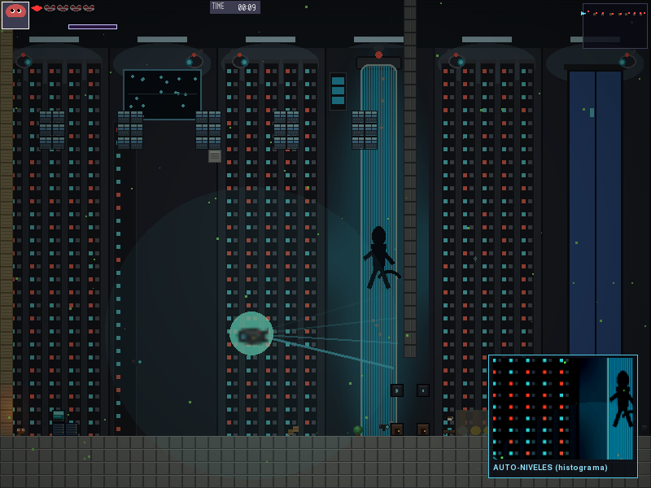
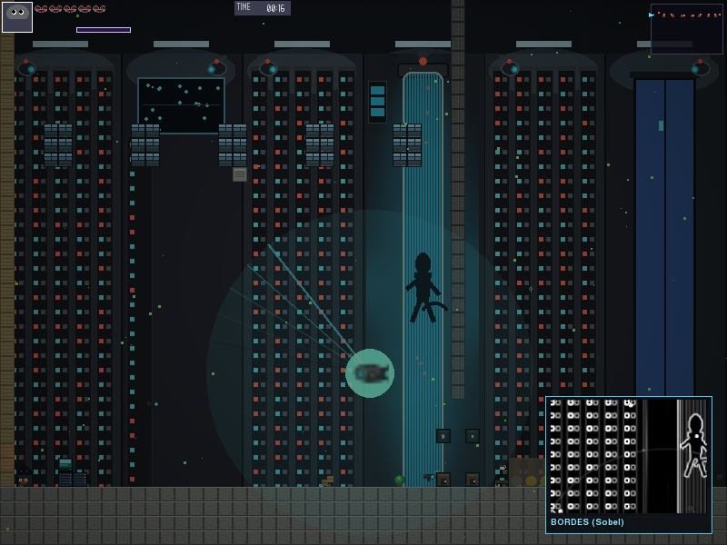

# Stage 2.1 — Distrito Central: Oficinas

Escenario de la Zona 2 (Distrito Central), datacenter de oficinas. Nivel
horizontal de recorrido y combate, sin jefe, dividido en cuartos conectados
por puertas: Pasillo A, Cubículos, Sala de Juntas, Pasillo B (peligro), Sala
de Control y Sala de Servidores.

## Unidad II — Vectores (20 pts)

`dron04.py` (`_target_lock`) usa las funciones de `src/engine/utils/
math_utils.py` **por nombre**, no matemática ad hoc:

- `vec2_distance(dron, jugador)` — ¿está el jugador dentro del radio real de
  detección (`detection_range_x`)?
- `vec2_normalize(jugador - dron)` — dirección unitaria dron→jugador.
- `vec2_dot(dirección, hacia_dónde_mira_el_dron)` — 1.0 si el jugador está
  justo al frente, -1.0 si está detrás. Un radar circular no distingue eso;
  el producto punto sí, y sólo entonces se dibuja la retícula de bloqueo de
  objetivo sobre el jugador.

## Unidad III — Curvas (15 pts)

DRON-04 patrulla un lazo cerrado, no una línea recta ni la sinusoide
genérica del motor. `dron04.py._build_loop()` genera 6 puntos de control
alrededor del punto de spawn:

```
p_i = origin + (cos(2πi/6)·rx, sin(2πi/6)·ry),  i = 0..5
```

Esos 6 puntos se pasan como `waypoints` a `EnemyFlying(flight_mode="bezier")`,
que en `flight_strategies.py` los interpola con Catmull-Rom cerrado vía
`CurveTools.build_bezier_path` (motor, Unidad III). Al detectar al jugador
(`alert_flight_mode="chase"`) abandona la curva y persigue con inercia.

## Unidad IV — Representación de escena (20 pts)

`stage2_1_oficinas.tmx`: 200×38 tiles (3200×608 px), 8 capas obligatorias
(`BG_Far/Mid/Near`, `Terrain`, `Terrain_Detail`, `Objects`, `Collision`,
`FG_Overlay`). Estructura por cuartos con paredes/puertas pintadas en
`Terrain` y su geometría sólida correspondiente en `Collision`; 7
checkpoints (uno por puerta), 8 `DataChip` coleccionables (uno o dos por
cuarto) y 10 enemigos con dificultad creciente izquierda→derecha: 3
`Walker`, 1 `WalkerGuardia` (variante de zona 2), 2 `ChargerOficinas`, 3
`BruteOficinas`, 1 `Dron04` (entidad propia).

## Unidad V — Color (15 pts)

El anillo del radar de DRON-04 no salta entre dos colores fijos.
`dron04.py._ring_color()` interpola el nivel de alerta (0 = patrulla, 1 =
alerta) en espacio **HSV** — matiz 195° (azul-cian) → 4° (rojo), saturación
0.65 → 0.85 — y reconvierte a RGB con `ColorTools.hsv_to_rgb` (`src/
framework/processing/color_tools.py`, Unidad V del framework) antes de
pintar. El resultado es una transición de color continua y visible según se
acerca el jugador, no un cambio de estado instantáneo.

## Completitud funcional — Evaluación Práctica I (20 pts)

El escenario carga y se recorre de punta a punta sin fallos. Verificado con
las herramientas reales del curso, no con una reimplementación manual:

```
python scripts/grade_stage.py src/stages/stage2_1_oficinas/stage2_1_oficinas.tmx
python -m tools.validate_stage --path src/stages/stage2_1_oficinas/stage2_1_oficinas.tmx
```

---

## Evaluación Práctica II — Vertical Slice

### Unidad VI — Animación e interacción (20 pts)

`security_monitor.py` implementa el **Monitor de Seguridad** de la Sala de
Control. No aparece con un timer inventado: se activa al recibir
`Events.CHECKPOINT_REACHED` con `checkpoint_id=4` — el mismo evento que ya
emite `checkpoint.py` al pisar esa puerta, así que la interacción es
genuinamente del `EventBus`, no un `if` sobre la posición del jugador. La
entrada y cada cambio de modo se animan con `ease_out_cubic` (crecimiento) y
`ease_in_out_quad` (desvanecido) de `math_utils.py`, no un `blit` directo al
100%.

### Unidad VII — Histograma (15 pts)

El modo **"AUTO-NIVELES"** no calcula un histograma y lo descarta:
`FilterTools.compute_histogram()` mide la luminancia media de la captura y
esa medida **decide** los factores de `adjust_brightness`/`adjust_contrast`
(`security_monitor.py._auto_levels`) — una captura oscura se corrige más que
una clara. Antes/después:

| Antes (FEED EN VIVO) | Después (AUTO-NIVELES, histograma) |
|---|---|
|  |  |

### Unidad VII — Convolución / bordes (20 pts)

El mismo panel recorre además **"DESENFOQUE"** (`FilterTools.gaussian_blur`,
σ=2.4) y **"BORDES"** (`FilterTools.sobel_edge`). Antes/después de Sobel:

| Antes (FEED EN VIVO) | Después (BORDES, Sobel) |
|---|---|
|  |  |

Los 4 modos se precalculan **una sola vez** por captura, no por fotograma
(`security_monitor.py.capture()` — evita recalcular filtros sobre una
imagen que no cambia, el mismo motivo que llevó a `FilterDemoScene` de
10,24 ms a 0,73 ms por fotograma según `CHANGELOG.md`).

### Completitud — Eval I se mantiene (10 pts)

Nada de lo anterior rompió el TMX ni la entidad de Eval I; `validate_stage.py`
sigue limpio después de cada cambio. La nota de `grade_stage.py` de hecho
**subió** en esta iteración (ver Testing más abajo): 93,1 % → 96,9 %.

---

## Testing / Iteración

Ciclo seguido en esta entrega: **versión → prueba → problema → corrección →
nueva prueba → mejora**, verificado siempre con las herramientas reales del
curso (`scripts/grade_stage.py`, `tools/validate_stage.py`, capturas del
motor en modo headless), no con una relectura del código.

| # | Problema encontrado jugando | Corrección | Verificación |
|---|---|---|---|
| 1 | Reporte del profesor: sin metadata, sin checkpoints, sin `climate`, "repechos imposibles" de 544 px | Metadata completa, 7 checkpoints, `climate="clear"`, geometría intermedia añadida | 63,8 % → 93,1 % en `grade_stage.py` |
| 2 | Los "repechos imposibles" seguían apareciendo tras añadir puertas | Bug real de `level_metrics.py`: los muros de cierre sin geometría intermedia se emparejan con el piso y disparan el falso positivo | 0 issues de geometría en el reporte |
| 3 | Cuartos sin separación visual (paredes sólo en `Collision`, invisibles) | Pintadas también en `Terrain` (GID de pared/puerta) | Capturas del motor confirmando muros visibles |
| 4 | DRON-04 y su radar casi invisibles contra el fondo | Sprite ampliado 3x + halo pulsante + radar con anillos gruesos y estela | Captura con el jugador cerca: dron y radar claramente legibles |
| 5 | Fondo sin relación con un datacenter (skyline nocturno genérico) | Repintados los 3 parallax (`bg_oficinas_far/mid/near.png`) como pared continua de racks/paneles/cámaras | Composite verificado capa por capa |
| 6 | Minimapa casi vacío: un mapa 3200×608 sólo llenaba 15 px de una caja de 56 px, pegado arriba | `minimap.py`: centrado del contenido dentro de la caja (`_offset_x/_offset_y`) | Captura del minimapa antes/después |
| 7 | **Un enemigo aparecía como un rectángulo rojo sólido que tapaba la pantalla** | `EnemyBrute` pide cuadros de 24×18 a una hoja compartida de zona 2 que mide 96×12 — `rows = 12 // 18 = 0`, cero cuadros cargados, cae al rectángulo de color plano de `EnemyBase.draw()`. Bug del motor, no de este mapa: pasa en las tres zonas y con `Charger` también (cuadros descuadrados, 96 no es múltiplo de 14). Arreglo local: `office_enemies.py` (`BruteOficinas`/`ChargerOficinas`) con hojas propias del tamaño correcto | `len(sprite_frames["walk"])` pasó de 0 a 6; captura sin rectángulos de color |
| 8 | Sin coleccionables ("monedas/puntos") | 8 `DataChip` (`collectible.py`) con animación de flotado y de recolección (anillo que se expande), contador en el HUD, más 3 `MessageTrigger_Once` para la detección de coleccionables de `grade_stage.py` | 96,9 % en `grade_stage.py`; recolección probada en el motor (`chips_collected` incrementa, `done` se activa tras el fundido) |
| 9 | Duda: ¿el checkpoint hace reaparecer ahí al morir? | No era un bug — ya funciona (`respawn()` usa `self._checkpoint_position`) | Probado: muerte tras el checkpoint 2 reaparece en (1390, 496) ≈ posición del checkpoint |
| 10 | Sin música/sonido propio del stage | `bgm_zone2_traverse` (ya estaba), zumbido ambiental de datacenter (`play_ambient`, existía sin usarse), alarma de DRON-04 al detectar, pitidos del monitor | Sin excepciones al disparar cada evento; `stop_ambient()` confirmado al salir del stage |

## Archivos

- `stage2_1_oficinas.tmx` — el mapa (Tiled)
- `stage2_1_oficinas.py` — la escena (subclase de `StageScene`)
- `dron04.py` — entidad propia (Unidades II, III, V — ver arriba)
- `office_enemies.py` — `BruteOficinas`/`ChargerOficinas` con hojas propias (ver Testing #7)
- `enemy_sprites/` — hojas de sprite de `BruteOficinas`/`ChargerOficinas`
- `security_monitor.py` — panel de la Sala de Control (Unidades VI, VII)
- `collectible.py` — `DataChip`, coleccionables con contador en el HUD
- `tileset_oficinas.png` — tileset propio, 32 tiles de 16×16
- Fondos en `assets/backgrounds/oficinas/` (`bg_oficinas_far/mid/near.png`)
- `docs/monitor_*.png` — capturas antes/después de los filtros

## Cómo ejecutar

```
.\.venv\Scripts\activate
python main.py --stage stage2_1_oficinas
```

## Controles

Mover: A/D o flechas | Saltar: Espacio/W | Ataque: Z o X | Dash: Shift

## Autor

Saúl Ramírez — Zona 2 (Distrito Central: Oficinas)
